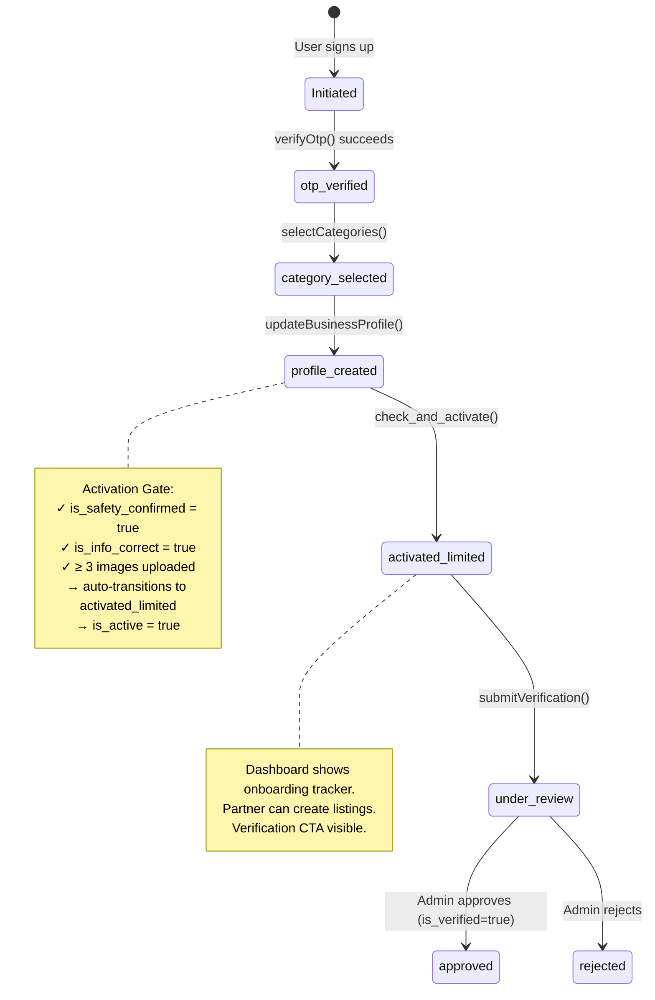
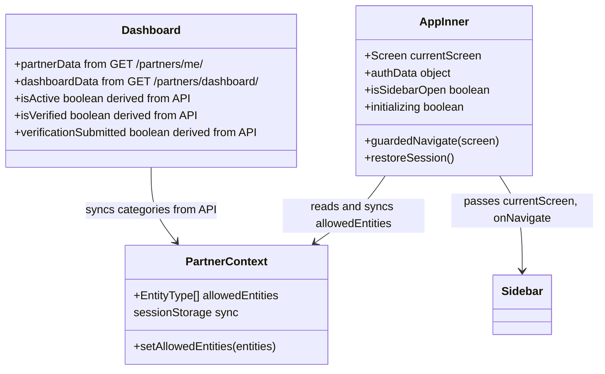

# TLB Partner Portal — Implementation Graph

> **Definitive architectural reference for the TLB Partner Portal.**
> Base URL: `https://tlb-api.reluconsultancy.in`
> Framework: React + Vite + TypeScript (SPA)
> Last Updated: June 4, 2026

---

## 1. Project Structure

```
src/
├── api/
│   ├── client.ts           # Centralized fetch wrapper, auth headers, 401 refresh
│   ├── auth.ts             # requestOtp, verifyOtp, getCurrentUser, logout
│   ├── onboarding.ts       # All partner CRUD endpoints (profile, media, categories, etc.)
│   ├── stats.ts            # Partner statistics endpoints (overview, events, venues, enquiries) + trackProfileView
│   ├── coupons.ts          # Partner coupons CRUD (live) — get/create/update/deactivate/usages; CreateCouponInput targeting
│   ├── help.ts             # Help & Support tickets — categories, list, create, detail, messages (poll), send, close
│   ├── notifications.ts     # In-app notifications — list, unread-count, mark read/all, get/update preferences
│   ├── network.ts          # Partner Network — directory, profile, block/unblock, conversations + single-message send
│   ├── reviews.ts          # Partner reviews — getPartnerReviews (all, paginated) + getListingReviews (per listing, 404-safe)
│   └── listings.ts         # Listings + ticket + media CRUD, bookings (+payment-detail), coupon_code, event/venue FAQ CRUD, generic terms, class + venue enquiries, ApiError class
├── context/
│   └── PartnerContext.tsx   # Global context: allowedEntities (synced to sessionStorage)
├── components/
│   ├── Navigation.tsx           # Sidebar: fixed push-content on desktop (lg+, dark navy #0f1729), always-`lg:hidden` overlay drawer on mobile; collapse via in-sidebar toggle, re-expand via hamburger (App.tsx onOpenSidebar sets both desktop+mobile state). Includes "Coupons" → ALL_COUPONS and "Help & Support" → HELP_SUPPORT entries.
│   ├── NotificationCenter.tsx   # Bell + badge (polls unread-count 60s). Click navigates to the dedicated MESSAGES screen (the slide-in drawer was replaced). `variant` 'light'|'dark'. Mounted in Dashboard header.
│   ├── EntityPickerSheet.tsx    # Bottom sheet for entity type selection
│   └── ui/
│       ├── DashboardCharts.tsx  # Shared SVG chart primitives: AreaSparkline, TrendAreaChart, WeeklyBarChart, DonutChart, fmtCurrency, trendPct, TrendBadge
│       ├── Toast.tsx            # Global imperative toast: `toast.success/error/warning/info()` singleton + <Toaster/> (mounted once in App.tsx). Card design (coloured top accent bar + bold title + message + dismiss). Legacy `useToasts()` + `<ToastContainer/>` kept as local-state shims rendering the same card.
│       ├── Select.tsx           # Reusable animated dropdown (drop-in for native <select>). Menu rendered in a portal (fixed position, never clipped by overflow); keyboard nav, flip-up, click-outside, icons/dots/check
│       ├── FaqTermsEditor.tsx   # Shared FAQ CRUD + Terms&Conditions editor (text + document upload); used by Event/Venue Policies steps. Theme-aware accent.
│       ├── BookingsCalendar.tsx # Month grid marking the partner's bookings per day; opened as a Dashboard popup
│       ├── LatestListings.tsx   # Compact upcoming/live listings list (soonest first, Live/Soon highlight); Dashboard popup
│       ├── AppListingPreview.tsx# Mobile-app-style listing detail preview (phone frame) shared by all 4 wizard Preview steps
│       └── OnboardingShell.tsx  # Shared layout for every onboarding screen: sticky branded header + ProgressDots + PageHeader + motion fade-in + decorative blurs
├── screens/
│   ├── auth/               # Landing, Login, OTPVerify, PartnerAccess, PartnerAccessOTP, PartnerCategory
│   ├── onboarding/         # Registration, AppSubmitted, AppApproved, AgreementSubmit, IdentityVerification, BankSetup, OnboardingComplete
│   ├── dashboard/          # Dashboard (Home) — lean layout; analytics moved to Statistics
│   ├── profile/            # BrandProfile (EditProfile), PreviewProfile
│   ├── services/           # ServiceListings (shared dashboard for all entities) — interactive stat-chips + animated cover-banner cards + animated table rows
│   ├── classes/            # CreateClass* (5 steps)
│   ├── events/             # CreateEvent* (5 steps: Details, Schedule, Media, Policies, Preview) + __tests__/
│   ├── programs/           # CreateProgram* (5 steps)
│   ├── venues/             # CreateVenue* (6 steps: Details, Occasions, Availability, Packages, Policies, Preview)
│   ├── enquiries/          # Enquiries (Classes), ProgramEnquiries, VenueEnquiries
│   ├── attendees/          # Attendees (attended-only) + Bookings (all, History split + happen-date sort/Live-Soon highlight) — shared parameterized component (variant)
│   ├── reviews/            # Reviews — per-listing ratings/reviews with overall summary
│   ├── documents/          # Documents — KYC (PAN/GST/bank) + brand assets (logo/cover) + uploaded media/docs
│   ├── messages/           # Messages — full-screen notification inbox (replaces the bell drawer)
│   ├── coupons/            # CreateCoupon (form, live API + targeting), AllCoupons (live list + deactivate, sample fallback)
│   ├── support/            # Support — Help & Support: ticket list → new ticket → chat thread (poll/refresh/close)
│   ├── network/            # PartnerNetwork — directory (search/filter) → profile (listings, block) → single-message compose (no chat)
│   ├── statistics/         # Statistics — tabbed analytics + Bookings→Attendees & Enquiries→Bookings(venue) ratios
│   ├── packages/           # Packages
│   └── financial/          # FinancialHub
├── test/
│   ├── setup.ts            # MSW server lifecycle, jest-dom, cleanup hooks
│   └── msw/
│       ├── handlers.ts     # Default MSW handlers for all API endpoints + shared fixtures
│       └── server.ts       # setupServer(...handlers)
├── data/
│   └── mockData.ts         # ⚠️ LEGACY — no longer imported anywhere
├── types.ts                # Screen enum, EntityType, shared interfaces
├── App.tsx                 # Root: session restore, routing, route guards
└── main.tsx                # Entry point
```

---

## 2. API Infrastructure

### 2.1 API Client (`src/api/client.ts`)

Central fetch wrapper used by ALL API calls.

| Feature | Implementation |
|---------|---------------|
| **Base URL** | `https://tlb-api.reluconsultancy.in` |
| **Auth Header** | `Authorization: Bearer <access_token>` on every request |
| **Content-Type** | `application/json` (auto-skipped for `FormData` uploads) |
| **401 Auto-Refresh** | On 401 → `POST /api/v1/auth/refresh-token/` → retry original request |
| **Token Storage** | `access_token` and `refresh_token` in `localStorage` |
| **Logout** | `clearTokens()` removes both tokens from localStorage |

**Token Refresh Flow:**
```
Request → 401 Unauthorized?
  ├─ YES → POST /auth/refresh-token/ with { refresh_token }
  │   ├─ 200 → save new access_token → retry original request
  │   └─ 401 → clearTokens() → return failed response
  └─ NO → return response
```

### 2.2 Auth API (`src/api/auth.ts`)

| Function | Method | Endpoint | Payload | Used By |
|----------|--------|----------|---------|---------|
| `requestOtp` | POST | `/api/v1/auth/request-otp/` | `{ identifier, identifier_type }` | Login, PartnerAccess, **OTPVerify (Resend)** |
| `verifyOtp` | POST | `/api/v1/auth/verify-otp/` | `{ identifier, otp, role: "partner" }` | OTPVerify, PartnerAccessOTP |
| `getCurrentUser` | GET | `/api/v1/auth/me/` | — | (available, not actively used) |
| `logout` | POST | `/api/v1/auth/logout/` | `{ refresh_token }` | Sidebar logout |

### 2.3 Listings API (`src/api/listings.ts`)

**Events:**

| Function | Method | Endpoint | Payload | Used By |
|----------|--------|----------|---------|---------|
| `getEventMetaCategories` | GET | `/api/v1/listings/events/metadata/categories/` | — | CreateEventDetails |
| `getEventMetaFormats` | GET | `/api/v1/listings/events/metadata/formats/` | — | CreateEventDetails |
| `getEventMetaAgeGroups` | GET | `/api/v1/listings/events/metadata/age-groups/` | — | CreateEventDetails |
| `getEventListings` | GET | `/api/v1/partner/listings/events/` | — | ServiceListings |
| `getListingDetail` | GET | `/api/v1/partner/listings/events/<id>/` | — | All event wizard steps, Preview |
| `createEventDraft` | POST | `/api/v1/partner/listings/events/` | `{ title?, description? }` | CreateEventDetails (Step 1) |
| `updateListing` | PATCH | `/api/v1/partner/listings/events/<id>/` | Partial event fields | Steps 1 & 2 |
| `submitListing` | POST | `/api/v1/partner/listings/events/<id>/submit/` | — | CreateEventPreview (Step 4) |
| `getListingMedia` | GET | `/api/v1/partner/listings/events/<id>/media/` | — | CreateEventMedia |
| `uploadListingMedia` | POST | `/api/v1/partner/listings/events/<id>/media/` | FormData (file, media_type) | CreateEventMedia |
| `deleteListingMedia` | DELETE | `/api/v1/partner/listings/events/<id>/media/<mid>/` | — | CreateEventMedia |
| `getTickets` | GET | `/api/v1/partner/listings/events/<id>/tickets/` | — | CreateEventSchedule |
| `createTicket` | POST | `/api/v1/partner/listings/events/<id>/tickets/` | `{ name, price, total_quantity, description? }` | CreateEventSchedule |
| `updateTicket` | PUT | `/api/v1/partner/listings/events/<id>/tickets/<tid>/` | Partial ticket fields | CreateEventSchedule |
| `deleteTicket` | DELETE | `/api/v1/partner/listings/events/<id>/tickets/<tid>/` | — | CreateEventSchedule |

> **Event media field:** `file_url` (not `url`) — response shape: `{ id, file_url, media_type }`

**Venues:**

| Function | Method | Endpoint | Payload | Used By |
|----------|--------|----------|---------|---------|
| `getVenueListings` | GET | `/api/v1/partner/listings/venues/` | — | ServiceListings |
| `getVenueListingDetail` | GET | `/api/v1/partner/listings/venues/<id>/` | — | All venue wizard steps, Preview |
| `createVenueListing` | POST | `/api/v1/partner/listings/venues/` | `{ title }` | CreateVenueDetails (Step 1) |
| `updateVenueListing` | PATCH | `/api/v1/partner/listings/venues/<id>/` | Partial venue fields | Steps 1 & 2 |
| `uploadVenueMedia` | POST | `/api/v1/partner/listings/venues/<id>/media/` | FormData (file, media_type) | CreateVenueDetails |
| `deleteVenueMedia` | DELETE | `/api/v1/partner/listings/venues/<id>/media/<mid>/` | — | CreateVenueDetails |
| `getVenueMetaOccasions` | GET | `/api/v1/listings/venues/meta/occasions/` | — | CreateVenueOccasions |
| `getVenueMetaDiscoveryEnums` | GET | `/api/v1/listings/venues/meta/discovery-enums/` | — | CreateVenueOccasions |
| `updateVenueDiscovery` | PUT | `/api/v1/partner/listings/venues/<id>/discovery/` | `{ outing_types, activity_types, format_types }` | CreateVenueOccasions |
| `getVenueAttendeeFields` | GET | `/api/v1/partner/listings/venues/<id>/attendee-fields/` | — | CreateVenueOccasions |
| `updateVenueAttendeeFields` | PUT | `/api/v1/partner/listings/venues/<id>/attendee-fields/` | `string[]` (field keys) | CreateVenueOccasions |
| `getVenueAvailability` | GET | `/api/v1/partner/listings/venues/<id>/availability/` | — | CreateVenueAvailability |
| `createVenueAvailabilitySlot` | POST | `/api/v1/partner/listings/venues/<id>/availability/` | `{ date, start_time, end_time, note? }` | CreateVenueAvailability |
| `deleteVenueAvailabilitySlot` | DELETE | `/api/v1/partner/listings/venues/<id>/availability/<sid>/` | — | CreateVenueAvailability |
| `getVenuePackages` | GET | `/api/v1/partner/listings/venues/<id>/packages/` | — | CreateVenuePackages |
| `createVenuePackage` | POST | `/api/v1/partner/listings/venues/<id>/packages/` | `{ name, price, description, duration_minutes?, max_guests? }` | CreateVenuePackages |
| `updateVenuePackage` | PATCH | `/api/v1/partner/listings/venues/<id>/packages/<pid>/` | Partial package fields | CreateVenuePackages |
| `deleteVenuePackage` | DELETE | `/api/v1/partner/listings/venues/<id>/packages/<pid>/` | — | CreateVenuePackages |

**Classes:**

| Function | Method | Endpoint | Payload | Used By |
|----------|--------|----------|---------|---------|
| `getClassMetaCategories` | GET | `/api/v1/listings/classes/metadata/categories/` | — | CreateClassIdentity |
| `getClassMetaFormats` | GET | `/api/v1/listings/classes/metadata/formats/` | — | CreateClassIdentity |
| `getClassListings` | GET | `/api/v1/partner/listings/classes/` | — | ServiceListings |
| `getClassListingDetail` | GET | `/api/v1/partner/listings/classes/<id>/` | — | All class wizard steps (media embedded here) |
| `createClassDraft` | POST | `/api/v1/partner/listings/classes/` | `{ title, short_description, description, booking_type }` | CreateClassIdentity |
| `updateClassListing` | PATCH | `/api/v1/partner/listings/classes/<id>/` | Partial class fields | CreateClassIdentity, CreateClassPolicies |
| `submitClassListing` | POST | `/api/v1/partner/listings/classes/<id>/submit/` | — | CreateClassPreview |
| `setClassListingLive` | POST | `/api/v1/partner/listings/classes/<id>/live/` | `{ is_live: bool }` | (available, not yet wired in UI) |
| `getClassBatches` | GET | `/api/v1/partner/listings/classes/<id>/batches/` | — | CreateClassBatch |
| `createClassBatch` | POST | `/api/v1/partner/listings/classes/<id>/batches/` | Batch JSON | CreateClassBatch |
| `updateClassBatch` | PUT | `/api/v1/partner/listings/classes/<id>/batches/<bid>/` | Batch JSON | CreateClassBatch |
| `deleteClassBatch` | DELETE | `/api/v1/partner/listings/classes/<id>/batches/<bid>/` | — | CreateClassBatch |
| `uploadClassMedia` | POST | `/api/v1/partner/listings/classes/<id>/media/` | FormData | CreateClassMedia |
| `deleteClassMedia` | DELETE | `/api/v1/partner/listings/classes/<id>/media/<mid>/` | — | CreateClassMedia |

> **Class delivery mode:**
> - `mode` → delivery method: `"offline"` / `"online"` / `"hybrid"` (fetched from `data.modes[]` at `/api/v1/listings/classes/metadata/formats/`). There is no separate `format` field for classes.
>
> **No GET `/media/` endpoint for classes:** `GET /api/v1/partner/listings/classes/<id>/media/` does not exist (returns 405). Media is embedded in the listing detail response under `service.media`. Always use `getClassListingDetail` to load media.
>
> **Class batch payload:** `days` uses 3-letter abbreviations (`mon`, `tue`, `wed`, `thu`, `fri`, `sat`, `sun`); capacity field is `capacity` (not `total_seats`); no `start_date`/`end_date`/`fee` fields exist on this endpoint.
>
> **Class FAQs:** Sent inline in the PATCH body as `faqs: [{question, answer}]` — replaces the entire list. No dedicated `/faqs/` sub-endpoint (unlike Programs which has individual FAQ CRUD).
>
> **Class submit validation — all fields required before `POST .../submit/`:** `title`, `description`, `mode`, `category_id`, `subcategory_id`, `address` (for offline/hybrid), cover image, ≥1 batch.

**Enquiries (Classes):**

| Function | Method | Endpoint | Payload | Used By |
|----------|--------|----------|---------|---------|
| `getClassEnquiries` | GET | `/api/v1/partner/listings/classes/enquiries/` | — | Enquiries |
| `getClassEnquiryDetail` | GET | `/api/v1/partner/listings/classes/enquiries/<id>/` | — | Enquiries |
| `updateClassEnquiry` | PUT | `/api/v1/partner/listings/classes/enquiries/<id>/` | `{ status, internal_notes }` | Enquiries |
| `unlockClassEnquiry` | POST | `/api/v1/partner/listings/classes/enquiries/<id>/unlock/` | — | Enquiries |

**Enquiries (Venues):** flat endpoints mirroring the Class CRM.

| Function | Method | Endpoint | Payload | Used By |
|----------|--------|----------|---------|---------|
| `getVenueEnquiries` | GET | `/api/v1/partner/listings/venues/enquiries/[?status=]` | — | VenueEnquiries |
| `getVenueEnquiryDetail` | GET | `/api/v1/partner/listings/venues/enquiries/<id>/` | — | VenueEnquiries |
| `updateVenueEnquiry` | PUT | `/api/v1/partner/listings/venues/enquiries/<id>/` | `{ status, internal_notes }` | VenueEnquiries |
| `unlockVenueEnquiry` | POST | `/api/v1/partner/listings/venues/enquiries/<id>/unlock/` | — | VenueEnquiries |

**Reviews:**

| Function | Method | Endpoint | Notes |
|----------|--------|----------|-------|
| `getPartnerReviews` | GET | `/api/v1/partner/reviews/?page=` | All reviews, every page fetched; normalized `{ listing_id, listing_title, rating, comment, reviewer_name, created_at }` |
| `getListingReviews` | GET | `/api/v1/partner/listings/<id>/reviews/` | Per-listing; returns `[]` on 404 |

**Programs:**

| Function | Method | Endpoint | Payload | Used By |
|----------|--------|----------|---------|---------|
| `getProgramMetaCategories` | GET | `/api/v1/listings/programs/metadata/categories/` | — | CreateProgramIdentity |
| `getProgramMetaFormats` | GET | `/api/v1/listings/programs/metadata/formats/` | — | CreateProgramIdentity |
| `getProgramMetaTags` | GET | `/api/v1/listings/programs/metadata/tags/` | — | CreateProgramIdentity |
| `getProgramListings` | GET | `/api/v1/partner/listings/programs/` | — | ServiceListings |
| `getProgramListingDetail` | GET | `/api/v1/partner/listings/programs/<id>/` | — | Program wizard steps |
| `createProgramDraft` | POST | `/api/v1/partner/listings/programs/` | `{ title, short_description?, description?, booking_type }` | CreateProgramIdentity |
| `updateProgramListing` | PATCH | `/api/v1/partner/listings/programs/<id>/` | Partial program fields | CreateProgramIdentity |
| `deleteProgramListing` | DELETE | `/api/v1/partner/listings/programs/<id>/` | — | CreateProgramIdentity |
| `submitProgramListing` | POST | `/api/v1/partner/listings/programs/<id>/submit/` | — | CreateProgramPreview |
| `archiveProgramListing` | POST | `/api/v1/partner/listings/programs/<id>/archive/` | — | CreateProgramPreview |
| `unarchiveProgramListing` | POST | `/api/v1/partner/listings/programs/<id>/unarchive/` | — | CreateProgramPreview |
| `getProgramBatches` | GET | `/api/v1/partner/listings/programs/<id>/batches/` | — | CreateProgramBatch |
| `createProgramBatch` | POST | `/api/v1/partner/listings/programs/<id>/batches/` | Batch JSON | CreateProgramBatch |
| `updateProgramBatch` | PUT | `/api/v1/partner/listings/programs/<id>/batches/<bid>/` | Batch JSON | CreateProgramBatch |
| `deleteProgramBatch` | DELETE | `/api/v1/partner/listings/programs/<id>/batches/<bid>/` | — | CreateProgramBatch |
| `getProgramEnquiries` | GET | `/api/v1/partner/listings/programs/<id>/enquiries/` | — | ProgramEnquiries |
| `updateProgramEnquiry` | PATCH | `/api/v1/partner/listings/programs/<id>/enquiries/<eid>/` | `{ status?, partner_note? }` | ProgramEnquiries |
| `getProgramFaqs` | GET | `/api/v1/partner/listings/programs/<id>/faqs/` | — | CreateProgramBatch |
| `createProgramFaq` | POST | `/api/v1/partner/listings/programs/<id>/faqs/` | `{ question, answer }` | CreateProgramBatch |
| `updateProgramFaq` | PATCH | `/api/v1/partner/listings/programs/<id>/faqs/<fid>/` | `{ question?, answer? }` | CreateProgramBatch |
| `deleteProgramFaq` | DELETE | `/api/v1/partner/listings/programs/<id>/faqs/<fid>/` | — | CreateProgramBatch |
| `getProgramMedia` | GET | `/api/v1/partner/listings/programs/<id>/media/` | — | CreateProgramMedia |
| `uploadProgramMedia` | POST | `/api/v1/partner/listings/programs/<id>/media/` | FormData | CreateProgramMedia |
| `deleteProgramMedia` | DELETE | `/api/v1/partner/listings/programs/<id>/media/<mid>/` | — | CreateProgramMedia |

**Bookings (Partner-wide):**

| Function | Method | Endpoint | Payload | Used By |
|----------|--------|----------|---------|---------|
| `getBookings` | GET | `/api/v1/partner/bookings/` | Query: `status?`, `listing_id?`, `page?` | Attendees — list now also returns `listing_id` + `listing_title` per booking |
| `getBookingDetail` | GET | `/api/v1/partner/bookings/{id}/` | — | Attendees (drawer) |
| `markBookingAttended` | POST | `/api/v1/partner/bookings/{id}/mark-attended/` | — | Attendees (drawer action) |
| `getBookingPaymentDetail` | GET | `/api/v1/partner/bookings/{id}/payment-detail/` | — | Attendees (drawer — Payment Summary: `{ payment_method, amount, status }`, no card/UPI details) |
| `cancelBooking` | POST | `/api/v1/partner/bookings/{id}/cancel/` | `{ reason }` | ⚠️ **Forbidden for partners** — returns 403 `PARTNER_BOOKING_CANCEL_FORBIDDEN`. Kept in `listings.ts` for tests but **NOT wired into the UI** (only customers can cancel). |

**Generic Listing Actions (entity-agnostic):**

| Function | Method | Endpoint | Payload | Used By |
|----------|--------|----------|---------|---------|
| `pauseListing` | POST | `/api/v1/partner/listings/{id}/pause/` | — | ServiceListings (all entity types) |
| `resumeListing` | POST | `/api/v1/partner/listings/{id}/resume/` | — | ServiceListings (all entity types) |
| `archiveListing` | POST | `/api/v1/partner/listings/{id}/archive/` | — | ServiceListings (all entity types) |
| `unarchiveListing` | POST | `/api/v1/partner/listings/{id}/unarchive/` | — | ServiceListings (all entity types) |

**FAQs & Terms (Events / Venues):**

| Function | Method | Endpoint | Used By |
|----------|--------|----------|---------|
| `getEventFaqs` / `createEventFaq` / `updateEventFaq` / `deleteEventFaq` | GET/POST/PUT/DELETE | `/api/v1/partner/listings/events/{id}/faqs/[{faqId}/]` | CreateEventPolicies |
| `getVenueFaqs` / `createVenueFaq` / `updateVenueFaq` / `deleteVenueFaq` | GET/POST/PUT/DELETE | `/api/v1/partner/listings/venues/{id}/faqs/[{faqId}/]` | CreateVenuePolicies |
| `getListingTerms` | GET | `/api/v1/partner/listings/{id}/terms/` | FaqTermsEditor — returns `null` on 404 (not set) |
| `setListingTerms` | PUT | `/api/v1/partner/listings/{id}/terms/` | FaqTermsEditor — **multipart** `content` and/or `document` file |
| `deleteListingTerms` | DELETE | `/api/v1/partner/listings/{id}/terms/` | FaqTermsEditor |

> **Terms is generic (all listing types):** the `/listings/{id}/terms/` endpoints work for events, venues, programs **and** classes via the listing UUID. Classes/Programs already collected FAQ/policies in their wizards; **Events and Venues** now get a dedicated **Policies** step (`FaqTermsEditor`) using the per-entity FAQ CRUD above + the generic terms endpoints. FAQ object: `{ id, question, answer, sort_order }`.

> **Generic endpoints used for ALL entity types (fixed June 2026):** pause/resume/archive/unarchive in `ServiceListings` route through the generic `/api/v1/partner/listings/{id}/{action}/` endpoints for Events, Classes, Programs **and** Venues. The backend URLconf only registers these generic routes — the old entity-specific routes (`/classes/{id}/live/`, `/programs/{id}/archive|unarchive/`) return 404. The entity-specific helpers (`setClassListingLive`, `archiveProgramListing`, `unarchiveProgramListing`) remain defined in `listings.ts` (with passing unit tests) but are **no longer wired into the UI**.

**Booking field reference:**

| Field | Values | Notes |
|-------|--------|-------|
| `status` | `awaiting_payment` / `confirmed` / `attended` / `cancelled` | Filter param + display badge |
| `payment_status` | `paid` / `pending` / `refunded` | Display badge only |
| `booking_type` | `event` / `class` / `program` / `venue` | Display badge only |

> **Program enquiries are per-listing (not global):** `ProgramEnquiries.tsx` fetches all programs on mount, then loads `GET /api/v1/partner/listings/programs/<id>/enquiries/` for the selected program. A dropdown appears when more than one program exists.
>
> **Program Enquiry Schema Differences:** Programs use `enrolled` status instead of `trial_booked` (used by classes). Additionally, contact information (`contact_number`, `email`) is available directly in the response payload (no `/unlock/` endpoint is required for programs).

> **Venue media field:** `url` (not `file_url`) — response shape: `{ id, url, media_type }`  
> **Venue detail response** includes all sub-resources inline: `media`, `availability`, `packages`, `discovery`, `occasions`, `required_attendee_fields` — Preview uses a single `getVenueListingDetail` call.  
> **Media field defensive handling:** `CreateClassMedia` and `CreateVenueDetails` resolve URLs via `getUrl(item) = resolveUrl(item.url || item.file_url || '')` to handle API field name variation across entity types.

**Draft ID Helpers (sessionStorage):**

| Function | Key | Purpose |
|----------|-----|---------|
| `getCurrentDraftId()` | `current_event_draft_id` | Read active event draft ID |
| `setCurrentDraftId(id)` | `current_event_draft_id` | Save event draft ID after create |
| `clearCurrentDraftId()` | `current_event_draft_id` | Clear on submit or cancel |
| `getCurrentVenueDraftId()` | `current_venue_draft_id` | Read active venue draft ID |
| `setCurrentVenueDraftId(id)` | `current_venue_draft_id` | Save venue draft ID after create |
| `clearCurrentVenueDraftId()` | `current_venue_draft_id` | Clear on submit or cancel |
| `getCurrentClassDraftId()` | `current_class_draft_id` | Read active class draft ID |
| `setCurrentClassDraftId(id)` | `current_class_draft_id` | Save class draft ID after create |
| `clearCurrentClassDraftId()` | `current_class_draft_id` | Clear on submit or cancel |
| `getCurrentProgramDraftId()` | `current_program_draft_id` | Read active program draft ID |
| `setCurrentProgramDraftId(id)` | `current_program_draft_id` | Save program draft ID after create |
| `clearCurrentProgramDraftId()` | `current_program_draft_id` | Clear on submit or cancel |

### 2.4 Partner API (`src/api/onboarding.ts`)

| Function | Method | Endpoint | Payload | Used By |
|----------|--------|----------|---------|---------|
| `getPartnerCategories` | GET | `/api/v1/partners/categories/` | — | PartnerCategory |

| `selectCategories` | POST | `/api/v1/partners/select-categories/` | `{ categories: string[] }` | PartnerCategory |
| `getBusinessProfile` | GET | `/api/v1/partners/profile/` | — | BrandProfile, Registration |
| `updateBusinessProfile` | POST | `/api/v1/partners/profile/` | Profile fields (JSON) | Registration, BrandProfile |
| `getExtendedProfile` | GET | `/api/v1/partners/extended-profile/` | — | BrandProfile |
| `updateExtendedProfile` | POST | `/api/v1/partners/extended-profile/` | FormData (bio, logo, etc.) | BrandProfile (edit mode) |
| `getPartnerMedia` | GET | `/api/v1/partners/media/` | — | Registration, BrandProfile |
| `uploadPartnerMedia` | POST | `/api/v1/partners/media/` | FormData (file, media_type) | Registration, BrandProfile |
| `deletePartnerMedia` | DELETE | `/api/v1/partners/media/{id}/` | — | Registration, BrandProfile |
| `getCurrentPartner` | GET | `/api/v1/partner/me/` | — | **App.tsx** (session restore), Dashboard, Registration, **FinancialHub**, **OTPVerify (login gate)** |
| `getPartnerDashboard` | GET | `/api/v1/partners/dashboard/` | — | Dashboard (legacy fallback — `/stats/overview/` is now preferred for `profile_views` / `new_enquiries` / `active_batches` / `followers`) |
| `getPartnerFollowerCount` | GET | `/api/v1/partner/{partner_id}/followers/count/` | — | Dashboard (profile popup + Profile Performance card) |
| `activatePartner` | POST | `/api/v1/partners/activate/` | `{ is_active: true }` | (available, not actively used) |
| `submitVerification` | POST | `/api/v1/partner/verification/` | PAN, bank, agreement | AgreementSubmit |

### 2.5 Partner Statistics API (`src/api/stats.ts`)

All four GET endpoints require `Authorization: Bearer <token>` (partner with `status=approved`). The `Statistics` screen fetches all four in parallel via `Promise.allSettled` so partial failure still renders whatever did come back. The `Dashboard` additionally calls `getStatsOverview` and prefers it over the legacy `/partners/dashboard/` for the four overview fields.

| Function | Method | Endpoint | Returns | Used By |
|----------|--------|----------|---------|---------|
| `getStatsOverview` | GET | `/api/v1/partner/stats/overview/` | `{ profile_views, followers, new_enquiries, active_batches }` | Dashboard (KPI cards + profile popup), Statistics (overview strip) |
| `getStatsEvents` | GET | `/api/v1/partner/stats/events/` | `{ upcoming, tickets_sold, registrations, event_reach, engagement_rate, booking_conv_rate, this_month_tickets, prev_month_tickets, ticket_growth_pct, weekly_ticket_sales[], ticket_sales_trend[], by_category[] }` | Statistics (Events Analytics, Weekly Ticket Sales, Ticket Sales Trend, by-category breakdown) |
| `getStatsVenues` | GET | `/api/v1/partner/stats/venues/` | `{ total_bookings, upcoming, monthly_earnings (string), occupancy_rate, avg_duration_minutes, repeat_clients, revenue_trend[] }` | Statistics (Venue Analytics, Revenue Trend) |
| `getStatsEnquiries` | GET | `/api/v1/partner/stats/enquiries/` | `{ conversion_funnel: {new_leads, contacted, converted, conversion_rate}, trial_requests, avg_response_hours, student_retention_pct, monthly_enrolments, monthly_trend[] }` | Statistics (Enquiry Insights funnel + KPIs + Monthly Trend) |
| `trackProfileView` | POST | `/api/v1/partner/{partner_id}/track-view/` | `{ message }` — **no auth required** | (available — call from public partner profile pages; best-effort silent fail) |

**Field-level gotchas:**

| Field | Source | Notes |
|-------|--------|-------|
| `engagement_rate` | events | **Always `null`** until likes/comments/saves tracking is added to the backend. UI shows `—`. |
| `avg_response_hours` | enquiries | `null` until the partner first updates an enquiry status away from `new`. Backend sets `responded_at = now()` automatically on first status change; the field becomes the mean (h) across all responded enquiries. UI shows `—` when null. |
| `monthly_earnings` / `revenue_trend[].earnings` | venues | Strings (e.g. `"24500.00"`) — coerced to numbers via `moneyToNumber` helper before charting. |
| `weekly_ticket_sales` | events | `[{day, date, count}]` — UI extracts the `day` array for chart labels rather than using the hard-coded `WEEK_LABELS` constant. `date` is surfaced as the bar-chart hover note. |
| `ticket_sales_trend` / `monthly_trend` / `revenue_trend` | various | All return `[{month: "Dec 2025", year, count, earnings}]` — UI extracts the month string for labels. `earnings` (when present) becomes the area-chart hover note; `revenue_trend[].count` becomes the "N bookings" note. |
| `by_category` | events | Array of `{category, count, amount}` — Statistics renders this as a horizontal bar list (Bookings by Category card) showing both the count and the `amount` (revenue, coerced via `moneyToNumber`) only when non-empty. |
| `followers` | overview | Same value the standalone `getPartnerFollowerCount` returns. Dashboard prefers `overview.followers` when available and only falls back to the dedicated endpoint if `/stats/overview/` fails. |

**Removed from Statistics (no equivalent in new API):**

| Old field | What happened |
|-----------|---------------|
| `top_listings` | No replacement endpoint — Top Performing Listings section removed from Statistics. |
| `recent_activity` | No replacement endpoint — Recent Activity feed removed from Statistics. |

### 2.6 Coupons API (`src/api/coupons.ts`) — ✅ live (requires APPROVED partner)

Discount rules (server-side): `percent` → `amount − (amount × value/100)`, capped at `max_discount`; `fixed` → `amount − value`. Coupons are blocked on ₹0 (free) bookings.

| Function | Method | Endpoint | Used By |
|----------|--------|----------|---------|
| `getCoupons({ is_active?, discount_type? })` | GET | `/api/v1/partner/coupons/` | AllCoupons, ServiceListings (coupon picker) |
| `getCoupon` | GET | `/api/v1/partner/coupons/{id}/` | (available) |
| `createCoupon` | POST | `/api/v1/partner/coupons/` | CreateCoupon |
| `updateCoupon` | PATCH | `/api/v1/partner/coupons/{id}/` | (available) |
| `deactivateCoupon` | DELETE | `/api/v1/partner/coupons/{id}/` | AllCoupons (soft-delete → `is_active=false`, code stays reserved) |
| `getCouponUsages` | GET | `/api/v1/partner/coupons/{id}/usages/` | (available — `{ coupon_code, customer_email, booking_reference, discount_applied, used_at }`) |

> **Create payload:** `{ code, discount_type: 'percent'|'fixed', discount_value, max_discount?, description?, min_order_value?, usage_limit?, per_user_limit (default 1), starts_at?, expires_at?, target_listing_ids?, target_event_category_ids?, target_listing_types?: ('event'|'venue'|'program'|'class')[], target_genders?: ('male'|'female'|'other')[], target_min_age?, target_max_age? }`.
> **List item shape:** `{ id, code, discount_type, discount_value, is_active, usage_count, usage_limit, expires_at }`.
> `CreateCoupon` maps the "Apply To" UI → targeting arrays: *Specific Listing* → `target_listing_ids`; *Category* → `target_listing_types`. `AllCoupons` falls back to sample data (amber banner) only when the service is unreachable / partner not approved.

> **Listing ↔ coupon link:** partner listing PATCH endpoints accept `coupon_code` (string to attach, `null` to remove; coupon must belong to the same partner). Listing list/detail responses now include `coupon: { code, discount_type, discount_value, max_discount, expires_at } | null`. `ServiceListings` shows a coupon badge per listing and an attach/change/remove modal (Ticket button) that PATCHes `coupon_code` via the entity's update function.

### 2.7 Help & Support API (`src/api/help.ts`) — ✅ live

Support ticket + chat thread. Base `/api/v1/help/`. All endpoints require the partner bearer token.

| Function | Method | Endpoint | Notes |
|----------|--------|----------|-------|
| `getTicketCategories` | GET | `/help/tickets/categories/` | Role-restricted `{value,label}[]` — populate the dropdown (don't hardcode); falls back to defaults if empty |
| `listTickets` | GET | `/help/tickets/list/` | `{ id, category, subject, status, created_at, updated_at, unread_count }[]` |
| `getTicket` | GET | `/help/tickets/{id}/` | ticket detail |
| `createTicket` | POST | `/help/tickets/` | `{ subject, category, body, booking_id? }` → first message auto-created. 400 `INVALID_CATEGORY` if category not allowed for role |
| `getTicketMessages` | GET | `/help/tickets/{id}/messages/?since=` | Returns `{ ticket_status, messages[] }`. Omit `since` for full thread; pass last `created_at` **verbatim (UTC `Z`)** for deltas. Auto-marks unread as read |
| `sendTicketMessage` | POST | `/help/tickets/{id}/messages/send/` | `{ body }`. 400 `TICKET_CLOSED` once closed |
| `closeTicket` | POST | `/help/tickets/{id}/close/` | Terminal — cannot reopen. 400 `TICKET_ALREADY_CLOSED` |

> **Statuses:** `open` (no admin reply) → `in_progress` (admin replied) → `resolved` → `closed`. **Sender roles:** `customer` / `partner` / `admin`.
> **Chat polling contract:** full-load (no `since`) + reset cursor on every open/reopen; send `created_at` unmodified as `since`. Cadence by status: `in_progress` 5s, `open` 30s, `resolved` 60s, `closed` stop.

### 2.8 Notifications API (`src/api/notifications.ts`) — ✅ live

In-app notifications (partner JWT). Base `/api/v1/notifications/`. Surfaced by `NotificationCenter` (bell in the Dashboard header).

| Function | Method | Endpoint | Notes |
|----------|--------|----------|-------|
| `listNotifications({ unread?, page?, page_size? })` | GET | `/notifications/in-app/` | Paginated `{ count, next, previous, results }`; newest first. Result: `{ id, notification_type, title, body, action_url, metadata, is_read, read_at, created_at }` |
| `getUnreadCount` | GET | `/notifications/in-app/unread-count/` | Drives the bell badge (polled every 60s) |
| `markNotificationRead` | POST | `/notifications/in-app/{id}/read/` | Returns the updated notification |
| `markAllNotificationsRead` | POST | `/notifications/in-app/read-all/` | `{ marked_read }` |
| `getNotificationPreferences` / `updateNotificationPreferences` | GET / PATCH | `/notifications/preferences/` | Broadcast opt-outs: `broadcast_in_app`, `broadcast_email` (+ per-event flags) |

> `notification_type` is `broadcast` for admin broadcasts (shown with an "Admin" badge via `metadata.broadcast_id`); other values include `booking_confirmed`, `partner_new_booking`, etc. Clicking a notification marks it read and opens its `action_url` (new tab) if present.

### 2.9 Partner Network API (`src/api/network.ts`) — ✅ live (APPROVED partners only)

Partner directory + 1-to-1 partner messaging. Base `/api/v1/partner/network/`.

| Function | Method | Endpoint | Notes |
|----------|--------|----------|-------|
| `listNetworkPartners({ search?, category_id? })` | GET | `/network/partners/` | Approved partners (excludes self). `{ id, business_name, base_city, logo, bio, categories[], published_listing_count, is_verified }` |
| `getNetworkPartner` | GET | `/network/partners/{id}/` | + social links, `cover_image`, `operating_cities[]`, `listings[]` cards |
| `blockPartner` / `unblockPartner` | POST / DELETE | `/network/partners/{id}/block/` | 204 |
| `listBlockedPartners` | GET | `/network/blocks/` | Directory-shaped items |
| `startConversation({ partner_id })` | POST | `/network/conversations/` | Idempotent (200 resume / 201 new). 403 `BLOCKED`, 400 self |
| `listConversations` | GET | `/network/conversations/list/` | `{ id, other_partner: {id,business_name,logo}, last_message_preview, last_message_at, unread_count }` |
| `getConversation` | GET | `/network/conversations/{id}/` | header only |
| `getConversationMessages` | GET | `/network/conversations/{id}/messages/?page=` | **Paginated oldest-first — all pages fetched.** Msg: `{ sender: {id,business_name}, content, attachments[], is_read, created_at }` |
| `sendConversationMessage` | POST | `/network/conversations/{id}/messages/` | **multipart** `content` (+ optional files) |
| `markConversationRead` | POST | `/network/conversations/{id}/messages/read/` | `{ marked_read }` |

> **Shape gotchas (normalized in `network.ts`):** `other_partner` is an **object** (not a string); a message's text is `content` (not `body`) and its sender is `sender: { id, business_name }`. **Ownership:** a message is yours when `sender.id === your partner id` (from `getCurrentPartner().id`) — there is no email/`is_mine` field. `normalizeMessage` maps these to `{ sender_id, sender_name, body, attachments }`.

---

## 3. Session Persistence & Routing (`App.tsx`)

### 3.1 Session Restore Flow (on page load / refresh)

```
App mounts → restoreSession()
  │
  ├─ access_token in localStorage?
  │   └─ YES → GET /partners/me/ → route by status (apiClient handles 401 refresh)
  │
  ├─ NO access_token, but refresh_token exists?
  │   └─ POST /auth/refresh-token/
  │       ├─ 200 → save new access_token → GET /partners/me/ → route by status
  │       └─ 401 → clearTokens() → LANDING
  │
  └─ No tokens at all → LANDING
```

### 3.2 Status → Screen Mapping

| Partner Status | Screen Routed To | Notes |
|---------------|------------------|-------|
| `otp_verified` | `PARTNER_CATEGORY` | Must select categories first |
| `category_selected` | `REGISTRATION` | Must complete profile |
| `profile_created` | `HOME` | Needs ≥3 images for activation |
| `activated_limited` | `HOME` | Can submit verification |
| `under_review` | `HOME` | Waiting for admin |
| `approved` | `HOME` | Fully verified |
| No token / invalid | `LANDING` | Login required |

### 3.3 Route Guard

`guardedNavigate()` checks `routes[screen].requiresEntities` before allowing navigation. If the partner doesn't have the required entity type, they're redirected to `HOME`.

### 3.4 Logout

Navigating to `LANDING` triggers `clearTokens()` + `sessionStorage.clear()`.

---

## 4. Token & Storage Map

| Key | Storage | Set By | Read By |
|-----|---------|--------|---------| 
| `access_token` | localStorage | OTPVerify, PartnerAccessOTP, token refresh | `apiClient` (every request) |
| `refresh_token` | localStorage | OTPVerify, PartnerAccessOTP | `apiClient` (on 401), App.tsx (session restore) |
| `allowedEntities` | sessionStorage | PartnerContext (synced from API) | PartnerContext, Sidebar, route guards |
| `pan_number` / `gst_number` | sessionStorage | IdentityVerification | BankSetup |
| `current_event_draft_id` | sessionStorage | `setCurrentDraftId()` in Step 1 (or Edit action) | All 4 event wizard steps |
| `current_venue_draft_id` | sessionStorage | `setCurrentVenueDraftId()` in Step 1 (or Edit action) | All 5 venue wizard steps |
| `current_class_draft_id` | sessionStorage | `setCurrentClassDraftId()` in Step 1 (or Edit action) | All 5 class wizard steps |
| `current_program_draft_id` | sessionStorage | `setCurrentProgramDraftId()` in Step 1 (or Edit action) | All 5 program wizard steps |

> **Note:** `partner_is_active` and `verification_submitted` sessionStorage keys have been **removed**. The Dashboard derives all flags from the API `status` field.

---

## 5. Partner Status State Machine



### Activation Gate (Backend Logic)

After `POST /api/v1/partners/profile/`, the backend calls `check_and_activate()`:

```
IF status == "profile_created"
   AND is_safety_confirmed == true
   AND is_info_correct == true
   AND image_count >= 3
THEN
   status → "activated_limited"
   is_active → true
```

**Frontend enforces this** by requiring ≥3 images in `Registration.tsx` before allowing form submission.

---

## 6. Screen-by-Screen API Integration

### 6.1 Auth Flow

| Screen | API Calls | Behavior |
|--------|-----------|----------|
| **Landing** | — | Static landing page with `tlbAppIcon.png` footer + dark strip (Platform / Company links / copyright) |
| **PartnerAccess** | — | Collects email/phone for OTP |
| **PartnerAccessOTP** | `requestOtp()` → `verifyOtp()` | Saves tokens to localStorage, navigates to `PARTNER_CATEGORY` (new user) |
| **OTPVerify** | `verifyOtp()` on submit; `getCurrentPartner()` after verify (login gate); `requestOtp()` on resend | 30-second countdown timer. Displays "Resend in 00:XX" while counting. At 0, shows "Resend OTP" button that calls `requestOtp()` with original `authData`, resets OTP inputs, restarts timer. **Login gate:** after a successful `verifyOtp`, fetches `getCurrentPartner()` and checks `status`. Only `profile_created` / `activated_limited` / `under_review` / `approved` are allowed in — anything earlier (or a fetch failure) is treated as "not registered as a partner": tokens are cleared, a warning toast is shown ("This email is not registered as a partner. Please sign up via onboarding first."), and the user is sent back to `LANDING` after 2 seconds. Invalid OTP and resend success/failure also use toasts (no more `alert()`). |
| **PartnerCategory** | `getPartnerCategories()` → `selectCategories()` | Fetches available categories, submits selection, navigates to `REGISTRATION`. **Already-registered guard:** when `selectCategories()` returns the `INVALID_PARTNER_STATE` error (`"This action is not allowed in '<status>' status."`), the screen clears tokens + `sessionStorage`, shows a warning toast ("This email is already registered as a partner. Redirecting you to login…"), and routes to `LOGIN` after 1.8 seconds. Other failures show the API error message in an error toast. |

### 6.2 Onboarding Flow

| Screen | API Calls | Behavior |
|--------|-----------|----------|
| **Registration** | `getBusinessProfile()`, `getPartnerMedia()` on mount; `uploadPartnerMedia()`, `deletePartnerMedia()` for images; `updateBusinessProfile()` on submit; `getCurrentPartner()` after submit | Validates ≥3 images before submit. After profile save, checks if backend auto-activated partner. |
| **AgreementSubmit** | `submitVerification()` | Client-side regex validation (PAN: `^[A-Z]{5}[0-9]{4}[A-Z]$`, IFSC: `^[A-Z]{4}0[A-Z0-9]{6}$`, Account: `^\d{9,18}$`). Toast notifications for validation errors. Transitions to `under_review`. |
| **IdentityVerification** | — (sessionStorage only) | Collects PAN + GST. PAN validated with `^[A-Z]{5}[0-9]{4}[A-Z]$` regex, inline error display, green/red field indicator. Stores to `sessionStorage`. Navigates to `BANK_SETUP`. |
| **BankSetup** | `submitVerification()` | Collects account name, account number (with confirm + match check), IFSC. Regex: IFSC `^[A-Z]{4}0[A-Z0-9]{6}$`, account `^\d{9,18}$`. Reads PAN/GST from sessionStorage. Navigates to `ONBOARDING_COMPLETE` on success. |
| **AppSubmitted** | — | Static confirmation page |
| **AppApproved** | — | Static confirmation page |

### 6.3 Dashboard

| API Call | Purpose |
|----------|---------|
| `getCurrentPartner()` | Gets partner status, categories, profile data. Derives `isActive`, `isVerified`, `verificationSubmitted` from `status` field. |
| `getPartnerDashboard()` | Gets KPI metrics (new_enquiries, active_batches, profile_views, upcoming_events, etc.). Only succeeds for `activated_limited+`. |
| `getBusinessProfile()` | Used for profile completion calculation (business name, social links) |
| `getExtendedProfile()` | Used for profile completion calculation (bio, contact, logo, cover, address) |
| `getPartnerMedia()` | Used for profile completion calculation (gallery images) |
| `getPartnerFollowerCount(partnerId)` | Fire-and-forget after `getCurrentPartner()` resolves; sets `followerCount` state. Response: `{ partner_id, follower_count }` |

> **Notifications:** the top-right header bell is the live `<NotificationCenter variant="light" />` (see §2.8) — it replaced the old static `dashboardData.notifications` popup. It's the single notification surface (the sidebar no longer has a bell).

**Dashboard Layout (lean — analytics moved to Statistics screen):**

| Order | Section | Notes |
|-------|---------|-------|
| 1 | Onboarding Tracker | Conditional — only for `isActive && !isVerified` |
| 2 | Welcome Banner | Dark gradient; shows `profileCompletion%` progress bar |
| 3 | Profile Performance | Views, Followers (real-time), Completion % + strength bar |
| 4 | KPI Cards (2–4 cards) | Entity-conditional; each card has `AreaSparkline` + `TrendBadge` |
| 5 | CTA Button | "Add New Listing" / "Create Event" / etc. — opens EntityPickerSheet for multi-entity |
| 6 | Quick Links grid | Brand Profile, My Listings, Statistics, Enquiries (if Classes/Programs), Finance |
| 7 | Footer | Dark footer with `tlbAppIcon.png`, contact, platform links |

**KPI Cards by entity type:**

| Entity | Cards |
|--------|-------|
| Classes / Programs | New Enquiries, Active Batches, Profile Views |
| Events | Upcoming Events, Tickets Sold, Profile Views, Total Revenue |
| Venues | Venue Bookings, Occupancy Rate, Profile Views, Monthly Earnings |
| None / fallback | New Enquiries, Active Batches, Profile Views |

**Chart Primitives (pure SVG, no external library) — shared via `src/components/ui/DashboardCharts.tsx`:**

| Component | Type | Used In |
|-----------|------|---------|
| `AreaSparkline` | Sparkline with gradient fill | Dashboard KPI card bottoms |
| `TrendAreaChart` | Full-width area chart with labeled x-axis | Statistics monthly trend sections |
| `WeeklyBarChart` | 7-bar activity chart with variable opacity | Statistics weekly activity section |
| `DonutChart` | Segmented ring with center label | Statistics enquiry funnel, venue occupancy |
| `TrendBadge` | Green/red % change pill | Dashboard KPI cards |
| `fmtCurrency` | `₹X.XK` / `₹X.XL` formatter | KPI cards, Statistics revenue |
| `trendPct` | Last-vs-second-to-last % helper | KPI cards, Statistics trends |

**Dashboard Footer:** Dark (`bg-tlb-dark`) full-width footer. Contains `tlbAppIcon.png`, tagline, contact details (email + phone), Platform section (Events / Classes / Venues), copyright.

**Dashboard State Flags (all API-driven):**

| Flag | Source | Purpose |
|------|--------|---------|
| `isActive` | `is_active` or status ∈ `{activated_limited, under_review, approved}` | Shows onboarding tracker |
| `isVerified` | `is_verified` or status = `approved` | Hides tracker entirely |
| `verificationSubmitted` | status ∈ `{under_review, approved}` | Shows review-pending step |
| `partnerStatus` | `status` field | Raw backend status |

**Redirect logic:** If status is `otp_verified` → `PARTNER_CATEGORY`. If `category_selected` → `REGISTRATION`.

### 6.4 Statistics Screen (`src/screens/statistics/`)

Tabbed analytics screen, fully redesigned (Phase 19). Two files:
- `Statistics.tsx` — screen shell, data fetching, tab routing, all section layouts.
- `StatCharts.tsx` — **Statistics-only** interactive chart toolkit (kept separate so the shared `DashboardCharts.tsx` and the Dashboard stay untouched).

| API Call | Purpose |
|----------|---------|
| `getStatsOverview()`, `getStatsEvents()`, `getStatsVenues()`, `getStatsEnquiries()` | All four fetched in parallel via `Promise.allSettled` on mount + manual Refresh button. Partial failure still renders whatever resolved; all-rejected → error state. |

**Layout:**

1. **Hero KPI strip (always):** count-up tiles for `profile_views`, `followers` (Heart icon), `new_enquiries`, `active_batches` — from `getStatsOverview()`.
2. **Tab switcher** — sliding `layoutId` pill. Tabs are entity-conditional and only shown when >1 exists:

| Tab | Shown When | Content |
|-----|------------|---------|
| **Overview** | Always | Cross-entity highlight tiles (per available entity) + one primary interactive trend chosen by entity (Events→ticket sales, else Venues→revenue, else Enquiries volume). |
| **Events** | `Events` in `allowedEntities` | KPI tiles (upcoming/tickets_sold/registrations/event_reach), interactive weekly-sales bar chart, engagement/booking-conv/this-month/prev-month tiles, ticket-sales trend (delta = `ticket_growth_pct`), Bookings-by-Category bars (count + `amount`). |
| **Venues** | `Venues` in `allowedEntities` | Occupancy donut + Total Bookings/Upcoming/Monthly Earnings legend, KPI tiles (bookings/upcoming/avg_duration/repeat_clients), revenue trend area chart. |
| **Classes** | `Classes` in `allowedEntities` | Conversion funnel (`FunnelBars` with stage drop-off %), trial-requests/avg-response/retention/enrolments tiles, monthly enquiry trend. "View all class enquiries" → `ENQUIRIES`. |
| **Programs** | `Programs` in `allowedEntities` | Same enrolment/enquiry analytics as Classes (labels say "Program"). "View all program enquiries" → `PROGRAM_ENQUIRIES`. |

> **Classes & Programs share one data source:** the partner stats API exposes a single class/program analytics endpoint (`/stats/enquiries/`). Both tabs render that same `StatsEnquiries` dataset — differing only in headings, copy, and the "view all" route. If the backend later splits it (e.g. `?type=class`), wire each tab to its own fetch.

**`StatCharts.tsx` toolkit:**

| Export | Type | Notes |
|--------|------|-------|
| `InteractiveAreaChart` | Animated area/line | Hover crosshair + dark tooltip (label/value/note), path-draw animation, HTML marker dot. `0..100` viewBox, `preserveAspectRatio="none"`. |
| `InteractiveBarChart` | Animated bars | Staggered grow-in, per-bar hover tooltip. |
| `AnimatedDonut` | Segmented ring | Segments animate on mount; center label/sub. |
| `FunnelBars` | Horizontal funnel | Animated stage bars with stage-to-stage drop-off %. |
| `CountUp` / `useCountUp` | Count-up hook | easeOutCubic; animates **from the previous value** so it re-animates on refresh. |
| `fmtCurrency` / `fmtCompact` | Formatters | `fmtCurrency` adds `Cr` tier above the shared version. |

> **Removed (no equivalent in the stats API):** the old `getPartnerDashboard()`-driven sections — Weekly **Activity** (generic), Top Performing Listings, Recent Activity, and the standalone 6-month Universal Trend block — are gone. The screen now sources exclusively from the four `/stats/*` endpoints.

### 6.5 Brand Profile (`EditProfile.tsx`)

| API Call | Purpose |
|----------|---------|
| `getBusinessProfile()` | Loads business name, social links |
| `getExtendedProfile()` | Loads bio, contact, logo, cover, operating cities |
| `getPartnerMedia()` | Loads portfolio images/videos |
| `updateExtendedProfile(FormData)` | Saves bio, contact, logo, cover, operating cities |
| `uploadPartnerMedia(file, type)` | Uploads gallery images (max 5, 5MB) or video (max 1, 100MB) |
| `deletePartnerMedia(id)` | Removes gallery item |

### 6.6 Preview Profile (`PreviewProfile.tsx`)

| API Call | Purpose |
|----------|---------|
| `getBusinessProfile()` | Business name, social links for public view |
| `getExtendedProfile()` | Bio, contact, logo, cover |
| `getPartnerMedia()` | Gallery images/videos |

### 6.7 Service Listings (`ServiceListings.tsx`)

| API Call | Purpose |
|----------|---------|
| `getEventListings()` | Fetches all event listings |
| `getVenueListings()` | Fetches all venue listings |
| `getClassListings()` | Fetches all class listings |
| `getProgramListings()` | Fetches all program listings |

All four calls run in parallel via `Promise.allSettled`. Items are tagged with `entityType` **at fetch time** (not derived from `listing_type`) — venues always get `'Venues'`, events always get `'Events'`, classes get `'Classes'`, programs get `'Programs'`. Cover URL: events use `cover_url`, venues use `cover` — normalized as `item.cover_url || item.cover`.

**Edit flow:** Clicking Edit on an Event sets `current_event_draft_id` + routes to `CREATE_EVENT_DETAILS`. Clicking Edit on a Venue sets `current_venue_draft_id` + routes to `CREATE_VENUE_DETAILS`. Edit on a Class sets `current_class_draft_id` + routes to `CREATE_CLASS_IDENTITY`. Edit on a Program sets `current_program_draft_id` + routes to `CREATE_PROGRAM_IDENTITY`. Edit is disabled **only** for `published` and `archived` listings — `pending` (In Review), `draft`, and `rejected` are all editable.  
**New listing:** `clearCurrentDraftId()`, `clearCurrentVenueDraftId()`, `clearCurrentClassDraftId()`, and `clearCurrentProgramDraftId()` are called before navigating to any wizard start screen.

**Pause/Resume & Archive/Unarchive:** all entity types use the generic `pauseListing`/`resumeListing`/`archiveListing`/`unarchiveListing` endpoints (see §2.3).

**Coupon link:** each listing shows its `coupon` badge (code · discount); a Ticket action opens a modal to attach/change/remove a coupon (`getCoupons` picker → entity update `PATCH { coupon_code }`, `null` to remove). See §2.6.

**View density (persisted — `listings_density`):** a Comfortable / Compact / List control in the toolbar.
- **List** (default) — desktop table (thumbnail+title, Type, Category, Status, icon actions) + mobile cards. Best for hundreds of listings.
- **Comfortable / Compact** — a responsive card grid (`renderListingCard`, 1–3 / 2–4 cols) with the same actions (pause/archive/coupon/edit) and coupon badge.

Status badge (`Draft` / `In Review` / `Live` / `Rejected`) comes from the API `status` field. Edit is disabled only for `published`/`archived`.

**Filter bottom sheet:**

| Feature | Detail |
|---------|--------|
| Trigger | Filter button in search row; shows active badge count (yellow dot) when filters are applied |
| Status filter | Draft, In Review, Live, Rejected — multi-select toggle chips |
| Listing Type filter | Shows only the partner's `allowedEntities` — multi-select toggle chips |
| Sort By | Newest First, Oldest First, A→Z, Z→A — single-select |
| State pattern | Temp state (`tmpStatuses`, `tmpTypes`, `tmpSort`) initialized from committed state on open; committed only on **Apply**; Reset clears temp without closing |
| Active count | `filterStatuses.length + filterTypes.length + (sortBy !== 'newest' ? 1 : 0)` |

### 6.8 Event Creation Wizard (`src/screens/events/`) — Fully API-Integrated

Theme color: `blue`. All wizard screens use `themeColor="blue"`.

| Step | Screen | API Calls | Key Behavior |
|------|--------|-----------|--------------|
| 1 | **CreateEventDetails** | `getEventMetaCategories`, `getEventMetaFormats`, `getEventMetaAgeGroups` (on mount, parallel); `getListingDetail` (on mount if draft exists); `createEventDraft` + `updateListing` (on Next) | Fetches dynamic categories/formats/age-groups from API. Age group chips render `{r.min_age}–{r.max_age} yrs` (API returns `StaticRange` objects with no `label` field). Pre-fills from existing draft if `current_event_draft_id` is set. Mode-conditional: city/area/address (offline/hybrid), meeting link (online/hybrid). |
| 2 | **CreateEventSchedule** | `getListingDetail` (on mount); `updateListing` (schedule + price_type + capacity); ticket CRUD on Next | Date+time inputs combined to ISO 8601 before sending. Warns on price_type switch (clears tickets on backend). Free: capacity only. Paid: ticket CRUD — creates new, updates dirty, deletes removed, all on Next click. |
| 3 | **CreateEventMedia** | `getListingMedia` (on mount); `uploadListingMedia`, `deleteListingMedia` (immediate on change) | Cover upload replaces existing (delete-then-upload). Gallery up to 10 images, 5MB each. Video up to 100MB. All media ops are immediate (no batch on Next). Warns if no cover (required for submit). Media items have `file_url` field. |
| 4 | **CreateEventPolicies** | `getEventFaqs` + `getListingTerms` (on mount via `FaqTermsEditor`); FAQ CRUD + `setListingTerms`/`deleteListingTerms` (immediate) | FAQ add/edit/delete (each persisted individually) + Terms (text + document upload). Both optional. Next → Preview. |
| 5 | **CreateEventPreview** | `getListingDetail` (on mount); `submitListing` (on Publish) | Renders full event from API. Client-side readiness check mirrors all backend submit requirements. Submit → `clearCurrentDraftId()` → navigate to `SERVICE_LISTINGS`. Non-draft events show locked state. Back → Policies. |

### 6.9 Venue Creation Wizard (`src/screens/venues/`) — Fully API-Integrated

Theme color: `amber`. All wizard screens use `themeColor="amber"`.

| Step | Screen | API Calls | Key Behavior |
|------|--------|-----------|--------------|
| 1 | **CreateVenueDetails** | `getVenueListingDetail` (on mount if draft exists); `createVenueListing` or `updateVenueListing` (on Next); `uploadVenueMedia`, `deleteVenueMedia` (immediate) | **`booking_type`** card (Enquiry / Direct Booking, amber-themed; default `enquiry`, sent in PATCH, prefilled on edit). Location fields: `location_type` (chip select), `city`, `area`, `address`, `latitude`, `longitude`. Capacity: `min_capacity`, `max_capacity`. Age range: `min_age`, `max_age`. Media items have `url` field (not `file_url`). Optional fields are only included in PATCH if non-empty. |
| 2 | **CreateVenueOccasions** | `getVenueMetaOccasions`, `getVenueMetaDiscoveryEnums`, `getVenueListingDetail`, `getVenueAttendeeFields` (on mount, parallel via `Promise.allSettled`); `updateVenueListing` + `updateVenueDiscovery` + `updateVenueAttendeeFields` (3 calls on Next) | Occasions sent as `occasion_ids: number[]` (integer IDs, not names). Discovery: `outing_types`, `activity_types`, `format_types` chip multi-select. Attendee fields: `child_name`, `child_age`, `contact_number`, `email`, `guest_count`, `special_requirements`. |
| 3 | **CreateVenueAvailability** | `getVenueAvailability` (on mount); `createVenueAvailabilitySlot` (on Add); `deleteVenueAvailabilitySlot` (on Delete) | Inline add form: `date`, `start_time`, `end_time`, `note?`. Validates end > start. Requires ≥1 slot before proceeding to Step 4. |
| 4 | **CreateVenuePackages** | `getVenuePackages` (on mount); `createVenuePackage` or `updateVenuePackage` (dirty packages on Next); `deleteVenuePackage` (on Delete) | Package fields: `name` (required), `price`, `description`, `duration_minutes?`, `max_guests?`. Optional fields omitted from payload if blank or < 1. Dirty tracking: only changed packages are saved on Next. |
| 5 | **CreateVenuePolicies** | `getVenueFaqs` + `getListingTerms` (on mount via `FaqTermsEditor`); FAQ CRUD + `setListingTerms`/`deleteListingTerms` (immediate) | FAQ add/edit/delete + Terms (text + document upload). Both optional. Back → Packages, Next → Preview. |
| 6 | **CreateVenuePreview** | `getVenueListingDetail` (single call — returns all sub-resources inline) | Venue detail response includes `media`, `availability`, `packages`, `discovery`, `occasions`, `required_attendee_fields` — no extra fetches needed. Cover = `media.find(m => m.media_type === 'cover')`, gallery = `media.filter(m => m.media_type === 'gallery')`. Readiness check: `title`, `city`, `address`, `subcategory`. Submit → `clearCurrentVenueDraftId()` → navigate to `SERVICE_LISTINGS`. Back → Policies. |

### 6.10 Class Creation Wizard (`src/screens/classes/`) — Fully API-Integrated

Theme color: `yellow`. All wizard screens use `themeColor="yellow"`.

| Step | Screen | API Calls | Key Behavior |
|------|--------|-----------|--------------|
| 1 | **CreateClassIdentity** | `getClassMetaCategories` + `getClassMetaFormats` (on mount, parallel); `getClassListingDetail` (on mount if draft exists); `createClassDraft` + `updateClassListing` (on Next) | Creates draft via `POST /classes/` on first Next; stores ID via `setCurrentClassDraftId()`. Fetches categories (with subcategories) and class formats from API — no hardcoded lists. Sends both `mode` (delivery: offline/online/hybrid) AND `format` (class type: workshop/camp/etc.) as separate fields. Sends `address` for offline/hybrid. Format selection is required — blocks Next with error if unset. **`booking_type`** card selector (Enquiry / Booking) — defaults to `enquiry`; sent in both `createClassDraft` POST and `updateClassListing` PATCH. **`price`** number input (Fees ₹) — sent as string in PATCH body (`"price": "1500"`); pre-filled from draft on resume/edit. |
| 2 | **CreateClassBatch** | `getClassBatches` (on mount); `createClassBatch`, `updateClassBatch` (dirty batches on Next); `deleteClassBatch` (staged on delete, flushed on Next) | Day abbreviations: `mon/tue/wed/thu/fri/sat/sun`. Capacity field: `capacity`. No `start_date`/`end_date`/`fee`. Dirty-only saves on Next. |
| 3 | **CreateClassMedia** | `getClassListingDetail` (on mount, extracts `service.media`); `uploadClassMedia`, `deleteClassMedia` (immediate) | Cover (1, 5MB), gallery (up to 5, 5MB each), video (1, 100MB). No GET `/media/` endpoint — media embedded in listing detail. Cover required warning shown if missing. Media URL resolved defensively: `item.url \|\| item.file_url`. |
| 4 | **CreateClassPolicies** | `getClassListingDetail` (on mount); `updateClassListing` (on Next) | Controlled inputs for cancellation policy and refund policy. FAQs sent inline in PATCH body as `faqs: [{question, answer}]` (replaces entire list — no dedicated `/faqs/` endpoint for classes). |
| 5 | **CreateClassPreview** | `getClassListingDetail` (on mount); `submitClassListing` (on Publish) | Loads real listing data. Readiness check: title, description, `format`, cover image, ≥1 batch — all must be present or Submit is blocked with a missing-fields list. Submit → success/under_review/error modal → `clearCurrentClassDraftId()` → `SERVICE_LISTINGS`. |

### 6.11 Program Creation Wizard (`src/screens/programs/`) — Fully API-Integrated

Theme color: `emerald`. All wizard screens use `themeColor="emerald"`.

| Step | Screen | API Calls | Key Behavior |
|------|--------|-----------|--------------|
| 1 | **CreateProgramIdentity** | `getProgramMetaCategories` + `getProgramMetaFormats` + `getProgramMetaTags` (on mount, parallel); `getProgramListingDetail` (on mount if draft exists); `createProgramDraft` + `updateProgramListing` (on Next) | Creates draft on first Next; stores ID via `setCurrentProgramDraftId()`. Formats (`program_format`) and delivery modes loaded from `/metadata/formats/` (`{ formats: [], delivery_modes: [] }`). **`booking_type`** card selector (Enquiry / Booking) — defaults to `enquiry`; sent in both `createProgramDraft` POST and `updateProgramListing` PATCH. Tags sent as `tag_ids: number[]`. |
| 2 | **CreateProgramBatch** | `getProgramBatches` + `getProgramFaqs` (on mount); batch CRUD + FAQ upsert (on Next) | Day abbreviations: `mon/tue/wed/thu/fri/sat/sun`. Capacity field: `capacity`. FAQ CRUD via dedicated `/faqs/` endpoint. |
| 3 | **CreateProgramMedia** | `getProgramListingDetail` (on mount, extracts media); `uploadProgramMedia`, `deleteProgramMedia` (immediate) | Gallery max 10 images. Cover required for submit. |
| 4 | **CreateProgramPolicies** | `getProgramListingDetail` (on mount); `updateProgramListing` (on Next) | Cancellation + refund policy via PATCH; FAQs via dedicated `/faqs/` endpoint with dirty tracking + delete staging. |
| 5 | **CreateProgramPreview** | `getProgramListingDetail` (on mount); `submitProgramListing` (on Publish) | Readiness check mirrors submit requirements. Submit → success / under_review / error modal → `clearCurrentProgramDraftId()` → `SERVICE_LISTINGS`. |

### 6.12 Enquiries — `Enquiries.tsx` / `ProgramEnquiries.tsx`

Both screens have **no mock data**. Both are fully API-integrated.

| Field | Behaviour |
|-------|-----------|
| `leads` state (`Enquiries`) | Populates from `GET /api/v1/partner/listings/classes/enquiries/` |
| `ProgramEnquiries` | Fetches all programs on mount; loads `GET .../programs/<id>/enquiries/` for selected program; dropdown when >1 program |
| Empty state | Table body renders an Inbox icon + "No enquiries yet" across all columns |
| Credits banner | Label reads "Credits Remaining" — no hardcoded number |
| Unlock / Status / Notes | `Enquiries` hits `/unlock/` and `PUT` update endpoints; `ProgramEnquiries` calls `updateProgramEnquiry(listingId, id, { status?, partner_note? })` |

### 6.13 Financial Hub — `FinancialHub.tsx`

Partially API-integrated: bank account details are fetched from the partner profile.

| On mount | `getCurrentPartner()` → `/api/v1/partners/me/` |
|---|---|
| Bank extraction | Reads `partner.bank_account`, `partner.verification`, or root-level fields defensively |
| Card display | Account holder name + masked account number (last 4 digits), IFSC |
| `isKycVerified` | Derived from `partner.status === 'approved'` |
| Button label | "Add Bank" when no account on file, "Update Bank" when loaded |
| Bank modal | Pre-fills existing account holder name and IFSC |

**Not yet wired (awaiting financial API):**

| Section | Current State |
|---------|---------------|
| Stat cards (Earned / Commission / Pending) | Show `—` placeholder |
| Transaction History | Empty state ("No transactions yet") |
| UPI ID | Modal UI only, no API |

### 6.14 Attendees (`src/screens/attendees/Attendees.tsx`) — Fully API-Integrated

Redesigned (June 2026) into a **two-level flow**: a card grid of listings/dates first, then drill into a group's bookings + per-booking detail drawer.

**Data load (single `loadAll` on mount):**

| Source | Purpose |
|--------|---------|
| `getEventListings/getClassListings/getProgramListings/getVenueListings` (per `allowedEntities`) | Build the listing cards |
| `getBookings({ page })` looped until no `next` | Fetch every booking once, then group |
| `getBookingDetail(id)` + `getBookingPaymentDetail(id)` | Load a booking into the right-side drawer (detail + Payment Summary, in parallel) |
| `markBookingAttended(id)` | Drawer action; patches both grouping maps in place (live count update, no refetch) |

Bookings are grouped into **two maps**: `bookingsByListing` (key = `listing_id`) and `bookingsByDate` (key = `created_at` → `YYYY-MM-DD`). Each booking now carries `listing_title` (from the API), so synthesized cards (for listings not in the catalog) and the By-Date table show the real listing name; bookings with no `listing_id` bucket under "Other bookings".

**Level 1 — card grid.** Opens with a **summary KPI strip** (Total Bookings / Confirmed / Attended / Awaiting across all listings), a **group toggle** (By Listing Type / By Date, animated via `AnimatePresence`), search, and a **view-density control** (persisted — `attendees_density`):
- **Comfortable / Compact** — `GroupCard` (banner with big count, attendance progress bar, stat dots); compact fits up to 5 per row.
- **List** — `GroupRow` one-per-row (icon, title, mini attendance bar, counts, total) for hundreds of listings.

Grouping modes:

| Mode | Cards |
|------|-------|
| **By Listing Type** (default) | One card per listing — muted type-coloured banner (Event=blue-700/800, Class=violet-700/800, Program=teal-700/800, Venue=amber-700/800), title, total bookings, Confirmed/Attended/Awaiting mini-stats |
| **By Date** | One card per booking date (newest first) — slate banner + weekday, full date title, `N bookings · M listings`, same mini-stats |

A search box adapts ("Search listings…" / "Search dates…") and filters the active grid.

**Level 2 — single group's bookings** (works for a listing OR a date, driven by `selected = { mode, key }`):

| Element | Detail |
|---------|--------|
| Header | Back button + group title (listing title or formatted date) + subtitle |
| KPI row | Total / Awaiting / Confirmed / Attended / Cancelled scoped to the group |
| Tabs + search | Client-side filter by status, then by customer name / email / booking ref |
| Table | Booking Ref, Customer, **Listing** (date-mode only — `listing_title` + type icon), Status, Payment, Amount, Date — whole row opens the drawer |
| Detail drawer | Status/type/payment badges, customer info, order items, **attendees list**, **Payment Summary** (`payment_method`/`amount`/`status` — no card/UPI details), payment activity, cancellation block (read-only, shown when a *customer* cancelled) |
| Mark Attended | Emerald button — only for `confirmed`; calls `markBookingAttended`. **No partner cancel** — `/cancel/` is 403 for partners, so the cancel flow was removed. |

**Color maps:** `TYPE_META` (per-type banner gradient + badge), `STATUS_COLORS` (confirmed→sky, attended→emerald, awaiting→amber, cancelled→red), `PAYMENT_COLORS` (paid→emerald, pending→amber, refunded→purple). Toasts/`alert()` not used here.

### 6.15 Screens NOT Yet API-Integrated

| Screen Group | Status | Notes |
|-------------|--------|-------|
| **Attendees** | ✅ Fully integrated | Listings/dates grid + booking drawer + mark-attended + payment summary (see §6.14) |
| **Coupons** (CreateCoupon, AllCoupons) | ✅ Fully integrated | Live `/coupons/` CRUD + targeting; listing↔coupon link (see §6.16) |
| **Help & Support** (Support) | ✅ Fully integrated | Live `/help/tickets/` — raise, list, chat thread, close (see §6.18) |
| **Packages** | Placeholder UI | No packages API |
| **FinancialHub** (transactions) | Empty state, no mock data | Bank details fetched; financial API pending |

### 6.16 Coupons (`src/screens/coupons/`)

| Screen | Detail |
|--------|--------|
| **CreateCoupon** (`CreateCoupon.tsx`) | Full form (live `createCoupon`): code, `percent`/`fixed` discount, max-discount cap, description, min-order, usage limit, **per-user limit**, start/expiry dates, Apply To, and an optional **Audience** section (gender chips + min/max age → `target_genders`/`target_min_age`/`target_max_age`). Live ticket preview + validation. "Apply To" → *Specific Listing* shows a **dropdown of the partner's listings** (fetched live, manual-ID fallback) mapping to `target_listing_ids`; *Category* (Events/Classes/Programs/Venues) → `target_listing_types`. 403 → "account must be approved" banner. |
| **AllCoupons** (`AllCoupons.tsx`) | Live list via `getCoupons()` (sample-data fallback + amber banner when unreachable). Stat cards (Total / Active / Redemptions / Inactive), status filters (All / Active / Scheduled / Expired / Inactive) + search, ticket cards with copy-code, derived status badge, redemption progress bar, and **Deactivate** per active coupon (`deactivateCoupon`, soft-delete). |

### 6.17 Global UI — Toast & Select

| Component | Detail |
|-----------|--------|
| **Toast** (`components/ui/Toast.tsx`) | App-wide imperative API `toast.success/error/warning/info(message, { title?, duration? })` backed by a singleton store; one `<Toaster/>` mounted in `App.tsx`. Card design: coloured top accent bar + bold title + message + dismiss, per-type palette. Default titles by type ("Success!"/"Error"/…). All former `alert()` calls across 13 screens replaced (validation → `toast.warning`, failures → `toast.error`). Legacy `useToasts()`/`<ToastContainer/>` retained as local-state shims (used by auth/onboarding screens) rendering the same card. |
| **Select** (`components/ui/Select.tsx`) | Reusable animated dropdown replacing every native `<select>` (coupon scope/category/listing, enquiry status pills, program picker, venue sub-category, program format, ticket category/booking). Menu rendered in a **portal** with fixed positioning so it's never clipped by overflow/scroll containers (e.g. CRM tables); keyboard nav (↑/↓/Home/End/Enter/Esc), flip-up when no room below, click-outside, selected check, optional icons/colour dots, `buttonClassName`/`triggerExtra`/`align`/`size` props. |

### 6.18 Help & Support (`src/screens/support/Support.tsx`)

Three views in one screen, backed by the live `/help/tickets/` API (see §2.7):

| View | Detail |
|------|--------|
| **Ticket list** | `listTickets()` — cards show subject, category, status badge, last-updated and an **unread badge** (`unread_count`); search + "N open" summary; loading/error/empty states |
| **Raise a Ticket** | subject, **category dropdown** (live `getTicketCategories()`, role-restricted), optional **Related Booking** dropdown (from `getBookings`), description → `createTicket` |
| **Conversation** | Chat thread (own messages right/yellow, admin left "TLB Support"); **status-based polling** (in_progress 5s / open 30s / resolved 60s / closed stop) using the verbatim-UTC `since` cursor (full-load + reset on open); a manual **Refresh** button; composer (Enter to send, `sendTicketMessage`) locked when closed; **Close Ticket** action (terminal) |

Sidebar entry "Help & Support" (LifeBuoy). `getTicketMessages` returns `{ ticket_status, messages }` and drives live status updates in the drawer.

### 6.19 Partner Network (`src/screens/network/PartnerNetwork.tsx`)

Partner directory + 1-to-1 chat, backed by the `/partner/network/` API (see §2.9). One screen with Discover/Messages tabs, a profile view, and a chat view.

| View | Detail |
|------|--------|
| **Discover** | Debounced search + category filter (`Select`) → grid of partner cards (logo/initials, verified badge, city, bio, listing count). Click → profile. |
| **Profile** | Cover + logo, verified, bio/contact/operating cities, social links, **published listings** grid. Actions: **Ping / Message** (`startConversation` → open chat) and **Block / Unblock** (`blockPartner`/`unblockPartner`). |
| **Messages** | Conversation list (`other_partner.business_name`, last-message preview, time, **unread badge**; tab shows total unread). |
| **Chat** | Thread (all pages fetched, oldest-first); **own vs. other by `sender.id === getCurrentPartner().id`** (yours right/yellow, theirs left/white with name); attachment links; 15s poll + manual Refresh; `markConversationRead` on open; composer sends multipart `content`. |

Sidebar entry "Partner Network" (Network icon). Resilience: a top-level `ScreenErrorBoundary` (in `App.tsx`) wraps every routed screen so a render error shows a recoverable fallback (Reload) with the sidebar still usable, instead of blanking the whole app.

---

## 7. State Management



---

## 8. Validation Rules (AgreementSubmit)

| Field | Regex | Example | Frontend | Backend |
|-------|-------|---------|----------|---------|
| PAN Number | `^[A-Z]{5}[0-9]{4}[A-Z]$` | `ABCDE1234F` | ✅ Real-time | ✅ |
| IFSC Code | `^[A-Z]{4}0[A-Z0-9]{6}$` | `SBIN0001234` | ✅ Real-time | ✅ |
| Account Number | `^\d{9,18}$` | `123456789012` | ✅ Real-time | ✅ |
| GST Number | max 15 chars | `22AAAAA0000A1Z5` | Optional | Optional |

**Error Display:** Toast notifications (slide-in from top, auto-dismiss 5s). Backend structured errors are parsed field-by-field.

---

## 9. Media Upload Constraints

| Type | Formats | Max Size | Max Count | Enforcement |
|------|---------|----------|-----------|-------------|
| Image | jpg, jpeg, png | 5 MB | 5 images | Frontend + Backend |
| Video | mp4, mov | 100 MB | 1 video | Frontend + Backend |
| Logo | image/* | — | 1 | Extended profile |
| Cover | image/* | — | 1 | Extended profile |

---

## 10. Design System

| Token | Value | Usage |
|-------|-------|-------|
| `--tlb-yellow` | `#F5C518` | Primary brand color, buttons, highlights |
| `--tlb-dark` | `#1A1A1A` | Dark text, dark backgrounds |
| `.tlb-button` | Yellow bg, dark text, rounded-2xl | All CTAs |
| `.tlb-card` | White bg, gray border, rounded-2xl | Content cards |
| `.tlb-input` | Gray-50 bg, rounded-xl, p-4 | All form inputs |
| `.tlb-content` | max-w-2xl mx-auto | Content container |

### Typographic scale (Phase 20)

One canonical type scale lives in `src/styles/components.css`; use these instead of ad-hoc `text-xl/2xl/3xl + font-black` combos so headings & spacing match site-wide. Global baseline (Inter font-smoothing, body `line-height: 1.5`, heading `line-height: 1.2`) is in `src/styles/base.css`.

| Class | Value | Usage |
|-------|-------|-------|
| `.tlb-page-title` | `text-2xl font-black tracking-tight leading-tight` | The single H1 in a screen's sticky header |
| `.tlb-page-sub` | `text-sm font-medium text-gray-400 mt-0.5` | Muted subtitle under a page title |
| `.tlb-h2` | `text-lg font-black tracking-tight` | Major section heading within a screen |
| `.tlb-h3` | `text-base font-bold` | Card / sub-section heading |
| `.tlb-label` | `text-[10px] font-bold uppercase tracking-widest text-gray-400` | Micro-label above a value/field |
| `.tlb-body` | `text-sm text-gray-600 leading-relaxed` | Default body copy |
| `.tlb-muted` | `text-xs text-gray-400` | Secondary / helper copy |

> Applied to the page-header title+subtitle of 9 portal screens (Attendees, Class/Program Enquiries, FinancialHub, ServiceListings, Statistics, Packages, EditProfile, PreviewProfile). Dashboard keeps its bespoke greeting header.

---

## 11. Route Configuration

| Screen | Sidebar | Entity Restriction | Component | API Status |
|--------|---------|-------------------|-----------|------------|
| LANDING | ❌ | — | Landing | Static |
| LOGIN | ❌ | — | Login | ✅ requestOtp |
| OTP_VERIFY | ❌ | — | OTPVerify | ✅ verifyOtp |
| PARTNER_ACCESS | ❌ | — | PartnerAccess | Static |
| PARTNER_ACCESS_OTP | ❌ | — | PartnerAccessOTP | ✅ requestOtp, verifyOtp |
| PARTNER_CATEGORY | ❌ | — | PartnerCategory | ✅ getPartnerCategories, selectCategories |
| REGISTRATION | ❌ | — | Registration | ✅ updateBusinessProfile, media CRUD, getCurrentPartner |
| APP_SUBMITTED | ❌ | — | AppSubmitted | Static |
| APP_APPROVED | ❌ | — | AppApproved | Static |
| AGREEMENT_SUBMIT | ❌ | — | AgreementSubmit | ✅ submitVerification |
| IDENTITY_VERIFICATION | ❌ | — | IdentityVerification | ✅ PAN regex validation, inline errors, stores to sessionStorage |
| BANK_SETUP | ❌ | — | BankSetup | ✅ IFSC/account regex, confirm account, calls `submitVerification`, navigates to `ONBOARDING_COMPLETE` |
| ONBOARDING_COMPLETE | ❌ | — | OnboardingComplete | Static |
| HOME | ✅ | — | Dashboard | ✅ getCurrentPartner, getPartnerDashboard, getPartnerFollowerCount — lean layout: Profile Performance at top, analytics in Statistics |
| STATISTICS | ✅ | — | Statistics | ✅ Parallel `getStatsOverview` + `getStatsEvents` + `getStatsVenues` + `getStatsEnquiries`; tabbed UI (Overview/Events/Venues/Classes/Programs, entity-conditional) with interactive hover charts (`StatCharts.tsx`) |
| BRAND_PROFILE | ✅ | — | BrandProfile | ✅ Full profile CRUD |
| PREVIEW_PROFILE | ✅ | — | PreviewProfile | ✅ Profile read |
| SERVICE_LISTINGS | ✅ | — | ServiceListings | ✅ Parallel fetch: events + venues + classes + programs (tagged at fetch time) |
| CREATE_CLASS_IDENTITY | ✅/❌ | Classes | CreateClassIdentity | ✅ API categories+formats; mode+format fields; address for offline/hybrid; booking_type card (theme: yellow) |
| CREATE_CLASS_BATCH | ✅/❌ | Classes | CreateClassBatch | ✅ Batch CRUD — days=3-letter abbr, capacity field |
| CREATE_CLASS_MEDIA | ✅/❌ | Classes | CreateClassMedia | ✅ Cover/gallery/video; media from listing detail (no GET /media/) |
| CREATE_CLASS_POLICIES | ✅/❌ | Classes | CreateClassPolicies | ✅ PATCH policies + inline faqs[] array |
| CREATE_CLASS_PREVIEW | ✅/❌ | Classes | CreateClassPreview | ✅ Full detail + readiness check + submit modals |
| CREATE_EVENT_DETAILS | ✅/❌ | — | CreateEventDetails | ✅ Meta + draft create/update (theme: blue) |
| CREATE_EVENT_SCHEDULE | ✅/❌ | — | CreateEventSchedule | ✅ Schedule + tickets CRUD (theme: blue) |
| CREATE_EVENT_MEDIA | ✅/❌ | — | CreateEventMedia | ✅ Cover/gallery/video upload (theme: blue) |
| CREATE_EVENT_POLICIES | ✅/❌ | — | CreateEventPolicies | ✅ FAQ CRUD + Terms (FaqTermsEditor) (theme: blue) |
| CREATE_EVENT_PREVIEW | ✅/❌ | — | CreateEventPreview | ✅ Full detail + submit (theme: blue) |
| CREATE_VENUE_DETAILS | ✅/❌ | Venues | CreateVenueDetails | ✅ booking_type (enquiry/direct_booking), location, capacity, age, media |
| CREATE_VENUE_OCCASIONS | ✅/❌ | Venues | CreateVenueOccasions | ✅ Occasion IDs, discovery tags, attendee fields |
| CREATE_VENUE_AVAILABILITY | ✅/❌ | Venues | CreateVenueAvailability | ✅ Slot CRUD |
| CREATE_VENUE_PACKAGES | ✅/❌ | Venues | CreateVenuePackages | ✅ Package CRUD |
| CREATE_VENUE_POLICIES | ✅/❌ | Venues | CreateVenuePolicies | ✅ FAQ CRUD + Terms (FaqTermsEditor) (theme: amber) |
| CREATE_VENUE_PREVIEW | ✅/❌ | Venues | CreateVenuePreview | ✅ Single-call detail + submit |
| CREATE_PROGRAM_IDENTITY | ✅/❌ | Programs | CreateProgramIdentity | ✅ createProgramDraft + updateProgramListing; booking_type card (theme: emerald) |
| CREATE_PROGRAM_BATCH | ✅/❌ | Programs | CreateProgramBatch | ✅ Batch CRUD — days=3-letter abbr, capacity field |
| CREATE_PROGRAM_MEDIA | ✅/❌ | Programs | CreateProgramMedia | ✅ Cover/gallery(max 10)/video upload; getProgramMedia on mount |
| CREATE_PROGRAM_POLICIES | ✅/❌ | Programs | CreateProgramPolicies | ✅ cancellation/refund via PATCH; FAQ upsert via /faqs/ endpoint |
| CREATE_PROGRAM_PREVIEW | ✅/❌ | Programs | CreateProgramPreview | ✅ Full detail + submit; success/under_review/error modals |
| ENQUIRIES | ✅ | Classes | Enquiries | ✅ getClassEnquiries, unlock, status/notes PUT |
| PROGRAM_ENQUIRIES | ✅ | Programs | ProgramEnquiries | ✅ getProgramListings → getProgramEnquiries per-listing, updateProgramEnquiry |
| VENUE_ENQUIRIES | ✅ | Venues | VenueEnquiries | ✅ getVenueEnquiries (flat) + unlock + status/notes PUT — mirrors Class CRM |
| ATTENDEES | ✅ | — | Attendees | ✅ Attended-only entries; listing/date grid + History split; detail drawer |
| BOOKINGS | ✅ | — | Bookings (Attendees variant) | ✅ All bookings; happen-date sort + Live/Soon highlight + History split; status tabs + drawer |
| REVIEWS | ✅ | — | Reviews | ✅ Per-listing reviews + overall summary (getPartnerReviews; 404-safe) |
| ALL_COUPONS | ✅ | — | AllCoupons | ✅ Live getCoupons + deactivate; sample fallback; status filters/search |
| CREATE_COUPON | ✅ | — | CreateCoupon | ✅ Live createCoupon + targeting (listing dropdown / category / audience) |
| HELP_SUPPORT | ✅ | — | Support | ✅ Live /help/tickets/ — categories, list, create, chat thread (poll/refresh), close |
| PARTNER_NETWORK | ✅ | — | PartnerNetwork | ✅ Live /partner/network/ — directory, profile, block, single-message compose (no chat) |
| DOCUMENTS | ✅ | — | Documents | ✅ KYC (submitVerification) + logo/cover (extended-profile) + media upload/delete |
| MESSAGES | ✅ | — | Messages | ✅ Full-screen notification inbox (list, mark read/all, prefs, paginate); bell navigates here |
| PACKAGES | ✅ | — | Packages | ❌ Placeholder |
| FINANCIAL_HUB | ✅ | — | FinancialHub | ⚡ Partial — bank details from `getCurrentPartner` |

---

## 12. What's Done vs What's Needed

### ✅ Fully Integrated (API-Driven)

- Auth flow (OTP request → verify → JWT tokens)
- **OTPVerify resend** — 30s countdown; "Resend OTP" button at 0 calls `requestOtp()` with original identifier, resets OTP inputs and restarts timer
- Session persistence (survives refresh, auto-refreshes expired tokens)
- Category selection
- Business profile creation & editing
- Extended profile (bio, logo, cover, contact, cities)
- Partner media CRUD (images/videos with limits)
- Activation gate enforcement (≥3 images + safety flags)
- Verification submission (PAN, IFSC, bank, agreement)
- Dashboard (status, onboarding tracker, profile completion computed client-side from 10 fields)
- Brand Profile view/edit mode
- Public profile preview
- **Service Listings** — parallel fetch (events + venues + classes), entity type tagged at fetch time, edit locked only for `published`
- **Event Creation Wizard (4 steps)** — full lifecycle: draft create → field update → media upload → ticket CRUD → submit for review (theme: blue)
- **Venue Creation Wizard (5 steps)** — full lifecycle: draft create → location/capacity/media → occasions/discovery/attendee fields → availability slots → packages → preview + submit (theme: amber)
- **Class Enquiries** — fully integrated with `getClassEnquiries`, `/unlock/`, and status/notes `PUT` endpoints.
- **Classes listing endpoints** — All Class listing endpoints are now mapped and hitting the API correctly, using singular `/api/v1/partner/` base paths.
- **Class Creation Wizard (all 5 steps)** — Identity fetches categories+formats from API, sends both `mode` (delivery) and `format` (class type) as separate fields with correct values; Batch uses real CRUD; Media loads from listing detail (no GET `/media/`); Policies PATCHes inline FAQs; Preview loads real data, blocks submit if any required field missing, calls `submitClassListing`, shows result modals.
- **Programs API** — Full endpoint set added to `listings.ts`: listings CRUD, batches, enquiries (per-listing), FAQs, media, archive/unarchive, and draft ID helpers (`getCurrentProgramDraftId`, `setCurrentProgramDraftId`, `clearCurrentProgramDraftId`).
- **Program Creation Wizard (all 5 steps)** — Fully API-integrated: Identity creates/updates draft via `createProgramDraft`+`updateProgramListing`; Batch uses real CRUD with day abbreviations and capacity field; Media fetches on mount and uploads/deletes immediately (gallery max 10, cover required warning); Policies saves cancellation/refund via PATCH and upserts FAQs via dedicated `/faqs/` endpoint with dirty-tracking and delete staging; Preview fetches full listing, shows readiness check, submits via `submitProgramListing`, shows success/under_review/error modals.
- **ProgramEnquiries** — Fully integrated with per-listing pattern: loads all programs, shows dropdown for multi-program partners, fetches enquiries per selected program, supports status update and partner notes via `updateProgramEnquiry`.
- **`booking_type` field — Classes & Programs** — `CreateClassIdentity` and `CreateProgramIdentity` both expose a card-style Enquiry / Booking selector. Value sent in both the initial draft `POST` and every `PATCH`. Loaded back from draft on resume/edit. Default: `enquiry`.
- **`price` field — Classes** — `CreateClassIdentity` exposes a "Fees (₹)" number input. Sent as a string in the `updateClassListing` PATCH body. Pre-filled from `srv.price ?? d.price` on draft resume/edit.
- **Dashboard profile popup Sign Out** — "Sign Out" button added below a divider in the header profile popup; navigates to `LANDING` (triggers `clearTokens()` + `sessionStorage.clear()`), consistent with sidebar Sign Out.
- **Registration city field** — replaced hardcoded `<select>` dropdown (Mumbai/Delhi/Bangalore/New York) with a free-text `<input>` so partners can type any city. Default value cleared from `''` (was `'Mumbai'`).
- **IdentityVerification** — upgraded from `alert()` to inline error banner; PAN regex (`^[A-Z]{5}[0-9]{4}[A-Z]$`) with real-time green/red field indicator; mobile-responsive padding; "Section A of 2" progress label.
- **BankSetup** — removed fake hardcoded file upload UI; added confirm account field with match check; IFSC/account regex inline validation with green/red indicators; `submitVerification()` wired up (reads PAN/GST from sessionStorage); navigates to `ONBOARDING_COMPLETE` (was `HOME`).

- **Login / Onboarding flow separation (Phase 17)** — Login is now strictly reserved for partners who have already completed onboarding. After `verifyOtp` succeeds in `OTPVerify`, the screen calls `getCurrentPartner()` and inspects `status`. Allowed statuses: `profile_created`, `activated_limited`, `under_review`, `approved`. Any earlier status (`otp_verified`, `category_selected`) or a `/partner/me/` fetch failure causes the screen to clear tokens, show a warning toast, and route back to `LANDING` instead of `HOME`. Conversely, in `PartnerCategory` the `INVALID_PARTNER_STATE` error from `selectCategories()` (returned when a fully-onboarded partner re-enters the onboarding flow) is intercepted, tokens are cleared, and the user is redirected to `LOGIN`. This eliminates the pre-Phase-17 behaviour where Login silently created new accounts and onboarding silently failed with an `alert()` for already-registered emails.
- **Shared Toast component** — `src/components/ui/Toast.tsx` exports a `ToastContainer` + `useToasts()` hook used by `OTPVerify` and `PartnerCategory` (and re-exported from `components/ui/index.ts`). Supports `error` / `warning` / `success` / `info` variants, auto-dismiss with configurable duration, slide-in animation. `AgreementSubmit` still has its own inline copy from the earlier toast work (left untouched to avoid disturbing its 8 tests).
- **Attendees / Booking Management** — Full booking management screen: KPI counts (5 parallel `getBookings` calls on mount including `awaiting_payment`), paginated list with filter tabs (All/Awaiting Payment/Confirmed/Attended/Cancelled) + search, right-side detail drawer with listing title (best-effort fetched), Mark Attended + Cancel Booking actions. Cancel available for both `confirmed` and `awaiting_payment`. Transaction badges context-aware ("Initiated" when payment pending, "SUCCESS" when paid). Order items show name + qty only (no repeated amounts).
- **Listing Pause/Resume & Archive/Unarchive (all entities)** — Generic `pauseListing`/`resumeListing`/`archiveListing`/`unarchiveListing` endpoints added to `listings.ts`. All entity types now have Pause/Resume and Archive/Unarchive buttons in ServiceListings. Classes and Programs retain their entity-specific endpoints as overrides.
- **ProgramEnquiries listing title** — Program name and format now displayed in the enquiry table and detail drawer, sourced from the already-fetched programs list (API enquiry response doesn't include these fields).
- **Statistics Screen (redesigned — Phase 19)** — Tabbed analytics screen (`src/screens/statistics/Statistics.tsx` + `StatCharts.tsx`) accessible from sidebar ("Statistics", BarChart3 icon) and Dashboard Quick Links. Always-on count-up KPI hero strip + sliding-pill tab switcher with entity-conditional tabs: Overview, Events, Venues, **Classes**, **Programs**. Fetches the four `/stats/*` endpoints in parallel via `Promise.allSettled` with a manual Refresh button. Interactive hover charts (crosshair tooltips, animated draw-in) live in the Statistics-only `StatCharts.tsx`. Classes & Programs tabs both render the shared `/stats/enquiries/` dataset (per-tab headings + "view all" routes to `ENQUIRIES` / `PROGRAM_ENQUIRIES`). Legacy `getPartnerDashboard()` sections (generic Weekly Activity, Top Listings, Recent Activity, Universal Trend) removed.
- **Dashboard restructured (lean layout)** — Analytics sections removed; Profile Performance moved to top (after Welcome Banner); follower count displayed in both profile popup and Profile Performance card via `getPartnerFollowerCount(partnerId)`.
- **Shared chart primitives** — `src/components/ui/DashboardCharts.tsx` extracted and re-exported via `components/ui/index.ts`. Both Dashboard and Statistics import from this shared file. SVG gradient IDs prefixed `st-` in Statistics to prevent conflicts.
- **UI Redesign (Phase 16)** — Full visual overhaul matching TLB Admin Portal design language:
  - **Sidebar** — Dark navy (`#0f1729`) fixed sidebar on desktop (lg+, 240px), animated drawer on mobile (280px). Yellow active state, compact single-line items. Collapsible via `PanelLeftClose` toggle button in header; collapsed state hides sidebar and removes content offset.
  - **App layout** — Content offset by `lg:ml-60` when sidebar is open on desktop. Screen transitions use `motion/react` `AnimatePresence` with fade + slide (200ms).
  - **Dashboard** — Redesigned: compact header with time-of-day greeting, 2-column welcome row (dark card + profile stats), 4-column KPI grid with hover shadows, inline CTA + quick links row, compact dark footer.
  - **Profile popup** — Dark gradient header with avatar + status badge, 3-column stats grid, color-coded entity chips, icon action buttons.
  - **ServiceListings** — Redesigned: desktop uses table layout (thumbnail, type badge, category, status dot, icon actions), mobile uses compact cards. Search + tabs inline on desktop.
  - **Loader** — Replaced multi-ring spinner with yellow (`#FACC15`) expanding-corners style (solid circle with 4 corner pieces that expand and rotate 90deg).
- **UI Redesign Phase 18 — Marketing + Onboarding overhaul** — All public-entry and onboarding screens redesigned around a shared visual language (cream `#FDFCF8` background, bold black headlines with yellow accent words, `Sparkles` pill eyebrows, dual yellow CTAs with motion hover/tap scale, decorative blurred yellow blobs for depth). No logic changes — same routes, API calls, validation, and sessionStorage keys.
  - **Landing** — Sticky backdrop-blur header (activates after 12px scroll), 2-column hero with animated floating entity cards (Events / Classes / Venues / Programs) bobbing on staggered loops, **mouse-following yellow spotlight** in the hero (`useMotionTemplate` so the gradient updates without re-renders, hidden on mobile), **3D cursor-tilt** on the HeroCards group (`useMotionValue` → `useTransform` ±8° rotateX/rotateY, smoothed via `useSpring`, `perspective: 1000px + transformStyle: preserve-3d`), **scroll-progress bar** at the very top (`useScroll().scrollYProgress` spring-smoothed), dark stats strip with count-up KPIs (custom `useCountUp` hook, easeOutCubic, fires once on scroll-into-view), 6-card feature grid with hover-lift + appearing arrow, "How it works" 3-step timeline with faint connector line, final CTA band with blurred yellow blobs, 4-column footer with hover-color links.
  - **Login** — 50/50 split-panel layout (dark brand panel left + form right; brand collapses to compact dark header on mobile). Mouse-following spotlight + decorative blurs + texture on the brand panel. Floating entity badges with color-coded tints. Mini stats row. **Tabbed mode switcher** (Mobile / Email) with `layoutId` pill that slides between tabs. **AnimatePresence form swap** between phone and email modes. `+91` prefix chip + 10-digit numeric input. Global Enter-to-submit. Phone validation tightened from `>=10` to `===10`; email validation tightened to a full regex. `alert()` calls replaced with toasts. `"New to TLB? Become a Partner"` now correctly routes to `PARTNER_ACCESS` (was `REGISTRATION`).
  - **Onboarding flow (10 screens)** — All entries from `PartnerAccess` through `OnboardingComplete` rebuilt on top of a shared `OnboardingShell` (sticky white header with TLB mark + back + title + eyebrow + animated **ProgressDots** + optional right-slot, cream background, decorative blurred ambience, motion fade-in container). New `PageHeader` helper inside the shell renders the bold black title + yellow-accent word + `Sparkles` eyebrow pill consistently across every screen.
    - **PartnerAccess** (Step 1 of 4) — smart email/phone auto-detection (icon swaps to green check when valid), helper text adapts to input type, toast errors, "Already a partner? Sign in" link.
    - **PartnerAccessOTP** (Step 2 of 4) — 6 OTP boxes with yellow fill when a digit is entered, live countdown for resend with toast on success, Enter-to-submit, "Change email" escape hatch, navigates to `PARTNER_CATEGORY` on verify.
    - **PartnerCategory** (Step 3 of 4) — 2×2 entity grid with hover-lift cards, animated check badge, color-coded tints matching Landing (Events→blue, Classes→purple, Programs→emerald, Venues→amber), live "X selected" counter; `INVALID_PARTNER_STATE` guard from Phase 17 preserved.
    - **Registration** (Step 4 of 4) — 4 distinct sections with color-coded icons (Business/Digital/Proof/Safety), pill-style business type chips, photo grid with hover-delete overlay, dynamic "X more needed" badge for the 3-photo activation requirement, animated checkboxes via `sr-only` pattern (kept accessible for `getByRole('checkbox')`).
    - **IdentityVerification** (Section A of 2) — inline valid/invalid status pills next to each label, KYC chip in header, helper text under every input.
    - **BankSetup** (Section B of 2) — all 4 fields show live valid/invalid pills with green/red rings, AES-256 trust footer, padlock chip in header.
    - **AgreementSubmit** — tab switcher A/B/C with animated `layoutId` pill, `AnimatePresence` slides between sections, polished submission-summary card before final submit. Tests rely on placeholder strings — `"Enter account number (9–18 digits)"` preserved exactly. All 8 tests still pass.
    - **AppSubmitted** — dark celebration hero with spinning border ring, pulsing "current" step dot, vertical-connector timeline.
    - **AppApproved** — spring-bouncing check badge, all-yellow timeline, "Sign Partner Agreement" primary CTA.
    - **OnboardingComplete** — spring-rotated check badge, dark hero with double yellow glow + cubes texture, 3 "Next Steps" cards with hover lift and animated chevron.

### ⚡ Partially Integrated

- **FinancialHub** — bank account details (name, masked number, IFSC, verified status) fetched from `getCurrentPartner()`. Stat cards and transaction history show empty state pending financial API.

### ⏳ UI Ready — Awaiting Backend Endpoints

- **FinancialHub** (transactions) — needs `GET /api/v1/partners/financial/transactions/`

### ⚠️ Needs Both UI and Backend

- `GET /api/v1/partners/packages/` — Package management

### 🧹 Cleanup Done

- ❌ `mockData.ts` — no longer imported anywhere
- ❌ `sessionStorage('partner_is_active')` — removed; backend sets `is_active` at OTP verification
- ❌ `sessionStorage('verification_submitted')` — removed; Dashboard reads from API `status`
- ❌ Hardcoded listings in ServiceListings — replaced with `getListings()` + empty state
- ❌ Static `eventCategories.ts` data in event wizard — replaced with live API metadata
- ❌ `initialLeads` mock array in Enquiries — replaced with `[]` + empty state row
- ❌ `initialLeads` mock array in ProgramEnquiries — replaced with `[]` + empty state row
- ❌ `MOCK_TRANSACTIONS` + hardcoded stats in FinancialHub — replaced with API fetch + `—` placeholders
- ❌ `isKycVerified = true` hardcoded toggle in FinancialHub — derived from `partner.status`
- ❌ Hardcoded `pb-24` on Dashboard wrapper — removed; footer now sits flush at bottom
- ❌ `main-footer.png` footer image — replaced with `tlbAppIcon.png` on both Landing and Dashboard
- ❌ Hardcoded "Resend in 00:45" static text in OTPVerify — replaced with live countdown timer
- ❌ `alert('Invalid OTP. Please try again.')` / `alert('Failed to resend OTP. Please try again.')` in OTPVerify — replaced with toast notifications via the shared `useToasts` hook
- ❌ `alert('Failed to save categories. Please try again.')` in PartnerCategory — replaced with toast; `INVALID_PARTNER_STATE` error now shows a friendly "already registered" message and routes to LOGIN
- ❌ Login flow silently created new partner accounts when an unregistered email submitted an OTP — Dashboard would then redirect to `PARTNER_CATEGORY`, putting "login" users into the onboarding flow. OTPVerify now gates on partner status and refuses incomplete accounts at the OTP step itself
- ❌ MSW handler only mocked `/api/v1/partners/me/` (plural) while the actual api client targets `/api/v1/partner/me/` (singular) — added a handler for the real path so tests exercising the login gate stay green
- ❌ Dashboard as simple 4-card grid — replaced with full analytics dashboard (charts, funnels, trends, activity feed)
- ❌ Status badge in top-left badge group on listing cards — moved to right side of card header
- ❌ Non-functional filter button on ServiceListings — replaced with full bottom sheet filter dialog
- ❌ Hardcoded `MOCK_ATTENDEES` array in Attendees — replaced; screen now fully API-driven (bookings API)
- ❌ Dashboard analytics sections (Weekly Activity, Enquiry Insights, Event/Venue Analytics, 6-month Trend, Top Listings, Recent Activity) — moved to Statistics screen; Dashboard is now a lean overview with Profile Performance + KPI Cards + Quick Links
- ❌ Profile Performance at bottom of Dashboard — moved to top (right after Welcome Banner)
- ❌ Follower count missing from Dashboard — now fetched via `getPartnerFollowerCount()` and shown in profile popup + Profile Performance card
- ❌ Statistics not accessible from sidebar — added "Statistics" nav item (BarChart3 icon, second position after Home) and Quick Links entry on Dashboard
- ❌ Wrong event metadata endpoint URLs (`/api/v1/listings/metadata/` → `/api/v1/listings/events/metadata/`)
- ❌ Event wizard theme `purple` → `blue` across all 4 screens
- ❌ Age group chips rendering empty (API `StaticRange` has no `label`) → now renders `{min_age}–{max_age} yrs`
- ❌ Venue wizard used wrong location field (`location` string) → replaced with `location_type`, `city`, `area`, `address`, `latitude`, `longitude`
- ❌ Venue capacity fields `min_guests`/`max_guests` → renamed to `min_capacity`/`max_capacity`
- ❌ Venue occasion selection used string names → now sends integer `occasion_ids`
- ❌ Venue preview made 3+ separate API calls → simplified to single `getVenueListingDetail` (sub-resources inline)
- ❌ Venue media used `file_url` field → corrected to `url`
- ❌ `ServiceListings` derived entity type from `listing_type` (defaulted to Events) → tagged at fetch time per API source
- ❌ Edit button locked for `pending` + `published` → now only locked for `published`
- ❌ Plural `partners` prefix in Listing API calls → fixed globally to singular `partner`
- ❌ `ServiceListings` inside `services` directory managed Class creation flows → Moved class flows to `src/screens/classes/` and renamed files to `CreateClass*.tsx`
- ❌ Dummy data in `CreateClassBatch` (hardcoded "Morning Batch") → replaced with real `getClassBatches` / `createClassBatch` / `updateClassBatch` / `deleteClassBatch`
- ❌ Dummy data in `CreateClassMedia` (hardcoded picsum images) → replaced with real `getClassMedia` / `uploadClassMedia` / `deleteClassMedia`
- ❌ `CreateClassIdentity` navigated to next step without any API call → now calls `createClassDraft` on first Next and `updateClassListing` on every Next, storing draft ID via `setCurrentClassDraftId()`
- ❌ Class batch payload used wrong field names (`days_of_week` with full names, `total_seats`, extra `start_date`/`end_date`/`fee` fields) → corrected to `days` (3-letter abbr), `capacity`, no date/fee fields
- ❌ `CreateClassMedia` and `CreateVenueDetails` broke when API returned `file_url` instead of `url` (or vice versa) → both now use `getUrl(item) = resolveUrl(item.url || item.file_url || '')` defensive helper
- ❌ Class media API response parsed unsafely (assumed array) → now uses `Array.isArray(raw) ? raw : []`
- ❌ `CreateClassMedia` and `CreateProgramMedia` called `getClassMedia`/`getProgramMedia` (GET `/media/`) on mount → API returns 405 because GET is not defined for those endpoints; media is embedded in the listing detail response (`service.media`). Fixed: both screens now call `getClassListingDetail`/`getProgramListingDetail` on mount and extract `srv.media || d.media`.
- ❌ `CreateClassIdentity` used a hardcoded local category string list → never sent `category_id`/`subcategory_id` to the API. Fixed: now fetches categories from `GET /api/v1/listings/classes/metadata/categories/` and sends `category_id`/`subcategory_id` (numeric IDs).
- ❌ `CreateClassIdentity` sent `mode: 'offline'` but class submit endpoint required a separate `format` field → two distinct fields: `mode` (delivery: offline/online/hybrid) and `format` (class type: workshop/camp/masterclass/bootcamp/demo/etc.). Discovered via `GET /api/v1/listings/classes/metadata/formats/`.
- ❌ `CreateClassIdentity` sent `format: 'offline'` then `format: 'physical'` — both invalid. Valid `format` choices fetched from metadata: `workshop`, `camp`, `masterclass`, `competition`, `tournament`, `showcase`, `bootcamp`, `demo`, `meetup`, `webinar`.
- ❌ `CreateClassIdentity` did not collect or send `address` → submit endpoint requires `address` for offline/hybrid classes. Fixed: separate `city` + `address` fields shown for offline/hybrid.
- ❌ `CreateClassPolicies` had uncontrolled textarea inputs (no value/onChange) and zero API calls → nothing was saved on Next. Fixed: controlled state + `updateClassListing` PATCH with inline `faqs` array.
- ❌ `CreateClassPreview` called `onNext={() => onNavigate('SERVICE_LISTINGS')}` — no submit API call. Draft sat as incomplete forever. Fixed: now calls `submitClassListing(draftId)` with result modals.
- ❌ `CreateClassPreview` readiness check did not include `format` → submit button was enabled even when format was not set on the draft. Fixed: `format` now in missing-items list; Submit blocked until format is present.
- ❌ `submitVerification` URL was documented (and MSW-mocked) as `/api/v1/partners/verification/` (plural) — actual endpoint is `/api/v1/partner/verification/` (singular). Fixed in `handlers.ts` default handler and in `implementation_graph.md` section 2.4.
- ❌ `OTPVerify` resend-OTP test used `await act(async () => vi.runAllTimersAsync())` — only fires one countdown tick because React's scheduler uses `setImmediate` which fake timers also intercept, causing `act(async)` to deadlock. Fixed: synchronous `act(() => vi.advanceTimersByTime(1000))` loop (31 iterations) + `vi.useRealTimers()` restored before click.
- ❌ `AgreementSubmit` tests timed out because `userEvent.type()` was used for multi-character inputs (dispatches one event per character). Fixed: replaced with `fireEvent.change()` throughout the file and in `navigateToSectionB()` helper.
- ❌ `generate-test-report.mjs` used `2>/dev/null` shell redirect (Unix only) — fails on Windows cmd.exe. Fixed: detects `platform() === 'win32'` and uses `2>nul` instead.
- ❌ `IdentityVerification` used `alert()` for validation and had no real-time field feedback — replaced with inline error banner and PAN regex indicator.
- ❌ `BankSetup` had a fake hardcoded file upload tile (`bank_statement_2024.pdf`) with no real upload logic, no confirm-account field, no IFSC/account validation, and navigated to `HOME` instead of `ONBOARDING_COMPLETE` — fully rewritten.
- ❌ Dashboard welcome banner emoji `ðŸ'‹` rendered as mojibake — file encoding issue. Fixed: replaced with literal `👋`.
- ❌ Dashboard onboarding tracker "Admin Review" subtitle had mojibake (`â€"`) for em-dash and en-dash characters — Fixed: `In Progress — typically 24–48 hrs`.
- ❌ Registration city field was a hardcoded `<select>` dropdown (Mumbai/Delhi/Bangalore/New York) — replaced with free-text `<input>` and default cleared to `''`.
- ❌ Dashboard profile popup had no Sign Out — added "Sign Out" button below a divider (red text, red hover), navigates to `LANDING`.
- ❌ Sidebar was a mobile-only overlay drawer (white bg, 85vw) — replaced with dark navy fixed sidebar on desktop + animated drawer on mobile; collapsible toggle.
- ❌ All screens rendered full-width with no sidebar offset — App.tsx now applies `lg:ml-60` for sidebar-aware screens.
- ❌ No screen transition animation — added `AnimatePresence` with fade+slide (200ms) on screen change.
- ❌ Attendees only supported `confirmed`/`attended`/`cancelled` statuses — added `awaiting_payment` status with amber badge, KPI card, and filter tab.
- ❌ Attendees cancel button only for `confirmed` — now also available for `awaiting_payment` bookings.
- ❌ Attendees drawer showed transaction amount on every row (redundant with header) — removed per-transaction amount; renamed section to "Payment Activity"; transaction status context-aware ("Initiated" vs "SUCCESS").
- ❌ Attendees drawer showed per-item price+subtotal+total (amount repeated 7-8 times) — simplified to item name + quantity only.
- ❌ Pause/Resume only available for Classes, Archive only for Programs — now all entity types have both actions via generic endpoints.
- ❌ ProgramEnquiries showed empty Program name/format columns — now populated from the already-fetched programs list.
- ❌ Loader was a multi-ring orange spinner — replaced with yellow expanding-corners animation.
- ❌ ServiceListings used full-height card layout for all screen sizes — redesigned: table on desktop, compact cards on mobile.
- ❌ Dashboard had centered Welcome Banner + Profile Performance + full footer — redesigned: 2-column layout, compact footer, time-of-day greeting.
- ❌ Dashboard.tsx had mojibake characters in comments and data strings — cleaned all non-ASCII bytes.
- ❌ Landing page was a static single-column scroll with picsum imagery — redesigned (Phase 18) with sticky backdrop-blur header, scroll-progress bar, animated floating entity cards with cursor-driven 3D tilt and mouse-following spotlight in the hero, dark stats strip with count-up KPIs, 6-card feature grid with hover-lift, How-it-works 3-step timeline, blob-decorated final CTA band. Initial root `overflow-x-hidden` trapped the sticky header in a scroll container — fixed by clipping blobs at section level instead.
- ❌ Hero/Sign-in duplication on Landing — initial redesign showed `Sign In` in both the header CTA row and the hero button group, creating visual repetition. Hero `Sign In` button replaced with a soft `Already a partner? Sign in here` text link below the primary `Become a Partner` CTA; header retains both buttons for sticky access.
- ❌ Login screen was a small centered card with a popup modal for email mode — redesigned (Phase 18) into a 50/50 split-panel layout (dark brand panel left, form right), modal popup replaced with inline tabbed switcher (Mobile / Email) using a sliding `layoutId` pill; phone validation tightened from `>=10` to `===10`; email validation upgraded from `includes('@')` to a full regex; `alert()` calls replaced with toasts; `"New to TLB? Join as a Partner"` link redirected from `REGISTRATION` to `PARTNER_ACCESS` to honor the Phase 17 Login/Onboarding boundary.
- ❌ Onboarding flow screens had inconsistent layouts (each one rolled its own header / step indicator / button styles), `alert()`-based error reporting, and used `picsum.photos` placeholder imagery — redesigned (Phase 18) all 10 screens to share a single `OnboardingShell` component with `ProgressDots` and `PageHeader` helpers. All `alert()` replaced with shared `useToasts` toasts. Placeholder imagery removed in favor of decorative blurred yellow blobs and motion entrance animations.
- ❌ Several onboarding screens used `className="hidden"` on form `<input type="checkbox">` to style the visible checkmark via the surrounding label — broke `screen.getByRole('checkbox')` in tests because `display: none` excludes elements from the accessibility tree. Fixed: switched to `className="sr-only"` (still in DOM, still in accessibility tree, still clickable via the label).
- ❌ Statistics screen fetched a single legacy `/api/v1/partners/dashboard/` endpoint that returned an ever-expanding monolithic blob and hard-coded `MONTH_LABELS_6` / `WEEK_LABELS` constants for chart labels — replaced with parallel fetch of 4 new partner stats endpoints (`/stats/overview/`, `/stats/events/`, `/stats/venues/`, `/stats/enquiries/`) via `Promise.allSettled`, with chart labels extracted from the API response arrays (`weekly_ticket_sales[].day`, `*_trend[].month`) rather than constants. Engagement-rate handled as nullable; decimal-string money fields coerced via a small `moneyToNumber` helper; Top-Listings and Recent-Activity sections removed (no replacement endpoints in the new API).
- ❌ Dashboard pulled `profile_views` / `new_enquiries` / `active_batches` from the legacy dashboard endpoint only — added `getStatsOverview()` to the parallel fetch and routed those three fields through `overviewData ?? d.<field> ?? 0` (preferring the new canonical source, falling back to the legacy endpoint). `overviewData.followers` also overrides the standalone `getPartnerFollowerCount()` when present.

---

## 13. Recurring Issue Pattern — Submit-Time Validation Failures

> **This pattern has re-occurred multiple times across classes, programs, and events. Document it here so future integrations avoid it.**

### The Problem

The API's `POST .../submit/` endpoint enforces strict field-completeness validation that is **not enforced** by the individual wizard step PATCH endpoints. This means a wizard can appear to work correctly (each step returns 200) but the final Submit fails with a 400 listing which fields are missing or invalid.

**Class wizard submit failures encountered (in order):**

| Error | Root Cause | Fix |
|-------|-----------|-----|
| `Cannot submit. Missing: category, subcategory` | Identity screen used hardcoded local string list, never sent `category_id`/`subcategory_id` | Fetch categories from metadata API; send numeric IDs |
| `Cannot submit. Missing: format, address` | `format` (class type) was never a field in the identity screen; `address` not collected | Add `format` selector (from metadata); add `address` field for offline/hybrid |
| `{'format': ["offline" is not a valid choice]}` | Sent `format: 'offline'` — valid for `mode` but not for `format` | Fetch valid format values from `/metadata/formats/`; `format` takes `workshop`/`camp`/etc. |
| `{'format': ["physical" is not a valid choice]}` | Changed to `format: 'physical'` — also invalid | Use correct API values from metadata endpoint |
| `Cannot submit. Missing: format` | Draft created before format fix; preview readiness check didn't block submit | Add `format` to preview's missing-items check; add validation in identity step |

### Prevention Checklist for New Wizard Integrations

Before declaring a wizard "integrated":

1. **Probe the metadata endpoint** — `GET /api/v1/listings/<type>/metadata/` or `/metadata/formats/`, `/metadata/categories/` — to discover all required fields and their valid choice values.
2. **Check what `POST .../submit/` validates** — read the API docs or trigger a submit on a minimal draft to see the full list of missing fields.
3. **Mirror submit requirements in the preview readiness check** — every field the backend requires must block the Submit button client-side if missing.
4. **Use `OPTIONS` on the PATCH endpoint** — or check the db-spec doc — to find all field names. Field names differ across entity types (e.g. `mode` vs `format`, `category_id` vs `occasion_ids`).
5. **Test with a real new draft** — not an old draft created before the fix. Old drafts may be missing fields set by earlier (broken) screens.

### Field Name Gotchas by Entity Type

| Entity | Delivery field | Type/format field | Category fields | Address requirement | Booking type field |
|--------|---------------|-------------------|-----------------|---------------------|--------------------|
| Events | `mode` (online/offline/hybrid) | `format` (from API formats list) | `category_id`, `subcategory_id` | `address` for offline/hybrid | — |
| Classes | `mode` (online/offline/hybrid) | `format` (workshop/camp/etc. — from `/metadata/formats/`) | `category_id`, `subcategory_id` | `address` for offline/hybrid | `booking_type` (`enquiry` / `booking`) |
| Programs | `delivery_mode` (online/offline/hybrid) | `program_format` (from `/metadata/formats/`) | `category_id`, `subcategory_id` | city/address for offline/hybrid | `booking_type` (`enquiry` / `booking`) |
| Venues | `location_type` | — | `category_id`, `subcategory_id` | `address`, `city`, `area` always | — |

---

## 14. Test Infrastructure

### 14.1 Setup

| File | Purpose |
|------|---------|
| `vitest.config.ts` | Vitest + jsdom + React plugin, `css: false`, globals |
| `src/test/setup.ts` | Imports `@testing-library/jest-dom`, starts/resets/stops MSW server, runs `cleanup()` + clears `session`/`localStorage` per test, and **stubs `IntersectionObserver` / `ResizeObserver`** (jsdom lacks them; `motion/react` layout & in-view features need them — required by the Statistics tab/`layoutId` animations) |
| `src/test/msw/handlers.ts` | Default handlers for all API endpoints; exports `DRAFT_ID`, `mockDraft`, `mockCategories`, `mockFormats`, `mockAgeGroups`, `mockListing`, and the **stats fixtures** `mockStatsOverview` / `mockStatsEvents` / `mockStatsVenues` / `mockStatsEnquiries` (with default handlers for all four `/stats/*` endpoints + `track-view/`) |
| `src/test/msw/server.ts` | `setupServer(...handlers)` from msw/node |

### 14.2 Test Files (392 tests)

> **Status:** All 392 tests pass → **100% pass rate**. The 12 previously-failing `ServiceListings` tests were stale assertions against the pre-Phase-16 UI (old "My Listings" heading + text "Edit Listing" button, single render layout). They were updated to the redesigned UI: `getAllByText`/`getAllByTitle` to tolerate the simultaneous desktop-table + mobile-card render under jsdom, `getByRole('heading', { name: 'Listings' })`, `title="Edit"` icon-button queries, and category-by-text assertions.

| File | Tests | Coverage |
|------|-------|----------|
| `src/api/__tests__/listings.test.ts` | 28 | `ApiError` class, draft ID helpers, all metadata/CRUD/media/ticket endpoints (success + error codes) |
| `src/api/__tests__/listings-classes-programs-venues.test.ts` | — | Classes, Programs, Venues API endpoints (formats, batches, enquiries, FAQs, media) |
| `src/api/__tests__/stats.test.ts` | 12 | All 4 `/stats/*` getters + `trackProfileView`: `{data}`-envelope unwrap, bare-body fallback, auth header, nullable `engagement_rate`/`avg_response_hours`, error-message propagation, best-effort track-view |
| `src/screens/statistics/__tests__/StatCharts.test.tsx` | 12 | `fmtCurrency`/`fmtCompact` tiers, `CountUp` final value + suffix, `InteractiveAreaChart` (svg/polyline, <2-pt placeholder, axis labels), `InteractiveBarChart` labels, `AnimatedDonut` center label, `FunnelBars` stages + drop-off % |
| `src/screens/statistics/__tests__/Statistics.test.tsx` | 9 | Header, overview KPI strip, entity-conditional tabs (show/hide), tab switching (Events→weekly/trend, Venues→occupancy, Classes→funnel), no-entity empty state, all-endpoints-fail error state |
| `src/screens/auth/__tests__/OTPVerify.test.tsx` | 16 | Initial render, OTP input/validation, verify → token store + navigate, **invalid-OTP toast**, **login gate rejects `otp_verified` status (clears tokens, blocks HOME)**, resend countdown (fake timer loop), phone mode |
| `src/screens/onboarding/__tests__/AgreementSubmit.test.tsx` | 8 | PAN/IFSC/account validation, section navigation, successful `submitVerification` POST |
| `src/screens/events/__tests__/CreateEventDetails.test.tsx` | 17 | Metadata loading, draft pre-fill, form interactions (category → subcategories, format toggle, mode fields, age group tabs), Next validation |
| `src/screens/events/__tests__/CreateEventSchedule.test.tsx` | 18 | Draft loading, pricing toggle, ticket add/remove, date validation, Next → updateListing + navigate |
| `src/screens/events/__tests__/CreateEventMedia.test.tsx` | 11 | Media loading, cover display/delete, empty-cover warning, gallery Add button, Next navigation |
| `src/screens/events/__tests__/CreateEventPreview.test.tsx` | 19 | Event detail display, missing fields list, all 3 modal variants (success/under_review/error), modal close → navigate + clear draft ID |
| `src/screens/services/__tests__/ServiceListings.test.tsx` | 29 | Loading, tabs, search filter, Edit → sets draft ID + navigates, Locked for pending/published, Add Listing navigation |
| `src/screens/classes/__tests__/CreateClassIdentity.test.tsx` | 17 | Metadata loading, mode selection, booking_type card (default/select/pre-fill/payload), Next validation |
| `src/screens/classes/__tests__/CreateClassBatch.test.tsx` | — | Batch fetch/display, add/delete batch, navigation |
| `src/screens/classes/__tests__/CreateClassPreview.test.tsx` | — | Preview display, submit modals |
| `src/screens/programs/__tests__/CreateProgramIdentity.test.tsx` | 17 | Metadata loading, delivery mode, booking_type card (default/select/pre-fill/payload), Next validation |
| `src/screens/programs/__tests__/CreateProgramPreview.test.tsx` | — | Preview display, submit modals |
| `src/screens/enquiries/__tests__/Enquiries.test.tsx` | — | Loading, search/filter, unlock, status update |
| `src/screens/enquiries/__tests__/ProgramEnquiries.test.tsx` | — | Loading, status update |

### 14.3 Modal Variant Routing (Critical Test)

`CreateEventPreview` submit error handling is tested for correctness of modal variant selection:

| Condition | Modal Shown | Verified By Test |
|-----------|-------------|-----------------|
| `submitListing` succeeds | `success` — "Event Under Review" (amber) | ✅ |
| API error code === `PARTNER_UNDER_REVIEW` | `under_review` — "Profile Under Review" (purple) | ✅ |
| Any other error code | `error` — "Submission Failed" (red) | ✅ |
| Non-`PARTNER_UNDER_REVIEW` code does NOT show profile modal | — | ✅ |

### 14.4 Run Commands

```bash
npm test              # vitest run (CI mode, single pass)
npm run test:watch    # vitest (watch mode)
npm run test:ui       # vitest --ui (browser UI)
npm run test:report   # run tests → generate test-report.html + test-report.pdf (gitignored)
```

> **Report generation (`scripts/generate-test-report.mjs`):** Runs the full suite with `--reporter=json`, builds an HTML report, then renders a PDF via `puppeteer-core` + Microsoft Edge. Uses `2>nul` redirect on Windows. Both `test-report.html` and `test-report.pdf` are in `.gitignore` and must never be committed.

---

---

## 15. Backend Documentation

| File | Purpose |
|------|---------|
| `docs/event-listings-db-spec.md` | Events module — tables (`events`, `event_tickets`, `event_media`), full column definitions, status lifecycle, existing API alignment, submission readiness rules, media constraints, indexes |
| `docs/class-listings-db-spec.md` | Classes module — tables (`classes`, `class_batches`, `class_media`, `class_faqs`), column definitions, category/tag reference, API endpoints, request/response shapes |
| `docs/program-listings-db-spec.md` | Programs module — tables (`programs`, `program_batches`, `program_media`, `program_faqs`), column definitions, category/tag reference, API endpoints, request/response shapes |
| `docs/venue-listings-db-spec.md` | Venues module — tables (`venues`, `venue_occasions`, `venue_availability`, `venue_packages`, `venue_media`), occasion/time-slot/attendee-field reference, bulk availability pattern, API endpoints |

---

*Phase 26 (2026-06-30) — Bookings/Reviews/Documents/Messages/Venue-Enquiries screens, dashboard popups, ratios, single-message network, interactive listings:*
- *Bookings vs Attendees: `attendees/Attendees.tsx` parameterized with a `variant` ('attendees' | 'bookings') and exported twice (`Attendees` default + `Bookings`). **Attendees** now shows only `status==='attended'` entries; **Bookings** (new `BOOKINGS` screen + sidebar) shows all. By-Listing grid sorts by each listing's happen date (live → soonest upcoming → recent past → undated) and highlights **Live** / **Soon** (≤2 days) cards; past-dated listings move to a separate **History** section. Captures `happenAt`/`happenEnd`/`is_live` from listing payloads.*
- *Reviews: new `src/api/reviews.ts` (`getPartnerReviews` paginated + `getListingReviews` 404-safe) + `src/screens/reviews/Reviews.tsx` (`REVIEWS` screen + sidebar) — overall rating/total/listings-reviewed summary + per-listing accordion of reviews.*
- *Documents: new `src/screens/documents/Documents.tsx` (`DOCUMENTS` screen + sidebar) — verification status banner, KYC (PAN/GST/bank via `submitVerification`), brand assets (logo/cover via `updateExtendedProfile`), and uploaded media (getPartnerMedia / uploadPartnerMedia / deletePartnerMedia).*
- *Messages: bell drawer removed — `NotificationCenter` is now just a badge+navigate bell; new `src/screens/messages/Messages.tsx` (`MESSAGES` screen + sidebar, Bell icon) is a full-screen notification inbox (list, mark read/all, preferences, paginate).*
- *Venue Enquiries: new `src/screens/enquiries/VenueEnquiries.tsx` (`VENUE_ENQUIRIES`, requiresEntities ['Venues']) + venue enquiry API in `listings.ts` (`getVenueEnquiries`/detail/update/unlock at `/listings/venues/enquiries/`) — mirrors the Class Enquiries CRM (venue/occasion/guests/event-date fields).*
- *Dashboard popups: header **Latest** (new `LatestListings` — upcoming/live, past excluded) and **Calendar** (`BookingsCalendar`) buttons open centered popups (Esc/backdrop/X). **Removed** the "Add New Listing" CTA and the footer.*
- *Statistics: added **Bookings → Attendees** (all types) and **Enquiries → Bookings** (venues only) ratio cards (donut + counts), computed client-side from raw bookings + venue enquiries.*
- *Partner Network: replaced the chat with a **single-message compose popup** (one editable enquiry per partner; `startConversation` → `sendConversationMessage`, then "Message Sent"/disabled). Directory cards redesigned with richer hover (glow, accent wipe, avatar zoom, animated arrow).*
- *Listings (`ServiceListings`): interactive status **stat-chips** (quick filters), animated **cover-banner cards** (hover zoom/lift, live-pulse status pill, re-animate on tab/view/filter change), and animated table rows with thumbnail zoom.*
- *Classes & Programs: removed the Direct Booking / Enquiry selector from the identity UI (booking_type still defaults to `enquiry` in the payload); tests updated.*

*Phase 25 (2026-06-12) — App-style previews + dashboard bookings calendar:*
- *`AppListingPreview` shared component renders each listing as it appears in the TLB user app (phone frame: hero, tag pills, about, things-to-know, gallery, map+directions, organized-by, terms, reviews empty state, sticky price/CTA). Wired into all four wizard Preview steps via per-entity normalized models; submission logic untouched.*
- *`BookingsCalendar` — month grid marking the partner's bookings per day, opened from a Dashboard header button as a popup.*

*Phase 24 (2026-06-10) — FAQ/Terms for Events & Venues + Partner Network + error boundary:*
- *FAQ & Terms: new shared `FaqTermsEditor` (FAQ CRUD + Terms text/document upload). Added a **Policies** step to the Events (now 5 steps) and Venues (now 6 steps) wizards via per-entity FAQ endpoints (`/events|venues/{id}/faqs/`) + the generic `/listings/{id}/terms/` endpoints. Classes/Programs unchanged. Renumbered steps + rewired Media→Policies→Preview (events) and Packages→Policies→Preview (venues); updated 2 event nav tests.*
- *Partner Network: new `src/api/network.ts` + `src/screens/network/PartnerNetwork.tsx` — directory (search/category filter), partner profile (listings, social links, block/unblock), and 1-to-1 chat (start/resume conversation, paginated messages, multipart send, mark-read, 15s poll + refresh). New `PARTNER_NETWORK` screen + sidebar entry. Normalizes the API's nested shapes (`other_partner` object, message `sender:{id}` / `content`); ownership by `sender.id === getCurrentPartner().id`.*
- *Resilience: added a `ScreenErrorBoundary` in `App.tsx` wrapping each routed screen so a render crash shows a recoverable fallback (with the sidebar intact) instead of blanking the whole app. (Note: project has no `@types/react`, so `react` is implicitly `any` — boundary class declares its own `props`/`state`.)*

*Phase 23 (2026-06-08) — Notifications + venue booking_type + listing density controls:*
- *In-app notifications: new `src/api/notifications.ts` (list / unread-count / mark read / mark-all / preferences) + `src/components/NotificationCenter.tsx` (bell with 60s-polled badge, slide-in drawer with mark-read/all, "Admin" broadcast badge, broadcast email/in-app preference toggles). Mounted as the Dashboard top-right bell (`variant="light"`), replacing the old static popup; the sidebar bell was removed so there's one surface.*
- *Venue `booking_type`: `CreateVenueDetails` now has an Enquiry / Direct Booking card (like Classes/Programs), sent in the venue PATCH and prefilled on edit.*
- *View-density controls (Comfortable / Compact / List, persisted to localStorage) added to **Attendees** (`GroupCard`/`GroupRow` + summary KPI strip) and **My Listings** (`renderListingCard` card grid vs. the existing table) — built for catalogs with hundreds of listings.*

*Phase 22 (2026-06-05) — Coupon API integration + Help & Support + Attendees/Bookings API alignment:*
- *Coupons live: rewrote `src/api/coupons.ts` to the real contract (`percent`/`fixed`, `per_user_limit`, targeting arrays, `usages`, soft-delete). `CreateCoupon` posts real payloads — Specific-Listing now picks from a **live dropdown of the partner's listings**, plus an optional Audience (gender/age) section. `AllCoupons` lists live coupons with Deactivate (sample fallback when unreachable).*
- *Listing ↔ coupon: listing list/detail now include `coupon`; partner update endpoints accept `coupon_code`. `ServiceListings` shows a coupon badge per listing + an attach/change/remove modal (Ticket button) that PATCHes `coupon_code`.*
- *Help & Support: new `src/api/help.ts` + `src/screens/support/Support.tsx` (ticket list → raise → chat thread). Live categories/list/create/messages/send/close; status-based polling (5/30/60s, stop on closed) with verbatim-UTC `since` cursor + manual Refresh; `getTicketMessages` returns `{ ticket_status, messages }`. New `HELP_SUPPORT` screen + sidebar entry (LifeBuoy).*
- *Attendees/Bookings: bookings now carry `listing_id`+`listing_title` (used for cards + a Listing column in By-Date view). **Removed the partner cancel flow** (`/cancel/` → 403 for partners). Added Payment Summary in the drawer via `getBookingPaymentDetail` (method/amount/status only).*

*Phase 21 (2026-06-04) — Toasts + Coupons + Dropdowns + Attendees redesign:*
- *Global toast system: rebuilt `components/ui/Toast.tsx` into an imperative singleton (`toast.success/error/warning/info`) + one `<Toaster/>` in `App.tsx`, with a card design (coloured top accent bar + bold title + message + dismiss). Replaced every `alert()` across 13 screens (validation→warning, failures→error). Legacy `useToasts()`/`<ToastContainer/>` kept as same-design local shims for auth/onboarding. Updated 4 event tests to spy on `toast` instead of `window.alert`.*
- *Archive fix: `ServiceListings` pause/resume/archive/unarchive now use the generic `/listings/{id}/{action}/` endpoints for ALL entity types (the entity-specific `/programs/.../archive/`, `/classes/.../live/` routes 404 on the backend).*
- *Coupons: new `src/api/coupons.ts` + `src/screens/coupons/` — `CreateCoupon` (form, live preview, "not connected yet" banner) and `AllCoupons` (mock-data list with filters/search, standalone vs from-listing source chips). New `ALL_COUPONS`/`CREATE_COUPON` screens + "Coupons" sidebar entry.*
- *Reusable `Select` (`components/ui/Select.tsx`): animated, portal-rendered (never clipped by overflow — fixes the Class-CRM dropdown break), keyboard-navigable. Replaced all 6 native `<select>`s. Coupon "Apply To → Category" now offers a dropdown of the four main offering types.*
- *Attendees redesign: two-level flow — a card grid of listings (with a By Listing Type / By Date animated toggle) → drill into a group's bookings + the existing detail drawer. Single `loadAll` fetches all listings + paginated bookings, grouped into `bookingsByListing` + `bookingsByDate`. Muted banner palette.*

*Phase 20 (2026-05-31) — Bug-fix sweep + Enquiry redesign + typography pass:*
- *Sidebar overlay bug (High): collapsing then reopening the desktop sidebar leaked the mobile dark overlay drawer over the main content. Root cause — the drawer's `lg:hidden` was conditionally tied to `desktopOpen`, which vanished once collapsed. Fixed: drawer + backdrop are now always `lg:hidden`; the hamburger (`onOpenSidebar`) re-expands the fixed desktop sidebar AND opens the mobile drawer (`App.tsx` + `Navigation.tsx`).*
- *OTP helper text unreadable (Medium): on the white-background Login OTP screen (`OTPVerify.tsx`) the helper/resend/change-email text used near-invisible light greys (`text-gray-400`, yellow-on-white, `opacity-50`). Darkened to `text-gray-600/700/800` + `text-tlb-dark`.*
- *Slide load / blank screen (High): `AnimatePresence mode="wait"` forced a ~200ms blank gap between screens, and lazy chunks flashed the Suspense fallback on first open. Fixed: switched to enter-only fade (no exit wait) and added `prefetchScreens()` on `requestIdleCallback` (2s `setTimeout` fallback) to warm all screen chunks after first paint (`App.tsx`).*
- *Photo upload "unknown error" (Critical): `Registration.tsx` & `EditProfile.tsx` swallowed the real error with hardcoded "Failed to upload" / "Upload failed." and did no file-type validation. Fixed: surface `err?.message`, add JPG/PNG + MP4/MOV type checks and size-with-actual-MB messages; `uploadPartnerMedia` (`api/onboarding.ts`) now reports HTTP status (special-case 413) instead of an opaque fallback.*
- *Statistics chart layout (High): no dummy data existed (already wired to the four `/stats/*` endpoints) — the real defect was x-axis month labels rendered in `flex-1` cells, offset from their data vertices. Fixed: labels are now absolutely positioned at the same `xAt(i)` coordinate as the line points (`StatCharts.tsx`).*
- *Enquiry management redesign (Class + Program): KPI quick-filter cards (status counts, click-to-filter), avatar-initial rows, motion spring drawer with gradient header + segmented status control, wired `tel:`/`wa.me`/email actions. Class screen now fetches once + filters client-side to power live counts.*
- *Typography consistency (Medium): added a global baseline + canonical type scale (see §10) and applied `.tlb-page-title`/`.tlb-page-sub` to 9 screen headers. Font family was already consistent (Inter); the fix standardizes sizes/weights/spacing.*
- *Tests: added `stats.test.ts` (12), `StatCharts.test.tsx` (12), `Statistics.test.tsx` (9); MSW stats fixtures/handlers; jsdom `IntersectionObserver`/`ResizeObserver` polyfills for `motion/react`. Fixed 12 stale `ServiceListings` tests (pre-Phase-16 assertions) → full suite 392/392 (100%).*

*Phase 19 (2026-05-30) — Statistics screen redesign: rebuilt `Statistics.tsx` into a tabbed, interactive analytics screen (sliding `layoutId` pill) with an always-on count-up KPI hero strip and entity-conditional tabs — Overview, Events, Venues, **Classes**, **Programs** (Classes/Programs split out from the former single "Enquiries" tab; both render the shared `/stats/enquiries/` dataset with per-tab headings and "view all" routes). New `src/screens/statistics/StatCharts.tsx` houses a Statistics-only interactive chart toolkit (`InteractiveAreaChart` with hover crosshair/tooltip, `InteractiveBarChart`, `AnimatedDonut`, `FunnelBars`, `CountUp`/`useCountUp`, `fmtCurrency`/`fmtCompact`) so the shared `DashboardCharts.tsx` and the Dashboard are untouched. `src/api/stats.ts` interfaces extended to match real payloads: `MonthlyBucket`/`RevenueBucket` gained `year`/`earnings`/`count`, `CategoryBucket` gained `amount` (now shown in Bookings-by-Category). Removed the legacy `getPartnerDashboard()`-driven sections (generic Weekly Activity, Top Listings, Recent Activity, standalone Universal Trend) — screen now sources exclusively from the four `/stats/*` endpoints.*

*Last updated: 2026-05-29 — Phase 18 (Marketing + Onboarding overhaul + Stats API migration): all 10 onboarding screens rebuilt on a shared `OnboardingShell` (sticky branded header, animated `ProgressDots`, `PageHeader` helper, motion fade-in, decorative blurs); Landing redesigned with sticky backdrop-blur header, scroll-progress bar, mouse-following spotlight, 3D cursor-tilt floating hero cards, count-up stats, 6-card feature grid, How-it-works timeline; Login redesigned into a 50/50 split-panel with `layoutId` tabbed mode switcher (Mobile/Email) — popup modal removed; `alert()` calls across all redesigned screens replaced with shared `useToasts` toasts; new `src/api/stats.ts` module wires the Statistics screen against 4 new partner stats endpoints (`/stats/overview/`, `/stats/events/`, `/stats/venues/`, `/stats/enquiries/`) via `Promise.allSettled`; Dashboard's `profile_views` / `new_enquiries` / `active_batches` / `followers` now prefer `/stats/overview/` with legacy fallback.*

*Phase 17 (2026-05-28) — Login / Onboarding flow separation: OTPVerify gates HOME on partner status and rejects incomplete accounts; PartnerCategory intercepts `INVALID_PARTNER_STATE` and redirects already-registered emails to LOGIN; shared `Toast` component in `components/ui/` replaces `alert()` calls in both screens; MSW handler added for `/api/v1/partner/me/` singular path.*

*Phase 16 (2026-05-27) — UI redesign: dark fixed sidebar with collapse toggle, screen transition animations, dashboard 2-column layout, ServiceListings table/card redesign, new loader animation; Attendees: awaiting_payment status, cancel for pending bookings, optimized drawer; Generic pause/resume/archive/unarchive for all listing types; ProgramEnquiries listing title resolution.*
