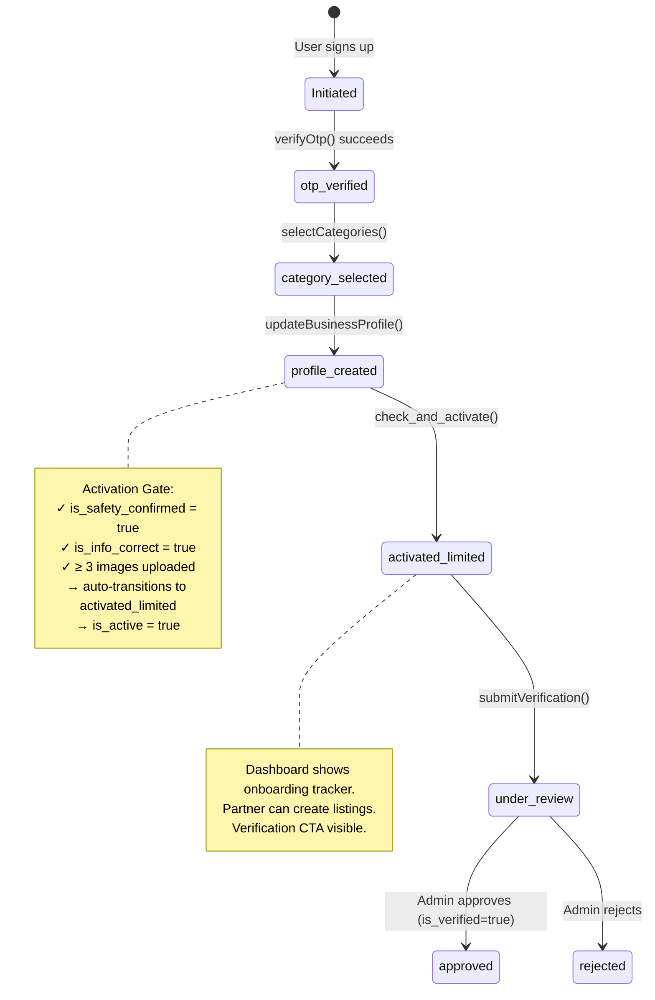
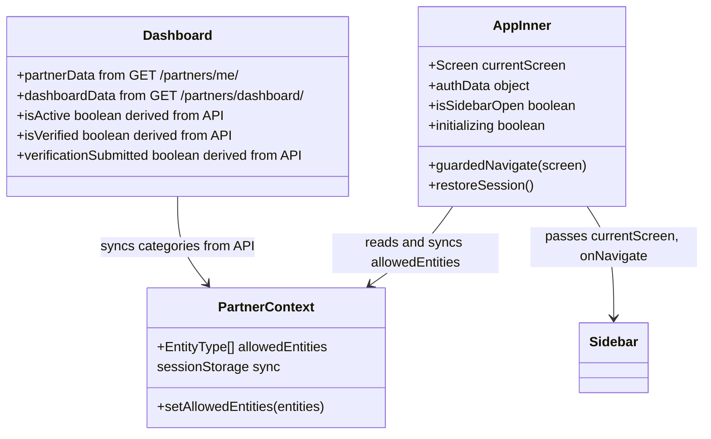

# TLB Partner Portal — Implementation Graph

> **Definitive architectural reference for the TLB Partner Portal.**
> Base URL: `https://tlb-api.reluconsultancy.in`
> Framework: React + Vite + TypeScript (SPA)

---

## 1. Project Structure

```
src/
├── api/
│   ├── client.ts           # Centralized fetch wrapper, auth headers, 401 refresh
│   ├── auth.ts             # requestOtp, verifyOtp, getCurrentUser, logout
│   ├── onboarding.ts       # All partner CRUD endpoints (profile, media, categories, etc.)
│   └── listings.ts         # Listings + ticket + media CRUD, draft ID helpers, ApiError class
├── context/
│   └── PartnerContext.tsx   # Global context: allowedEntities (synced to sessionStorage)
├── components/
│   ├── Navigation.tsx       # Sidebar component
│   └── EntityPickerSheet.tsx# Bottom sheet for entity type selection
├── screens/
│   ├── auth/               # Landing, Login, OTPVerify, PartnerAccess, PartnerAccessOTP, PartnerCategory
│   ├── onboarding/         # Registration, AppSubmitted, AppApproved, AgreementSubmit, IdentityVerification, BankSetup, OnboardingComplete
│   ├── dashboard/          # Dashboard (Home)
│   ├── profile/            # BrandProfile (EditProfile), PreviewProfile
│   ├── services/           # ServiceListings, CreateListing* (5 steps)
│   ├── events/             # CreateEvent* (4 steps) + __tests__/
│   ├── programs/           # CreateProgram* (5 steps)
│   ├── venues/             # CreateVenue* (5 steps)
│   ├── enquiries/          # Enquiries, ProgramEnquiries
│   ├── attendees/          # Attendees
│   ├── packages/           # Packages
│   └── financial/          # FinancialHub
├── test/
│   ├── setup.ts            # MSW server lifecycle, jest-dom, cleanup hooks
│   └── msw/
│       ├── handlers.ts     # Default MSW handlers for all API endpoints + shared fixtures
│       └── server.ts       # setupServer(...handlers)
├── data/
│   └── mockData.ts         # ⚠️ LEGACY — no longer imported anywhere
├── types.ts                # Screen enum, EntityType, shared interfaces
├── App.tsx                 # Root: session restore, routing, route guards
└── main.tsx                # Entry point
```

---

## 2. API Infrastructure

### 2.1 API Client (`src/api/client.ts`)

Central fetch wrapper used by ALL API calls.

| Feature | Implementation |
|---------|---------------|
| **Base URL** | `https://tlb-api.reluconsultancy.in` |
| **Auth Header** | `Authorization: Bearer <access_token>` on every request |
| **Content-Type** | `application/json` (auto-skipped for `FormData` uploads) |
| **401 Auto-Refresh** | On 401 → `POST /api/v1/auth/refresh-token/` → retry original request |
| **Token Storage** | `access_token` and `refresh_token` in `localStorage` |
| **Logout** | `clearTokens()` removes both tokens from localStorage |

**Token Refresh Flow:**
```
Request → 401 Unauthorized?
  ├─ YES → POST /auth/refresh-token/ with { refresh_token }
  │   ├─ 200 → save new access_token → retry original request
  │   └─ 401 → clearTokens() → return failed response
  └─ NO → return response
```

### 2.2 Auth API (`src/api/auth.ts`)

| Function | Method | Endpoint | Payload | Used By |
|----------|--------|----------|---------|---------|
| `requestOtp` | POST | `/api/v1/auth/request-otp/` | `{ identifier, identifier_type }` | Login, PartnerAccess, **OTPVerify (Resend)** |
| `verifyOtp` | POST | `/api/v1/auth/verify-otp/` | `{ identifier, otp, role: "partner" }` | OTPVerify, PartnerAccessOTP |
| `getCurrentUser` | GET | `/api/v1/auth/me/` | — | (available, not actively used) |
| `logout` | POST | `/api/v1/auth/logout/` | `{ refresh_token }` | Sidebar logout |

### 2.3 Listings API (`src/api/listings.ts`)

**Events:**

| Function | Method | Endpoint | Payload | Used By |
|----------|--------|----------|---------|---------|
| `getEventMetaCategories` | GET | `/api/v1/listings/events/metadata/categories/` | — | CreateEventDetails |
| `getEventMetaFormats` | GET | `/api/v1/listings/events/metadata/formats/` | — | CreateEventDetails |
| `getEventMetaAgeGroups` | GET | `/api/v1/listings/events/metadata/age-groups/` | — | CreateEventDetails |
| `getEventListings` | GET | `/api/v1/partners/listings/events/` | — | ServiceListings |
| `getListingDetail` | GET | `/api/v1/partners/listings/events/<id>/` | — | All event wizard steps, Preview |
| `createEventDraft` | POST | `/api/v1/partners/listings/events/` | `{ title?, description? }` | CreateEventDetails (Step 1) |
| `updateListing` | PATCH | `/api/v1/partners/listings/events/<id>/` | Partial event fields | Steps 1 & 2 |
| `submitListing` | POST | `/api/v1/partners/listings/events/<id>/submit/` | — | CreateEventPreview (Step 4) |
| `getListingMedia` | GET | `/api/v1/partners/listings/events/<id>/media/` | — | CreateEventMedia |
| `uploadListingMedia` | POST | `/api/v1/partners/listings/events/<id>/media/` | FormData (file, media_type) | CreateEventMedia |
| `deleteListingMedia` | DELETE | `/api/v1/partners/listings/events/<id>/media/<mid>/` | — | CreateEventMedia |
| `getTickets` | GET | `/api/v1/partners/listings/events/<id>/tickets/` | — | CreateEventSchedule |
| `createTicket` | POST | `/api/v1/partners/listings/events/<id>/tickets/` | `{ name, price, total_quantity, description? }` | CreateEventSchedule |
| `updateTicket` | PUT | `/api/v1/partners/listings/events/<id>/tickets/<tid>/` | Partial ticket fields | CreateEventSchedule |
| `deleteTicket` | DELETE | `/api/v1/partners/listings/events/<id>/tickets/<tid>/` | — | CreateEventSchedule |

> **Event media field:** `file_url` (not `url`) — response shape: `{ id, file_url, media_type }`

**Venues:**

| Function | Method | Endpoint | Payload | Used By |
|----------|--------|----------|---------|---------|
| `getVenueListings` | GET | `/api/v1/partners/listings/venues/` | — | ServiceListings |
| `getVenueListingDetail` | GET | `/api/v1/partners/listings/venues/<id>/` | — | All venue wizard steps, Preview |
| `createVenueListing` | POST | `/api/v1/partners/listings/venues/` | `{ title }` | CreateVenueDetails (Step 1) |
| `updateVenueListing` | PATCH | `/api/v1/partners/listings/venues/<id>/` | Partial venue fields | Steps 1 & 2 |
| `uploadVenueMedia` | POST | `/api/v1/partners/listings/venues/<id>/media/` | FormData (file, media_type) | CreateVenueDetails |
| `deleteVenueMedia` | DELETE | `/api/v1/partners/listings/venues/<id>/media/<mid>/` | — | CreateVenueDetails |
| `getVenueMetaOccasions` | GET | `/api/v1/listings/venues/meta/occasions/` | — | CreateVenueOccasions |
| `getVenueMetaDiscoveryEnums` | GET | `/api/v1/listings/venues/meta/discovery-enums/` | — | CreateVenueOccasions |
| `updateVenueDiscovery` | PUT | `/api/v1/partners/listings/venues/<id>/discovery/` | `{ outing_types, activity_types, format_types }` | CreateVenueOccasions |
| `getVenueAttendeeFields` | GET | `/api/v1/partners/listings/venues/<id>/attendee-fields/` | — | CreateVenueOccasions |
| `updateVenueAttendeeFields` | PUT | `/api/v1/partners/listings/venues/<id>/attendee-fields/` | `string[]` (field keys) | CreateVenueOccasions |
| `getVenueAvailability` | GET | `/api/v1/partners/listings/venues/<id>/availability/` | — | CreateVenueAvailability |
| `createVenueAvailabilitySlot` | POST | `/api/v1/partners/listings/venues/<id>/availability/` | `{ date, start_time, end_time, note? }` | CreateVenueAvailability |
| `deleteVenueAvailabilitySlot` | DELETE | `/api/v1/partners/listings/venues/<id>/availability/<sid>/` | — | CreateVenueAvailability |
| `getVenuePackages` | GET | `/api/v1/partners/listings/venues/<id>/packages/` | — | CreateVenuePackages |
| `createVenuePackage` | POST | `/api/v1/partners/listings/venues/<id>/packages/` | `{ name, price, description, duration_minutes?, max_guests? }` | CreateVenuePackages |
| `updateVenuePackage` | PATCH | `/api/v1/partners/listings/venues/<id>/packages/<pid>/` | Partial package fields | CreateVenuePackages |
| `deleteVenuePackage` | DELETE | `/api/v1/partners/listings/venues/<id>/packages/<pid>/` | — | CreateVenuePackages |

> **Venue media field:** `url` (not `file_url`) — response shape: `{ id, url, media_type }`  
> **Venue detail response** includes all sub-resources inline: `media`, `availability`, `packages`, `discovery`, `occasions`, `required_attendee_fields` — Preview uses a single `getVenueListingDetail` call.

**Draft ID Helpers (sessionStorage):**

| Function | Key | Purpose |
|----------|-----|---------|
| `getCurrentDraftId()` | `current_event_draft_id` | Read active event draft ID |
| `setCurrentDraftId(id)` | `current_event_draft_id` | Save event draft ID after create |
| `clearCurrentDraftId()` | `current_event_draft_id` | Clear on submit or cancel |
| `getCurrentVenueDraftId()` | `current_venue_draft_id` | Read active venue draft ID |
| `setCurrentVenueDraftId(id)` | `current_venue_draft_id` | Save venue draft ID after create |
| `clearCurrentVenueDraftId()` | `current_venue_draft_id` | Clear on submit or cancel |

### 2.4 Partner API (`src/api/onboarding.ts`)

| Function | Method | Endpoint | Payload | Used By |
|----------|--------|----------|---------|---------|
| `getPartnerCategories` | GET | `/api/v1/partners/categories/` | — | PartnerCategory |

| `selectCategories` | POST | `/api/v1/partners/select-categories/` | `{ categories: string[] }` | PartnerCategory |
| `getBusinessProfile` | GET | `/api/v1/partners/profile/` | — | BrandProfile, Registration |
| `updateBusinessProfile` | POST | `/api/v1/partners/profile/` | Profile fields (JSON) | Registration, BrandProfile |
| `getExtendedProfile` | GET | `/api/v1/partners/extended-profile/` | — | BrandProfile |
| `updateExtendedProfile` | POST | `/api/v1/partners/extended-profile/` | FormData (bio, logo, etc.) | BrandProfile (edit mode) |
| `getPartnerMedia` | GET | `/api/v1/partners/media/` | — | Registration, BrandProfile |
| `uploadPartnerMedia` | POST | `/api/v1/partners/media/` | FormData (file, media_type) | Registration, BrandProfile |
| `deletePartnerMedia` | DELETE | `/api/v1/partners/media/{id}/` | — | Registration, BrandProfile |
| `getCurrentPartner` | GET | `/api/v1/partners/me/` | — | **App.tsx** (session restore), Dashboard, Registration, **FinancialHub** |
| `getPartnerDashboard` | GET | `/api/v1/partners/dashboard/` | — | Dashboard |
| `activatePartner` | POST | `/api/v1/partners/activate/` | `{ is_active: true }` | (available, not actively used) |
| `submitVerification` | POST | `/api/v1/partners/verification/` | PAN, bank, agreement | AgreementSubmit |

---

## 3. Session Persistence & Routing (`App.tsx`)

### 3.1 Session Restore Flow (on page load / refresh)

```
App mounts → restoreSession()
  │
  ├─ access_token in localStorage?
  │   └─ YES → GET /partners/me/ → route by status (apiClient handles 401 refresh)
  │
  ├─ NO access_token, but refresh_token exists?
  │   └─ POST /auth/refresh-token/
  │       ├─ 200 → save new access_token → GET /partners/me/ → route by status
  │       └─ 401 → clearTokens() → LANDING
  │
  └─ No tokens at all → LANDING
```

### 3.2 Status → Screen Mapping

| Partner Status | Screen Routed To | Notes |
|---------------|------------------|-------|
| `otp_verified` | `PARTNER_CATEGORY` | Must select categories first |
| `category_selected` | `REGISTRATION` | Must complete profile |
| `profile_created` | `HOME` | Needs ≥3 images for activation |
| `activated_limited` | `HOME` | Can submit verification |
| `under_review` | `HOME` | Waiting for admin |
| `approved` | `HOME` | Fully verified |
| No token / invalid | `LANDING` | Login required |

### 3.3 Route Guard

`guardedNavigate()` checks `routes[screen].requiresEntities` before allowing navigation. If the partner doesn't have the required entity type, they're redirected to `HOME`.

### 3.4 Logout

Navigating to `LANDING` triggers `clearTokens()` + `sessionStorage.clear()`.

---

## 4. Token & Storage Map

| Key | Storage | Set By | Read By |
|-----|---------|--------|---------| 
| `access_token` | localStorage | OTPVerify, PartnerAccessOTP, token refresh | `apiClient` (every request) |
| `refresh_token` | localStorage | OTPVerify, PartnerAccessOTP | `apiClient` (on 401), App.tsx (session restore) |
| `allowedEntities` | sessionStorage | PartnerContext (synced from API) | PartnerContext, Sidebar, route guards |
| `pan_number` / `gst_number` | sessionStorage | IdentityVerification | BankSetup |
| `current_event_draft_id` | sessionStorage | `setCurrentDraftId()` in Step 1 (or Edit action) | All 4 event wizard steps |
| `current_venue_draft_id` | sessionStorage | `setCurrentVenueDraftId()` in Step 1 (or Edit action) | All 5 venue wizard steps |

> **Note:** `partner_is_active` and `verification_submitted` sessionStorage keys have been **removed**. The Dashboard derives all flags from the API `status` field.

---

## 5. Partner Status State Machine



### Activation Gate (Backend Logic)

After `POST /api/v1/partners/profile/`, the backend calls `check_and_activate()`:

```
IF status == "profile_created"
   AND is_safety_confirmed == true
   AND is_info_correct == true
   AND image_count >= 3
THEN
   status → "activated_limited"
   is_active → true
```

**Frontend enforces this** by requiring ≥3 images in `Registration.tsx` before allowing form submission.

---

## 6. Screen-by-Screen API Integration

### 6.1 Auth Flow

| Screen | API Calls | Behavior |
|--------|-----------|----------|
| **Landing** | — | Static landing page with `tlbAppIcon.png` footer + dark strip (Platform / Company links / copyright) |
| **PartnerAccess** | — | Collects email/phone for OTP |
| **PartnerAccessOTP** | `requestOtp()` → `verifyOtp()` | Saves tokens to localStorage, navigates to `PARTNER_CATEGORY` (new user) |
| **OTPVerify** | `verifyOtp()` on submit; `requestOtp()` on resend | 30-second countdown timer. Displays "Resend in 00:XX" while counting. At 0, shows "Resend OTP" button that calls `requestOtp()` with original `authData`, resets OTP inputs, restarts timer. Saves tokens, navigates to `HOME`. |
| **PartnerCategory** | `getPartnerCategories()` → `selectCategories()` | Fetches available categories, submits selection, navigates to `REGISTRATION` |

### 6.2 Onboarding Flow

| Screen | API Calls | Behavior |
|--------|-----------|----------|
| **Registration** | `getBusinessProfile()`, `getPartnerMedia()` on mount; `uploadPartnerMedia()`, `deletePartnerMedia()` for images; `updateBusinessProfile()` on submit; `getCurrentPartner()` after submit | Validates ≥3 images before submit. After profile save, checks if backend auto-activated partner. |
| **AgreementSubmit** | `submitVerification()` | Client-side regex validation (PAN: `^[A-Z]{5}[0-9]{4}[A-Z]$`, IFSC: `^[A-Z]{4}0[A-Z0-9]{6}$`, Account: `^\d{9,18}$`). Toast notifications for validation errors. Transitions to `under_review`. |
| **AppSubmitted** | — | Static confirmation page |
| **AppApproved** | — | Static confirmation page |

### 6.3 Dashboard

| API Call | Purpose |
|----------|---------|
| `getCurrentPartner()` | Gets partner status, categories, profile data. Derives `isActive`, `isVerified`, `verificationSubmitted` from `status` field. |
| `getPartnerDashboard()` | Gets dashboard metrics and analytics data. Only succeeds for `activated_limited+`. |
| `getBusinessProfile()` | Used for profile completion calculation (business name, social links) |
| `getExtendedProfile()` | Used for profile completion calculation (bio, contact, logo, cover, address) |
| `getPartnerMedia()` | Used for profile completion calculation (gallery images) |

**Dashboard Analytics Sections (entity-conditional):**

All chart data reads from `dashboardData` API fields first, then falls back to zeros with empty states.

| Section | Shown When | API Fields Consumed |
|---------|------------|---------------------|
| KPI Cards (4) with sparklines + trend % | Always | `new_enquiries`, `active_batches`, `profile_views`, `credit_balance`, `upcoming_events`, `tickets_sold`, `venue_bookings`, `occupancy_rate`, `weekly_*` arrays |
| Weekly Activity bar chart | Always | `weekly_activity` (7-element array) |
| Enquiry Funnel donut + conversion stats | Classes or Programs | `funnel_new`, `funnel_contacted`, `funnel_converted`, `trial_requests`, `avg_response_time`, `retention_rate`, `monthly_enrolments` |
| Monthly Enquiry Trend area chart | Classes or Programs | `monthly_enquiries` (6-element array) |
| Event Analytics stats grid | Events | `upcoming_events`, `tickets_sold`, `total_registrations`, `event_reach`, `engagement_rate`, `booking_conversion` |
| Ticket Sales Trend area chart | Events | `monthly_tickets` (6-element array) |
| Venue Occupancy donut + booking stats | Venues | `venue_bookings`, `occupancy_rate`, `upcoming_reservations`, `monthly_earnings`, `avg_booking_hours`, `repeat_clients` |
| Venue Revenue Trend area chart | Venues | `monthly_revenue` (6-element array) |
| 6-month Trend chart (universal) | Always | Adapts to `monthly_enquiries` / `monthly_tickets` / `monthly_revenue` by entity type |
| Top Performing Listings | When `top_listings` array is non-empty | `top_listings[].{id, title, listing_type, views}` |
| Recent Activity feed | When `recent_activity` array is non-empty | `recent_activity[].{title, description, time}` |
| Profile Performance card | Always | `profile_views`, `credit_balance` + computed `profileCompletion` |

**Chart Primitives (pure SVG, no external library):**

| Component | Type | Used In |
|-----------|------|---------|
| `AreaSparkline` | Sparkline with gradient fill | KPI card bottoms |
| `TrendAreaChart` | Full-width area chart with labeled x-axis | Monthly trend sections |
| `WeeklyBarChart` | 7-bar activity chart with variable opacity | Weekly activity section |
| `DonutChart` | Segmented ring with center label | Enquiry funnel, Venue occupancy |

**Dashboard Footer:** Dark (`bg-tlb-dark`) full-width footer appended below main content. Contains `tlbAppIcon.png` (w-14 h-14), tagline, contact details (email + phone), Platform section (Events / Classes / Venues), and copyright. The outer wrapper no longer has `pb-24` padding so no white gap appears below the footer.

**Dashboard State Flags (all API-driven):**

| Flag | Source | Purpose |
|------|--------|---------|
| `isActive` | `is_active` or status ∈ `{activated_limited, under_review, approved}` | Shows onboarding tracker |
| `isVerified` | `is_verified` or status = `approved` | Hides tracker entirely |
| `verificationSubmitted` | status ∈ `{under_review, approved}` | Shows review-pending step |
| `partnerStatus` | `status` field | Raw backend status |

**Redirect logic:** If status is `otp_verified` → `PARTNER_CATEGORY`. If `category_selected` → `REGISTRATION`.

### 6.4 Brand Profile (`EditProfile.tsx`)

| API Call | Purpose |
|----------|---------|
| `getBusinessProfile()` | Loads business name, social links |
| `getExtendedProfile()` | Loads bio, contact, logo, cover, operating cities |
| `getPartnerMedia()` | Loads portfolio images/videos |
| `updateExtendedProfile(FormData)` | Saves bio, contact, logo, cover, operating cities |
| `uploadPartnerMedia(file, type)` | Uploads gallery images (max 5, 5MB) or video (max 1, 100MB) |
| `deletePartnerMedia(id)` | Removes gallery item |

### 6.5 Preview Profile (`PreviewProfile.tsx`)

| API Call | Purpose |
|----------|---------|
| `getBusinessProfile()` | Business name, social links for public view |
| `getExtendedProfile()` | Bio, contact, logo, cover |
| `getPartnerMedia()` | Gallery images/videos |

### 6.6 Service Listings (`ServiceListings.tsx`)

| API Call | Purpose |
|----------|---------|
| `getEventListings()` | Fetches all event listings |
| `getVenueListings()` | Fetches all venue listings |

Both calls run in parallel via `Promise.allSettled`. Items are tagged with `entityType` **at fetch time** (not derived from `listing_type`) — venues always get `'Venues'`, events always get `'Events'`. Cover URL: events use `cover_url`, venues use `cover` — normalized as `item.cover_url || item.cover`.

**Edit flow:** Clicking Edit on an Event sets `current_event_draft_id` + routes to `CREATE_EVENT_DETAILS`. Clicking Edit on a Venue sets `current_venue_draft_id` + routes to `CREATE_VENUE_DETAILS`. Edit is disabled **only** for `published` listings — `pending` (In Review), `draft`, and `rejected` are all editable.  
**New listing:** `clearCurrentDraftId()` + `clearCurrentVenueDraftId()` both called before navigating to any wizard start screen.

**Listing card layout:** Status badge (`Draft` / `In Review` / `Live` / `Rejected`) rendered on the **right side** of each card header row, opposite the entity type badge. Status data is sourced from the `getListings()` API response `status` field.

**Filter bottom sheet:**

| Feature | Detail |
|---------|--------|
| Trigger | Filter button in search row; shows active badge count (yellow dot) when filters are applied |
| Status filter | Draft, In Review, Live, Rejected — multi-select toggle chips |
| Listing Type filter | Shows only the partner's `allowedEntities` — multi-select toggle chips |
| Sort By | Newest First, Oldest First, A→Z, Z→A — single-select |
| State pattern | Temp state (`tmpStatuses`, `tmpTypes`, `tmpSort`) initialized from committed state on open; committed only on **Apply**; Reset clears temp without closing |
| Active count | `filterStatuses.length + filterTypes.length + (sortBy !== 'newest' ? 1 : 0)` |

### 6.7 Event Creation Wizard (`src/screens/events/`) — Fully API-Integrated

Theme color: `blue`. All wizard screens use `themeColor="blue"`.

| Step | Screen | API Calls | Key Behavior |
|------|--------|-----------|--------------|
| 1 | **CreateEventDetails** | `getEventMetaCategories`, `getEventMetaFormats`, `getEventMetaAgeGroups` (on mount, parallel); `getListingDetail` (on mount if draft exists); `createEventDraft` + `updateListing` (on Next) | Fetches dynamic categories/formats/age-groups from API. Age group chips render `{r.min_age}–{r.max_age} yrs` (API returns `StaticRange` objects with no `label` field). Pre-fills from existing draft if `current_event_draft_id` is set. Mode-conditional: city/area/address (offline/hybrid), meeting link (online/hybrid). |
| 2 | **CreateEventSchedule** | `getListingDetail` (on mount); `updateListing` (schedule + price_type + capacity); ticket CRUD on Next | Date+time inputs combined to ISO 8601 before sending. Warns on price_type switch (clears tickets on backend). Free: capacity only. Paid: ticket CRUD — creates new, updates dirty, deletes removed, all on Next click. |
| 3 | **CreateEventMedia** | `getListingMedia` (on mount); `uploadListingMedia`, `deleteListingMedia` (immediate on change) | Cover upload replaces existing (delete-then-upload). Gallery up to 10 images, 5MB each. Video up to 100MB. All media ops are immediate (no batch on Next). Warns if no cover (required for submit). Media items have `file_url` field. |
| 4 | **CreateEventPreview** | `getListingDetail` (on mount); `submitListing` (on Publish) | Renders full event from API. Client-side readiness check mirrors all backend submit requirements. Submit → `clearCurrentDraftId()` → navigate to `SERVICE_LISTINGS`. Non-draft events show locked state. |

### 6.8 Venue Creation Wizard (`src/screens/venues/`) — Fully API-Integrated

Theme color: `amber`. All wizard screens use `themeColor="amber"`.

| Step | Screen | API Calls | Key Behavior |
|------|--------|-----------|--------------|
| 1 | **CreateVenueDetails** | `getVenueListingDetail` (on mount if draft exists); `createVenueListing` or `updateVenueListing` (on Next); `uploadVenueMedia`, `deleteVenueMedia` (immediate) | Location fields: `location_type` (chip select), `city`, `area`, `address`, `latitude`, `longitude`. Capacity: `min_capacity`, `max_capacity`. Age range: `min_age`, `max_age`. Media items have `url` field (not `file_url`). Optional fields are only included in PATCH if non-empty. |
| 2 | **CreateVenueOccasions** | `getVenueMetaOccasions`, `getVenueMetaDiscoveryEnums`, `getVenueListingDetail`, `getVenueAttendeeFields` (on mount, parallel via `Promise.allSettled`); `updateVenueListing` + `updateVenueDiscovery` + `updateVenueAttendeeFields` (3 calls on Next) | Occasions sent as `occasion_ids: number[]` (integer IDs, not names). Discovery: `outing_types`, `activity_types`, `format_types` chip multi-select. Attendee fields: `child_name`, `child_age`, `contact_number`, `email`, `guest_count`, `special_requirements`. |
| 3 | **CreateVenueAvailability** | `getVenueAvailability` (on mount); `createVenueAvailabilitySlot` (on Add); `deleteVenueAvailabilitySlot` (on Delete) | Inline add form: `date`, `start_time`, `end_time`, `note?`. Validates end > start. Requires ≥1 slot before proceeding to Step 4. |
| 4 | **CreateVenuePackages** | `getVenuePackages` (on mount); `createVenuePackage` or `updateVenuePackage` (dirty packages on Next); `deleteVenuePackage` (on Delete) | Package fields: `name` (required), `price`, `description`, `duration_minutes?`, `max_guests?`. Optional fields omitted from payload if blank or < 1. Dirty tracking: only changed packages are saved on Next. |
| 5 | **CreateVenuePreview** | `getVenueListingDetail` (single call — returns all sub-resources inline) | Venue detail response includes `media`, `availability`, `packages`, `discovery`, `occasions`, `required_attendee_fields` — no extra fetches needed. Cover = `media.find(m => m.media_type === 'cover')`, gallery = `media.filter(m => m.media_type === 'gallery')`. Readiness check: `title`, `city`, `address`, `subcategory`. Submit → `clearCurrentVenueDraftId()` → navigate to `SERVICE_LISTINGS`. |

### 6.9 Enquiries — `Enquiries.tsx` / `ProgramEnquiries.tsx`

Both screens have **no API yet** but all hardcoded mock data has been removed.

| Field | Behaviour |
|-------|-----------|
| `leads` state | Starts as `[]` — populated from API when endpoint is available |
| Empty state | Table body renders an Inbox icon + "No enquiries yet" across all columns |
| Credits banner | Label reads "Credits Remaining" — no hardcoded number |
| Unlock / Status / Notes | All local-state mutations remain; will delegate to API when wired |

### 6.10 Financial Hub — `FinancialHub.tsx`

Partially API-integrated: bank account details are fetched from the partner profile.

| On mount | `getCurrentPartner()` → `/api/v1/partners/me/` |
|---|---|
| Bank extraction | Reads `partner.bank_account`, `partner.verification`, or root-level fields defensively |
| Card display | Account holder name + masked account number (last 4 digits), IFSC |
| `isKycVerified` | Derived from `partner.status === 'approved'` |
| Button label | "Add Bank" when no account on file, "Update Bank" when loaded |
| Bank modal | Pre-fills existing account holder name and IFSC |

**Not yet wired (awaiting financial API):**

| Section | Current State |
|---------|---------------|
| Stat cards (Earned / Commission / Pending) | Show `—` placeholder |
| Transaction History | Empty state ("No transactions yet") |
| UPI ID | Modal UI only, no API |

### 6.11 Screens NOT Yet API-Integrated

| Screen Group | Status | Notes |
|-------------|--------|-------|
| **Create Class** (5 steps) | Local state only | Awaiting class listing API endpoints |
| **Create Program** (5 steps) | Local state only | Awaiting program listing API endpoints |
| **Enquiries** / **ProgramEnquiries** | Empty state, no mock data | Awaiting enquiry API endpoints |
| **Attendees** | Empty state UI | No attendees API — mock data removed, starts with `[]` |
| **Packages** | Placeholder UI | No packages API |
| **FinancialHub** (transactions) | Empty state, no mock data | Bank details fetched; financial API pending |

---

## 7. State Management



---

## 8. Validation Rules (AgreementSubmit)

| Field | Regex | Example | Frontend | Backend |
|-------|-------|---------|----------|---------|
| PAN Number | `^[A-Z]{5}[0-9]{4}[A-Z]$` | `ABCDE1234F` | ✅ Real-time | ✅ |
| IFSC Code | `^[A-Z]{4}0[A-Z0-9]{6}$` | `SBIN0001234` | ✅ Real-time | ✅ |
| Account Number | `^\d{9,18}$` | `123456789012` | ✅ Real-time | ✅ |
| GST Number | max 15 chars | `22AAAAA0000A1Z5` | Optional | Optional |

**Error Display:** Toast notifications (slide-in from top, auto-dismiss 5s). Backend structured errors are parsed field-by-field.

---

## 9. Media Upload Constraints

| Type | Formats | Max Size | Max Count | Enforcement |
|------|---------|----------|-----------|-------------|
| Image | jpg, jpeg, png | 5 MB | 5 images | Frontend + Backend |
| Video | mp4, mov | 100 MB | 1 video | Frontend + Backend |
| Logo | image/* | — | 1 | Extended profile |
| Cover | image/* | — | 1 | Extended profile |

---

## 10. Design System

| Token | Value | Usage |
|-------|-------|-------|
| `--tlb-yellow` | `#F5C518` | Primary brand color, buttons, highlights |
| `--tlb-dark` | `#1A1A1A` | Dark text, dark backgrounds |
| `.tlb-button` | Yellow bg, dark text, rounded-2xl | All CTAs |
| `.tlb-card` | White bg, gray border, rounded-2xl | Content cards |
| `.tlb-input` | Gray-50 bg, rounded-xl, p-4 | All form inputs |
| `.tlb-content` | max-w-2xl mx-auto | Content container |

---

## 11. Route Configuration

| Screen | Sidebar | Entity Restriction | Component | API Status |
|--------|---------|-------------------|-----------|------------|
| LANDING | ❌ | — | Landing | Static |
| LOGIN | ❌ | — | Login | ✅ requestOtp |
| OTP_VERIFY | ❌ | — | OTPVerify | ✅ verifyOtp |
| PARTNER_ACCESS | ❌ | — | PartnerAccess | Static |
| PARTNER_ACCESS_OTP | ❌ | — | PartnerAccessOTP | ✅ requestOtp, verifyOtp |
| PARTNER_CATEGORY | ❌ | — | PartnerCategory | ✅ getPartnerCategories, selectCategories |
| REGISTRATION | ❌ | — | Registration | ✅ updateBusinessProfile, media CRUD, getCurrentPartner |
| APP_SUBMITTED | ❌ | — | AppSubmitted | Static |
| APP_APPROVED | ❌ | — | AppApproved | Static |
| AGREEMENT_SUBMIT | ❌ | — | AgreementSubmit | ✅ submitVerification |
| IDENTITY_VERIFICATION | ❌ | — | IdentityVerification | Local state |
| BANK_SETUP | ❌ | — | BankSetup | Local state |
| ONBOARDING_COMPLETE | ❌ | — | OnboardingComplete | Static |
| HOME | ✅ | — | Dashboard | ✅ getCurrentPartner, getPartnerDashboard |
| BRAND_PROFILE | ✅ | — | BrandProfile | ✅ Full profile CRUD |
| PREVIEW_PROFILE | ✅ | — | PreviewProfile | ✅ Profile read |
| SERVICE_LISTINGS | ✅ | — | ServiceListings | ✅ getEventListings + getVenueListings (tagged at fetch, parallel) |
| CREATE_LISTING_* (5) | ✅/❌ | — | Class wizard | ❌ Local only |
| CREATE_EVENT_DETAILS | ✅/❌ | — | CreateEventDetails | ✅ Meta + draft create/update (theme: blue) |
| CREATE_EVENT_SCHEDULE | ✅/❌ | — | CreateEventSchedule | ✅ Schedule + tickets CRUD (theme: blue) |
| CREATE_EVENT_MEDIA | ✅/❌ | — | CreateEventMedia | ✅ Cover/gallery/video upload (theme: blue) |
| CREATE_EVENT_PREVIEW | ✅/❌ | — | CreateEventPreview | ✅ Full detail + submit (theme: blue) |
| CREATE_VENUE_DETAILS | ✅/❌ | Venues | CreateVenueDetails | ✅ Location, capacity, age, media |
| CREATE_VENUE_OCCASIONS | ✅/❌ | Venues | CreateVenueOccasions | ✅ Occasion IDs, discovery tags, attendee fields |
| CREATE_VENUE_AVAILABILITY | ✅/❌ | Venues | CreateVenueAvailability | ✅ Slot CRUD |
| CREATE_VENUE_PACKAGES | ✅/❌ | Venues | CreateVenuePackages | ✅ Package CRUD |
| CREATE_VENUE_PREVIEW | ✅/❌ | Venues | CreateVenuePreview | ✅ Single-call detail + submit |
| CREATE_PROGRAM_* (5) | ✅/❌ | — | Program wizard | ❌ Local only |
| ENQUIRIES | ✅ | Classes | Enquiries | ⏳ Empty state (no mock data) |
| PROGRAM_ENQUIRIES | ✅ | Programs | ProgramEnquiries | ⏳ Empty state (no mock data) |
| ATTENDEES | ✅ | — | Attendees | ❌ Placeholder |
| PACKAGES | ✅ | — | Packages | ❌ Placeholder |
| FINANCIAL_HUB | ✅ | — | FinancialHub | ⚡ Partial — bank details from `getCurrentPartner` |

---

## 12. What's Done vs What's Needed

### ✅ Fully Integrated (API-Driven)

- Auth flow (OTP request → verify → JWT tokens)
- **OTPVerify resend** — 30s countdown; "Resend OTP" button at 0 calls `requestOtp()` with original identifier, resets OTP inputs and restarts timer
- Session persistence (survives refresh, auto-refreshes expired tokens)
- Category selection
- Business profile creation & editing
- Extended profile (bio, logo, cover, contact, cities)
- Partner media CRUD (images/videos with limits)
- Activation gate enforcement (≥3 images + safety flags)
- Verification submission (PAN, IFSC, bank, agreement)
- Dashboard (status, onboarding tracker, profile completion computed client-side from 10 fields)
- Brand Profile view/edit mode
- Public profile preview
- **Service Listings** — parallel fetch (events + venues), entity type tagged at fetch time, edit locked only for `published`
- **Event Creation Wizard (4 steps)** — full lifecycle: draft create → field update → media upload → ticket CRUD → submit for review (theme: blue)
- **Venue Creation Wizard (5 steps)** — full lifecycle: draft create → location/capacity/media → occasions/discovery/attendee fields → availability slots → packages → preview + submit (theme: amber)

### ⚡ Partially Integrated

- **FinancialHub** — bank account details (name, masked number, IFSC, verified status) fetched from `getCurrentPartner()`. Stat cards and transaction history show empty state pending financial API.

### ⏳ UI Ready — Awaiting Backend Endpoints

- **Enquiries** (`ENQUIRIES`) — full table + slide-out panel UI, starts empty; needs `GET /api/v1/partners/enquiries/`
- **ProgramEnquiries** (`PROGRAM_ENQUIRIES`) — same pattern; needs `GET /api/v1/partners/program-enquiries/`
- **FinancialHub** (transactions) — needs `GET /api/v1/partners/financial/transactions/`
- Class/Program listing create/update/submit endpoints

### ⚠️ Needs Both UI and Backend

- `GET /api/v1/partners/attendees/` — Attendee tracking
- `GET /api/v1/partners/packages/` — Package management

### 🧹 Cleanup Done

- ❌ `mockData.ts` — no longer imported anywhere
- ❌ `sessionStorage('partner_is_active')` — removed; backend sets `is_active` at OTP verification
- ❌ `sessionStorage('verification_submitted')` — removed; Dashboard reads from API `status`
- ❌ Hardcoded listings in ServiceListings — replaced with `getListings()` + empty state
- ❌ Static `eventCategories.ts` data in event wizard — replaced with live API metadata
- ❌ `initialLeads` mock array in Enquiries — replaced with `[]` + empty state row
- ❌ `initialLeads` mock array in ProgramEnquiries — replaced with `[]` + empty state row
- ❌ `MOCK_TRANSACTIONS` + hardcoded stats in FinancialHub — replaced with API fetch + `—` placeholders
- ❌ `isKycVerified = true` hardcoded toggle in FinancialHub — derived from `partner.status`
- ❌ Hardcoded `pb-24` on Dashboard wrapper — removed; footer now sits flush at bottom
- ❌ `main-footer.png` footer image — replaced with `tlbAppIcon.png` on both Landing and Dashboard
- ❌ Hardcoded "Resend in 00:45" static text in OTPVerify — replaced with live countdown timer
- ❌ Dashboard as simple 4-card grid — replaced with full analytics dashboard (charts, funnels, trends, activity feed)
- ❌ Status badge in top-left badge group on listing cards — moved to right side of card header
- ❌ Non-functional filter button on ServiceListings — replaced with full bottom sheet filter dialog
- ❌ Hardcoded `MOCK_ATTENDEES` array in Attendees — removed; screen initializes with empty state
- ❌ Wrong event metadata endpoint URLs (`/api/v1/listings/metadata/` → `/api/v1/listings/events/metadata/`)
- ❌ Event wizard theme `purple` → `blue` across all 4 screens
- ❌ Age group chips rendering empty (API `StaticRange` has no `label`) → now renders `{min_age}–{max_age} yrs`
- ❌ Venue wizard used wrong location field (`location` string) → replaced with `location_type`, `city`, `area`, `address`, `latitude`, `longitude`
- ❌ Venue capacity fields `min_guests`/`max_guests` → renamed to `min_capacity`/`max_capacity`
- ❌ Venue occasion selection used string names → now sends integer `occasion_ids`
- ❌ Venue preview made 3+ separate API calls → simplified to single `getVenueListingDetail` (sub-resources inline)
- ❌ Venue media used `file_url` field → corrected to `url`
- ❌ `ServiceListings` derived entity type from `listing_type` (defaulted to Events) → tagged at fetch time per API source
- ❌ Edit button locked for `pending` + `published` → now only locked for `published`

---

## 13. Test Infrastructure

### 13.1 Setup

| File | Purpose |
|------|---------|
| `vitest.config.ts` | Vitest + jsdom + React plugin, `css: false`, globals |
| `src/test/setup.ts` | Imports `@testing-library/jest-dom`, starts/resets/stops MSW server |
| `src/test/msw/handlers.ts` | Default handlers for all API endpoints; exports `DRAFT_ID`, `mockDraft`, `mockCategories`, `mockFormats`, `mockAgeGroups`, `mockListing` |
| `src/test/msw/server.ts` | `setupServer(...handlers)` from msw/node |

### 13.2 Test Files (122 tests — all passing)

| File | Tests | Coverage |
|------|-------|----------|
| `src/api/__tests__/listings.test.ts` | 28 | `ApiError` class, draft ID helpers, all metadata/CRUD/media/ticket endpoints (success + error codes) |
| `src/screens/events/__tests__/CreateEventDetails.test.tsx` | 17 | Metadata loading, draft pre-fill, form interactions (category → subcategories, format toggle, mode fields, age group tabs), Next validation |
| `src/screens/events/__tests__/CreateEventSchedule.test.tsx` | 18 | Draft loading, pricing toggle, ticket add/remove, date validation, Next → updateListing + navigate |
| `src/screens/events/__tests__/CreateEventMedia.test.tsx` | 11 | Media loading, cover display/delete, empty-cover warning, gallery Add button, Next navigation |
| `src/screens/events/__tests__/CreateEventPreview.test.tsx` | 19 | Event detail display, missing fields list, all 3 modal variants (success/under_review/error), modal close → navigate + clear draft ID |
| `src/screens/services/__tests__/ServiceListings.test.tsx` | 29 | Loading, tabs, search filter, Edit → sets draft ID + navigates, Locked for pending/published, Add Listing navigation |

### 13.3 Modal Variant Routing (Critical Test)

`CreateEventPreview` submit error handling is tested for correctness of modal variant selection:

| Condition | Modal Shown | Verified By Test |
|-----------|-------------|-----------------|
| `submitListing` succeeds | `success` — "Event Under Review" (amber) | ✅ |
| API error code === `PARTNER_UNDER_REVIEW` | `under_review` — "Profile Under Review" (purple) | ✅ |
| Any other error code | `error` — "Submission Failed" (red) | ✅ |
| Non-`PARTNER_UNDER_REVIEW` code does NOT show profile modal | — | ✅ |

### 13.4 Run Commands

```bash
npm test           # vitest run (CI mode, single pass)
npm run test:watch # vitest (watch mode)
npm run test:ui    # vitest --ui (browser UI)
```

---

---

## 14. Backend Documentation

| File | Purpose |
|------|---------|
| `docs/event-listings-db-spec.md` | Events module — tables (`events`, `event_tickets`, `event_media`), full column definitions, status lifecycle, existing API alignment, submission readiness rules, media constraints, indexes |
| `docs/class-listings-db-spec.md` | Classes module — tables (`classes`, `class_batches`, `class_media`, `class_faqs`), column definitions, category/tag reference, API endpoints, request/response shapes |
| `docs/program-listings-db-spec.md` | Programs module — tables (`programs`, `program_batches`, `program_media`, `program_faqs`), column definitions, category/tag reference, API endpoints, request/response shapes |
| `docs/venue-listings-db-spec.md` | Venues module — tables (`venues`, `venue_occasions`, `venue_availability`, `venue_packages`, `venue_media`), occasion/time-slot/attendee-field reference, bulk availability pattern, API endpoints |

---

*Last updated: 2026-05-11 — Phase 8 (Event wizard blue theme + age group fix; Venue wizard full API integration — 5 steps; ServiceListings entity tagging + edit lock fix)*
