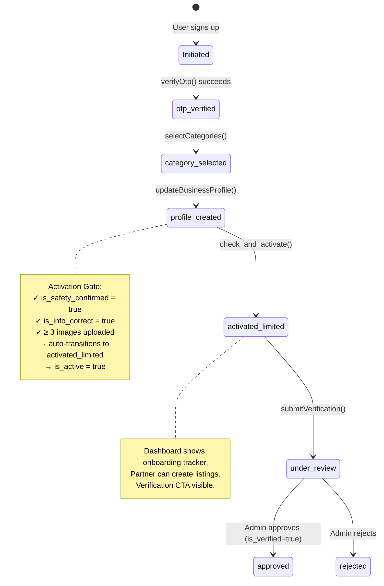
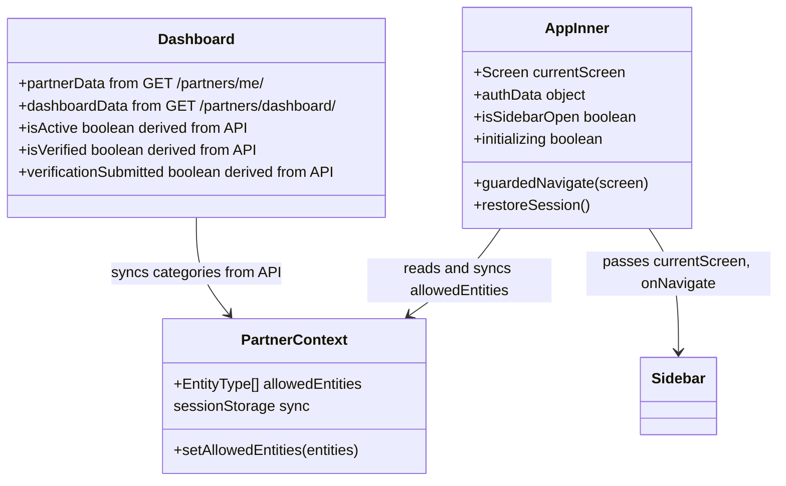

# TLB Partner Portal — Implementation Graph

> **Definitive architectural reference for the TLB Partner Portal.**
> Base URL: `https://tlb-api.reluconsultancy.in`
> Framework: React + Vite + TypeScript (SPA)
> Last Updated: May 21, 2026

---

## 1. Project Structure

```
src/
├── api/
│   ├── client.ts           # Centralized fetch wrapper, auth headers, 401 refresh
│   ├── auth.ts             # requestOtp, verifyOtp, getCurrentUser, logout
│   ├── onboarding.ts       # All partner CRUD endpoints (profile, media, categories, etc.)
│   └── listings.ts         # Listings + ticket + media CRUD, draft ID helpers, ApiError class
├── context/
│   └── PartnerContext.tsx   # Global context: allowedEntities (synced to sessionStorage)
├── components/
│   ├── Navigation.tsx           # Sidebar component (Home, Statistics, Brand Profile, Listings, Attendees, Enquiries, Finance)
│   ├── EntityPickerSheet.tsx    # Bottom sheet for entity type selection
│   └── ui/
│       └── DashboardCharts.tsx  # Shared SVG chart primitives: AreaSparkline, TrendAreaChart, WeeklyBarChart, DonutChart, fmtCurrency, trendPct, TrendBadge
├── screens/
│   ├── auth/               # Landing, Login, OTPVerify, PartnerAccess, PartnerAccessOTP, PartnerCategory
│   ├── onboarding/         # Registration, AppSubmitted, AppApproved, AgreementSubmit, IdentityVerification, BankSetup, OnboardingComplete
│   ├── dashboard/          # Dashboard (Home) — lean layout; analytics moved to Statistics
│   ├── profile/            # BrandProfile (EditProfile), PreviewProfile
│   ├── services/           # ServiceListings (shared dashboard for all entities)
│   ├── classes/            # CreateClass* (5 steps)
│   ├── events/             # CreateEvent* (4 steps) + __tests__/
│   ├── programs/           # CreateProgram* (5 steps)
│   ├── venues/             # CreateVenue* (5 steps)
│   ├── enquiries/          # Enquiries, ProgramEnquiries
│   ├── attendees/          # Attendees — full booking management (list, detail, mark-attended, cancel)
│   ├── statistics/         # Statistics — dedicated analytics/charts screen
│   ├── packages/           # Packages
│   └── financial/          # FinancialHub
├── test/
│   ├── setup.ts            # MSW server lifecycle, jest-dom, cleanup hooks
│   └── msw/
│       ├── handlers.ts     # Default MSW handlers for all API endpoints + shared fixtures
│       └── server.ts       # setupServer(...handlers)
├── data/
│   └── mockData.ts         # ⚠️ LEGACY — no longer imported anywhere
├── types.ts                # Screen enum, EntityType, shared interfaces
├── App.tsx                 # Root: session restore, routing, route guards
└── main.tsx                # Entry point
```

---

## 2. API Infrastructure

### 2.1 API Client (`src/api/client.ts`)

Central fetch wrapper used by ALL API calls.

| Feature | Implementation |
|---------|---------------|
| **Base URL** | `https://tlb-api.reluconsultancy.in` |
| **Auth Header** | `Authorization: Bearer <access_token>` on every request |
| **Content-Type** | `application/json` (auto-skipped for `FormData` uploads) |
| **401 Auto-Refresh** | On 401 → `POST /api/v1/auth/refresh-token/` → retry original request |
| **Token Storage** | `access_token` and `refresh_token` in `localStorage` |
| **Logout** | `clearTokens()` removes both tokens from localStorage |

**Token Refresh Flow:**
```
Request → 401 Unauthorized?
  ├─ YES → POST /auth/refresh-token/ with { refresh_token }
  │   ├─ 200 → save new access_token → retry original request
  │   └─ 401 → clearTokens() → return failed response
  └─ NO → return response
```

### 2.2 Auth API (`src/api/auth.ts`)

| Function | Method | Endpoint | Payload | Used By |
|----------|--------|----------|---------|---------|
| `requestOtp` | POST | `/api/v1/auth/request-otp/` | `{ identifier, identifier_type }` | Login, PartnerAccess, **OTPVerify (Resend)** |
| `verifyOtp` | POST | `/api/v1/auth/verify-otp/` | `{ identifier, otp, role: "partner" }` | OTPVerify, PartnerAccessOTP |
| `getCurrentUser` | GET | `/api/v1/auth/me/` | — | (available, not actively used) |
| `logout` | POST | `/api/v1/auth/logout/` | `{ refresh_token }` | Sidebar logout |

### 2.3 Listings API (`src/api/listings.ts`)

**Events:**

| Function | Method | Endpoint | Payload | Used By |
|----------|--------|----------|---------|---------|
| `getEventMetaCategories` | GET | `/api/v1/listings/events/metadata/categories/` | — | CreateEventDetails |
| `getEventMetaFormats` | GET | `/api/v1/listings/events/metadata/formats/` | — | CreateEventDetails |
| `getEventMetaAgeGroups` | GET | `/api/v1/listings/events/metadata/age-groups/` | — | CreateEventDetails |
| `getEventListings` | GET | `/api/v1/partner/listings/events/` | — | ServiceListings |
| `getListingDetail` | GET | `/api/v1/partner/listings/events/<id>/` | — | All event wizard steps, Preview |
| `createEventDraft` | POST | `/api/v1/partner/listings/events/` | `{ title?, description? }` | CreateEventDetails (Step 1) |
| `updateListing` | PATCH | `/api/v1/partner/listings/events/<id>/` | Partial event fields | Steps 1 & 2 |
| `submitListing` | POST | `/api/v1/partner/listings/events/<id>/submit/` | — | CreateEventPreview (Step 4) |
| `getListingMedia` | GET | `/api/v1/partner/listings/events/<id>/media/` | — | CreateEventMedia |
| `uploadListingMedia` | POST | `/api/v1/partner/listings/events/<id>/media/` | FormData (file, media_type) | CreateEventMedia |
| `deleteListingMedia` | DELETE | `/api/v1/partner/listings/events/<id>/media/<mid>/` | — | CreateEventMedia |
| `getTickets` | GET | `/api/v1/partner/listings/events/<id>/tickets/` | — | CreateEventSchedule |
| `createTicket` | POST | `/api/v1/partner/listings/events/<id>/tickets/` | `{ name, price, total_quantity, description? }` | CreateEventSchedule |
| `updateTicket` | PUT | `/api/v1/partner/listings/events/<id>/tickets/<tid>/` | Partial ticket fields | CreateEventSchedule |
| `deleteTicket` | DELETE | `/api/v1/partner/listings/events/<id>/tickets/<tid>/` | — | CreateEventSchedule |

> **Event media field:** `file_url` (not `url`) — response shape: `{ id, file_url, media_type }`

**Venues:**

| Function | Method | Endpoint | Payload | Used By |
|----------|--------|----------|---------|---------|
| `getVenueListings` | GET | `/api/v1/partner/listings/venues/` | — | ServiceListings |
| `getVenueListingDetail` | GET | `/api/v1/partner/listings/venues/<id>/` | — | All venue wizard steps, Preview |
| `createVenueListing` | POST | `/api/v1/partner/listings/venues/` | `{ title }` | CreateVenueDetails (Step 1) |
| `updateVenueListing` | PATCH | `/api/v1/partner/listings/venues/<id>/` | Partial venue fields | Steps 1 & 2 |
| `uploadVenueMedia` | POST | `/api/v1/partner/listings/venues/<id>/media/` | FormData (file, media_type) | CreateVenueDetails |
| `deleteVenueMedia` | DELETE | `/api/v1/partner/listings/venues/<id>/media/<mid>/` | — | CreateVenueDetails |
| `getVenueMetaOccasions` | GET | `/api/v1/listings/venues/meta/occasions/` | — | CreateVenueOccasions |
| `getVenueMetaDiscoveryEnums` | GET | `/api/v1/listings/venues/meta/discovery-enums/` | — | CreateVenueOccasions |
| `updateVenueDiscovery` | PUT | `/api/v1/partner/listings/venues/<id>/discovery/` | `{ outing_types, activity_types, format_types }` | CreateVenueOccasions |
| `getVenueAttendeeFields` | GET | `/api/v1/partner/listings/venues/<id>/attendee-fields/` | — | CreateVenueOccasions |
| `updateVenueAttendeeFields` | PUT | `/api/v1/partner/listings/venues/<id>/attendee-fields/` | `string[]` (field keys) | CreateVenueOccasions |
| `getVenueAvailability` | GET | `/api/v1/partner/listings/venues/<id>/availability/` | — | CreateVenueAvailability |
| `createVenueAvailabilitySlot` | POST | `/api/v1/partner/listings/venues/<id>/availability/` | `{ date, start_time, end_time, note? }` | CreateVenueAvailability |
| `deleteVenueAvailabilitySlot` | DELETE | `/api/v1/partner/listings/venues/<id>/availability/<sid>/` | — | CreateVenueAvailability |
| `getVenuePackages` | GET | `/api/v1/partner/listings/venues/<id>/packages/` | — | CreateVenuePackages |
| `createVenuePackage` | POST | `/api/v1/partner/listings/venues/<id>/packages/` | `{ name, price, description, duration_minutes?, max_guests? }` | CreateVenuePackages |
| `updateVenuePackage` | PATCH | `/api/v1/partner/listings/venues/<id>/packages/<pid>/` | Partial package fields | CreateVenuePackages |
| `deleteVenuePackage` | DELETE | `/api/v1/partner/listings/venues/<id>/packages/<pid>/` | — | CreateVenuePackages |

**Classes:**

| Function | Method | Endpoint | Payload | Used By |
|----------|--------|----------|---------|---------|
| `getClassMetaCategories` | GET | `/api/v1/listings/classes/metadata/categories/` | — | CreateClassIdentity |
| `getClassMetaFormats` | GET | `/api/v1/listings/classes/metadata/formats/` | — | CreateClassIdentity |
| `getClassListings` | GET | `/api/v1/partner/listings/classes/` | — | ServiceListings |
| `getClassListingDetail` | GET | `/api/v1/partner/listings/classes/<id>/` | — | All class wizard steps (media embedded here) |
| `createClassDraft` | POST | `/api/v1/partner/listings/classes/` | `{ title, short_description, description, booking_type }` | CreateClassIdentity |
| `updateClassListing` | PATCH | `/api/v1/partner/listings/classes/<id>/` | Partial class fields | CreateClassIdentity, CreateClassPolicies |
| `submitClassListing` | POST | `/api/v1/partner/listings/classes/<id>/submit/` | — | CreateClassPreview |
| `setClassListingLive` | POST | `/api/v1/partner/listings/classes/<id>/live/` | `{ is_live: bool }` | (available, not yet wired in UI) |
| `getClassBatches` | GET | `/api/v1/partner/listings/classes/<id>/batches/` | — | CreateClassBatch |
| `createClassBatch` | POST | `/api/v1/partner/listings/classes/<id>/batches/` | Batch JSON | CreateClassBatch |
| `updateClassBatch` | PUT | `/api/v1/partner/listings/classes/<id>/batches/<bid>/` | Batch JSON | CreateClassBatch |
| `deleteClassBatch` | DELETE | `/api/v1/partner/listings/classes/<id>/batches/<bid>/` | — | CreateClassBatch |
| `uploadClassMedia` | POST | `/api/v1/partner/listings/classes/<id>/media/` | FormData | CreateClassMedia |
| `deleteClassMedia` | DELETE | `/api/v1/partner/listings/classes/<id>/media/<mid>/` | — | CreateClassMedia |

> **Class delivery mode:**
> - `mode` → delivery method: `"offline"` / `"online"` / `"hybrid"` (fetched from `data.modes[]` at `/api/v1/listings/classes/metadata/formats/`). There is no separate `format` field for classes.
>
> **No GET `/media/` endpoint for classes:** `GET /api/v1/partner/listings/classes/<id>/media/` does not exist (returns 405). Media is embedded in the listing detail response under `service.media`. Always use `getClassListingDetail` to load media.
>
> **Class batch payload:** `days` uses 3-letter abbreviations (`mon`, `tue`, `wed`, `thu`, `fri`, `sat`, `sun`); capacity field is `capacity` (not `total_seats`); no `start_date`/`end_date`/`fee` fields exist on this endpoint.
>
> **Class FAQs:** Sent inline in the PATCH body as `faqs: [{question, answer}]` — replaces the entire list. No dedicated `/faqs/` sub-endpoint (unlike Programs which has individual FAQ CRUD).
>
> **Class submit validation — all fields required before `POST .../submit/`:** `title`, `description`, `mode`, `category_id`, `subcategory_id`, `address` (for offline/hybrid), cover image, ≥1 batch.

**Enquiries (Classes):**

| Function | Method | Endpoint | Payload | Used By |
|----------|--------|----------|---------|---------|
| `getClassEnquiries` | GET | `/api/v1/partner/listings/classes/enquiries/` | — | Enquiries |
| `getClassEnquiryDetail` | GET | `/api/v1/partner/listings/classes/enquiries/<id>/` | — | Enquiries |
| `updateClassEnquiry` | PUT | `/api/v1/partner/listings/classes/enquiries/<id>/` | `{ status, internal_notes }` | Enquiries |
| `unlockClassEnquiry` | POST | `/api/v1/partner/listings/classes/enquiries/<id>/unlock/` | — | Enquiries |

**Programs:**

| Function | Method | Endpoint | Payload | Used By |
|----------|--------|----------|---------|---------|
| `getProgramMetaCategories` | GET | `/api/v1/listings/programs/metadata/categories/` | — | CreateProgramIdentity |
| `getProgramMetaFormats` | GET | `/api/v1/listings/programs/metadata/formats/` | — | CreateProgramIdentity |
| `getProgramMetaTags` | GET | `/api/v1/listings/programs/metadata/tags/` | — | CreateProgramIdentity |
| `getProgramListings` | GET | `/api/v1/partner/listings/programs/` | — | ServiceListings |
| `getProgramListingDetail` | GET | `/api/v1/partner/listings/programs/<id>/` | — | Program wizard steps |
| `createProgramDraft` | POST | `/api/v1/partner/listings/programs/` | `{ title, short_description?, description?, booking_type }` | CreateProgramIdentity |
| `updateProgramListing` | PATCH | `/api/v1/partner/listings/programs/<id>/` | Partial program fields | CreateProgramIdentity |
| `deleteProgramListing` | DELETE | `/api/v1/partner/listings/programs/<id>/` | — | CreateProgramIdentity |
| `submitProgramListing` | POST | `/api/v1/partner/listings/programs/<id>/submit/` | — | CreateProgramPreview |
| `archiveProgramListing` | POST | `/api/v1/partner/listings/programs/<id>/archive/` | — | CreateProgramPreview |
| `unarchiveProgramListing` | POST | `/api/v1/partner/listings/programs/<id>/unarchive/` | — | CreateProgramPreview |
| `getProgramBatches` | GET | `/api/v1/partner/listings/programs/<id>/batches/` | — | CreateProgramBatch |
| `createProgramBatch` | POST | `/api/v1/partner/listings/programs/<id>/batches/` | Batch JSON | CreateProgramBatch |
| `updateProgramBatch` | PUT | `/api/v1/partner/listings/programs/<id>/batches/<bid>/` | Batch JSON | CreateProgramBatch |
| `deleteProgramBatch` | DELETE | `/api/v1/partner/listings/programs/<id>/batches/<bid>/` | — | CreateProgramBatch |
| `getProgramEnquiries` | GET | `/api/v1/partner/listings/programs/<id>/enquiries/` | — | ProgramEnquiries |
| `updateProgramEnquiry` | PATCH | `/api/v1/partner/listings/programs/<id>/enquiries/<eid>/` | `{ status?, partner_note? }` | ProgramEnquiries |
| `getProgramFaqs` | GET | `/api/v1/partner/listings/programs/<id>/faqs/` | — | CreateProgramBatch |
| `createProgramFaq` | POST | `/api/v1/partner/listings/programs/<id>/faqs/` | `{ question, answer }` | CreateProgramBatch |
| `updateProgramFaq` | PATCH | `/api/v1/partner/listings/programs/<id>/faqs/<fid>/` | `{ question?, answer? }` | CreateProgramBatch |
| `deleteProgramFaq` | DELETE | `/api/v1/partner/listings/programs/<id>/faqs/<fid>/` | — | CreateProgramBatch |
| `getProgramMedia` | GET | `/api/v1/partner/listings/programs/<id>/media/` | — | CreateProgramMedia |
| `uploadProgramMedia` | POST | `/api/v1/partner/listings/programs/<id>/media/` | FormData | CreateProgramMedia |
| `deleteProgramMedia` | DELETE | `/api/v1/partner/listings/programs/<id>/media/<mid>/` | — | CreateProgramMedia |

**Bookings (Partner-wide):**

| Function | Method | Endpoint | Payload | Used By |
|----------|--------|----------|---------|---------|
| `getBookings` | GET | `/api/v1/partner/bookings/` | Query: `status?`, `listing_id?`, `page?` | Attendees |
| `getBookingDetail` | GET | `/api/v1/partner/bookings/{id}/` | — | Attendees (drawer) |
| `markBookingAttended` | POST | `/api/v1/partner/bookings/{id}/mark-attended/` | — | Attendees (drawer action) |
| `cancelBooking` | POST | `/api/v1/partner/bookings/{id}/cancel/` | `{ reason: string }` | Attendees (drawer action) |

**Booking field reference:**

| Field | Values | Notes |
|-------|--------|-------|
| `status` | `confirmed` / `attended` / `cancelled` | Filter param + display badge |
| `payment_status` | `paid` / `pending` / `refunded` | Display badge only |
| `booking_type` | `event` / `class` / `program` / `venue` | Display badge only |

> **Program enquiries are per-listing (not global):** `ProgramEnquiries.tsx` fetches all programs on mount, then loads `GET /api/v1/partner/listings/programs/<id>/enquiries/` for the selected program. A dropdown appears when more than one program exists.
>
> **Program Enquiry Schema Differences:** Programs use `enrolled` status instead of `trial_booked` (used by classes). Additionally, contact information (`contact_number`, `email`) is available directly in the response payload (no `/unlock/` endpoint is required for programs).

> **Venue media field:** `url` (not `file_url`) — response shape: `{ id, url, media_type }`  
> **Venue detail response** includes all sub-resources inline: `media`, `availability`, `packages`, `discovery`, `occasions`, `required_attendee_fields` — Preview uses a single `getVenueListingDetail` call.  
> **Media field defensive handling:** `CreateClassMedia` and `CreateVenueDetails` resolve URLs via `getUrl(item) = resolveUrl(item.url || item.file_url || '')` to handle API field name variation across entity types.

**Draft ID Helpers (sessionStorage):**

| Function | Key | Purpose |
|----------|-----|---------|
| `getCurrentDraftId()` | `current_event_draft_id` | Read active event draft ID |
| `setCurrentDraftId(id)` | `current_event_draft_id` | Save event draft ID after create |
| `clearCurrentDraftId()` | `current_event_draft_id` | Clear on submit or cancel |
| `getCurrentVenueDraftId()` | `current_venue_draft_id` | Read active venue draft ID |
| `setCurrentVenueDraftId(id)` | `current_venue_draft_id` | Save venue draft ID after create |
| `clearCurrentVenueDraftId()` | `current_venue_draft_id` | Clear on submit or cancel |
| `getCurrentClassDraftId()` | `current_class_draft_id` | Read active class draft ID |
| `setCurrentClassDraftId(id)` | `current_class_draft_id` | Save class draft ID after create |
| `clearCurrentClassDraftId()` | `current_class_draft_id` | Clear on submit or cancel |
| `getCurrentProgramDraftId()` | `current_program_draft_id` | Read active program draft ID |
| `setCurrentProgramDraftId(id)` | `current_program_draft_id` | Save program draft ID after create |
| `clearCurrentProgramDraftId()` | `current_program_draft_id` | Clear on submit or cancel |

### 2.4 Partner API (`src/api/onboarding.ts`)

| Function | Method | Endpoint | Payload | Used By |
|----------|--------|----------|---------|---------|
| `getPartnerCategories` | GET | `/api/v1/partners/categories/` | — | PartnerCategory |

| `selectCategories` | POST | `/api/v1/partners/select-categories/` | `{ categories: string[] }` | PartnerCategory |
| `getBusinessProfile` | GET | `/api/v1/partners/profile/` | — | BrandProfile, Registration |
| `updateBusinessProfile` | POST | `/api/v1/partners/profile/` | Profile fields (JSON) | Registration, BrandProfile |
| `getExtendedProfile` | GET | `/api/v1/partners/extended-profile/` | — | BrandProfile |
| `updateExtendedProfile` | POST | `/api/v1/partners/extended-profile/` | FormData (bio, logo, etc.) | BrandProfile (edit mode) |
| `getPartnerMedia` | GET | `/api/v1/partners/media/` | — | Registration, BrandProfile |
| `uploadPartnerMedia` | POST | `/api/v1/partners/media/` | FormData (file, media_type) | Registration, BrandProfile |
| `deletePartnerMedia` | DELETE | `/api/v1/partners/media/{id}/` | — | Registration, BrandProfile |
| `getCurrentPartner` | GET | `/api/v1/partners/me/` | — | **App.tsx** (session restore), Dashboard, Registration, **FinancialHub** |
| `getPartnerDashboard` | GET | `/api/v1/partners/dashboard/` | — | Dashboard, Statistics |
| `getPartnerFollowerCount` | GET | `/api/v1/partner/{partner_id}/followers/count/` | — | Dashboard (profile popup + Profile Performance card) |
| `activatePartner` | POST | `/api/v1/partners/activate/` | `{ is_active: true }` | (available, not actively used) |
| `submitVerification` | POST | `/api/v1/partner/verification/` | PAN, bank, agreement | AgreementSubmit |

---

## 3. Session Persistence & Routing (`App.tsx`)

### 3.1 Session Restore Flow (on page load / refresh)

```
App mounts → restoreSession()
  │
  ├─ access_token in localStorage?
  │   └─ YES → GET /partners/me/ → route by status (apiClient handles 401 refresh)
  │
  ├─ NO access_token, but refresh_token exists?
  │   └─ POST /auth/refresh-token/
  │       ├─ 200 → save new access_token → GET /partners/me/ → route by status
  │       └─ 401 → clearTokens() → LANDING
  │
  └─ No tokens at all → LANDING
```

### 3.2 Status → Screen Mapping

| Partner Status | Screen Routed To | Notes |
|---------------|------------------|-------|
| `otp_verified` | `PARTNER_CATEGORY` | Must select categories first |
| `category_selected` | `REGISTRATION` | Must complete profile |
| `profile_created` | `HOME` | Needs ≥3 images for activation |
| `activated_limited` | `HOME` | Can submit verification |
| `under_review` | `HOME` | Waiting for admin |
| `approved` | `HOME` | Fully verified |
| No token / invalid | `LANDING` | Login required |

### 3.3 Route Guard

`guardedNavigate()` checks `routes[screen].requiresEntities` before allowing navigation. If the partner doesn't have the required entity type, they're redirected to `HOME`.

### 3.4 Logout

Navigating to `LANDING` triggers `clearTokens()` + `sessionStorage.clear()`.

---

## 4. Token & Storage Map

| Key | Storage | Set By | Read By |
|-----|---------|--------|---------| 
| `access_token` | localStorage | OTPVerify, PartnerAccessOTP, token refresh | `apiClient` (every request) |
| `refresh_token` | localStorage | OTPVerify, PartnerAccessOTP | `apiClient` (on 401), App.tsx (session restore) |
| `allowedEntities` | sessionStorage | PartnerContext (synced from API) | PartnerContext, Sidebar, route guards |
| `pan_number` / `gst_number` | sessionStorage | IdentityVerification | BankSetup |
| `current_event_draft_id` | sessionStorage | `setCurrentDraftId()` in Step 1 (or Edit action) | All 4 event wizard steps |
| `current_venue_draft_id` | sessionStorage | `setCurrentVenueDraftId()` in Step 1 (or Edit action) | All 5 venue wizard steps |
| `current_class_draft_id` | sessionStorage | `setCurrentClassDraftId()` in Step 1 (or Edit action) | All 5 class wizard steps |
| `current_program_draft_id` | sessionStorage | `setCurrentProgramDraftId()` in Step 1 (or Edit action) | All 5 program wizard steps |

> **Note:** `partner_is_active` and `verification_submitted` sessionStorage keys have been **removed**. The Dashboard derives all flags from the API `status` field.

---

## 5. Partner Status State Machine



### Activation Gate (Backend Logic)

After `POST /api/v1/partners/profile/`, the backend calls `check_and_activate()`:

```
IF status == "profile_created"
   AND is_safety_confirmed == true
   AND is_info_correct == true
   AND image_count >= 3
THEN
   status → "activated_limited"
   is_active → true
```

**Frontend enforces this** by requiring ≥3 images in `Registration.tsx` before allowing form submission.

---

## 6. Screen-by-Screen API Integration

### 6.1 Auth Flow

| Screen | API Calls | Behavior |
|--------|-----------|----------|
| **Landing** | — | Static landing page with `tlbAppIcon.png` footer + dark strip (Platform / Company links / copyright) |
| **PartnerAccess** | — | Collects email/phone for OTP |
| **PartnerAccessOTP** | `requestOtp()` → `verifyOtp()` | Saves tokens to localStorage, navigates to `PARTNER_CATEGORY` (new user) |
| **OTPVerify** | `verifyOtp()` on submit; `requestOtp()` on resend | 30-second countdown timer. Displays "Resend in 00:XX" while counting. At 0, shows "Resend OTP" button that calls `requestOtp()` with original `authData`, resets OTP inputs, restarts timer. Saves tokens, navigates to `HOME`. |
| **PartnerCategory** | `getPartnerCategories()` → `selectCategories()` | Fetches available categories, submits selection, navigates to `REGISTRATION` |

### 6.2 Onboarding Flow

| Screen | API Calls | Behavior |
|--------|-----------|----------|
| **Registration** | `getBusinessProfile()`, `getPartnerMedia()` on mount; `uploadPartnerMedia()`, `deletePartnerMedia()` for images; `updateBusinessProfile()` on submit; `getCurrentPartner()` after submit | Validates ≥3 images before submit. After profile save, checks if backend auto-activated partner. |
| **AgreementSubmit** | `submitVerification()` | Client-side regex validation (PAN: `^[A-Z]{5}[0-9]{4}[A-Z]$`, IFSC: `^[A-Z]{4}0[A-Z0-9]{6}$`, Account: `^\d{9,18}$`). Toast notifications for validation errors. Transitions to `under_review`. |
| **IdentityVerification** | — (sessionStorage only) | Collects PAN + GST. PAN validated with `^[A-Z]{5}[0-9]{4}[A-Z]$` regex, inline error display, green/red field indicator. Stores to `sessionStorage`. Navigates to `BANK_SETUP`. |
| **BankSetup** | `submitVerification()` | Collects account name, account number (with confirm + match check), IFSC. Regex: IFSC `^[A-Z]{4}0[A-Z0-9]{6}$`, account `^\d{9,18}$`. Reads PAN/GST from sessionStorage. Navigates to `ONBOARDING_COMPLETE` on success. |
| **AppSubmitted** | — | Static confirmation page |
| **AppApproved** | — | Static confirmation page |

### 6.3 Dashboard

| API Call | Purpose |
|----------|---------|
| `getCurrentPartner()` | Gets partner status, categories, profile data. Derives `isActive`, `isVerified`, `verificationSubmitted` from `status` field. |
| `getPartnerDashboard()` | Gets KPI metrics (new_enquiries, active_batches, profile_views, upcoming_events, etc.). Only succeeds for `activated_limited+`. |
| `getBusinessProfile()` | Used for profile completion calculation (business name, social links) |
| `getExtendedProfile()` | Used for profile completion calculation (bio, contact, logo, cover, address) |
| `getPartnerMedia()` | Used for profile completion calculation (gallery images) |
| `getPartnerFollowerCount(partnerId)` | Fire-and-forget after `getCurrentPartner()` resolves; sets `followerCount` state. Response: `{ partner_id, follower_count }` |

**Dashboard Layout (lean — analytics moved to Statistics screen):**

| Order | Section | Notes |
|-------|---------|-------|
| 1 | Onboarding Tracker | Conditional — only for `isActive && !isVerified` |
| 2 | Welcome Banner | Dark gradient; shows `profileCompletion%` progress bar |
| 3 | Profile Performance | Views, Followers (real-time), Completion % + strength bar |
| 4 | KPI Cards (2–4 cards) | Entity-conditional; each card has `AreaSparkline` + `TrendBadge` |
| 5 | CTA Button | "Add New Listing" / "Create Event" / etc. — opens EntityPickerSheet for multi-entity |
| 6 | Quick Links grid | Brand Profile, My Listings, Statistics, Enquiries (if Classes/Programs), Finance |
| 7 | Footer | Dark footer with `tlbAppIcon.png`, contact, platform links |

**KPI Cards by entity type:**

| Entity | Cards |
|--------|-------|
| Classes / Programs | New Enquiries, Active Batches, Profile Views |
| Events | Upcoming Events, Tickets Sold, Profile Views, Total Revenue |
| Venues | Venue Bookings, Occupancy Rate, Profile Views, Monthly Earnings |
| None / fallback | New Enquiries, Active Batches, Profile Views |

**Chart Primitives (pure SVG, no external library) — shared via `src/components/ui/DashboardCharts.tsx`:**

| Component | Type | Used In |
|-----------|------|---------|
| `AreaSparkline` | Sparkline with gradient fill | Dashboard KPI card bottoms |
| `TrendAreaChart` | Full-width area chart with labeled x-axis | Statistics monthly trend sections |
| `WeeklyBarChart` | 7-bar activity chart with variable opacity | Statistics weekly activity section |
| `DonutChart` | Segmented ring with center label | Statistics enquiry funnel, venue occupancy |
| `TrendBadge` | Green/red % change pill | Dashboard KPI cards |
| `fmtCurrency` | `₹X.XK` / `₹X.XL` formatter | KPI cards, Statistics revenue |
| `trendPct` | Last-vs-second-to-last % helper | KPI cards, Statistics trends |

**Dashboard Footer:** Dark (`bg-tlb-dark`) full-width footer. Contains `tlbAppIcon.png`, tagline, contact details (email + phone), Platform section (Events / Classes / Venues), copyright.

**Dashboard State Flags (all API-driven):**

| Flag | Source | Purpose |
|------|--------|---------|
| `isActive` | `is_active` or status ∈ `{activated_limited, under_review, approved}` | Shows onboarding tracker |
| `isVerified` | `is_verified` or status = `approved` | Hides tracker entirely |
| `verificationSubmitted` | status ∈ `{under_review, approved}` | Shows review-pending step |
| `partnerStatus` | `status` field | Raw backend status |

**Redirect logic:** If status is `otp_verified` → `PARTNER_CATEGORY`. If `category_selected` → `REGISTRATION`.

### 6.4 Statistics Screen (`src/screens/statistics/Statistics.tsx`)

Dedicated analytics screen. All chart/analytics sections removed from Dashboard live here.

| API Call | Purpose |
|----------|---------|
| `getPartnerDashboard()` | Single call on mount + on manual refresh |

**Sections (entity-conditional):**

| Section | Shown When | API Fields |
|---------|------------|------------|
| Weekly Activity bar chart | Always | `weekly_activity` (7-element array) |
| Enquiry Insights (funnel donut + stats + trend) | Classes or Programs | `funnel_new/contacted/converted`, `trial_requests`, `avg_response_time`, `retention_rate`, `monthly_enrolments`, `monthly_enquiries[]` |
| Event Analytics (stats grid + ticket sales trend) | Events | `upcoming_events`, `tickets_sold`, `total_registrations`, `event_reach`, `engagement_rate`, `booking_conversion`, `monthly_tickets[]` |
| Venue Analytics (occupancy donut + revenue trend) | Venues | `venue_bookings`, `occupancy_rate`, `upcoming_reservations`, `monthly_earnings`, `avg_booking_hours`, `repeat_clients`, `monthly_revenue[]` |
| 6-month Universal Trend | Always | `monthly_enquiries` / `monthly_tickets` / `monthly_revenue` by entity |
| Top Performing Listings (up to 5) | `top_listings` non-empty | `top_listings[].{id, title, listing_type, views}` |
| Recent Activity (up to 8) | `recent_activity` non-empty | `recent_activity[].{title, description, time}` |

> **SVG gradient ID namespace:** All chart gradient IDs are prefixed `st-` (e.g. `st-moenq`, `st-evtkt`) to prevent conflicts if Dashboard and Statistics are mounted simultaneously.

### 6.5 Brand Profile (`EditProfile.tsx`)

| API Call | Purpose |
|----------|---------|
| `getBusinessProfile()` | Loads business name, social links |
| `getExtendedProfile()` | Loads bio, contact, logo, cover, operating cities |
| `getPartnerMedia()` | Loads portfolio images/videos |
| `updateExtendedProfile(FormData)` | Saves bio, contact, logo, cover, operating cities |
| `uploadPartnerMedia(file, type)` | Uploads gallery images (max 5, 5MB) or video (max 1, 100MB) |
| `deletePartnerMedia(id)` | Removes gallery item |

### 6.6 Preview Profile (`PreviewProfile.tsx`)

| API Call | Purpose |
|----------|---------|
| `getBusinessProfile()` | Business name, social links for public view |
| `getExtendedProfile()` | Bio, contact, logo, cover |
| `getPartnerMedia()` | Gallery images/videos |

### 6.7 Service Listings (`ServiceListings.tsx`)

| API Call | Purpose |
|----------|---------|
| `getEventListings()` | Fetches all event listings |
| `getVenueListings()` | Fetches all venue listings |
| `getClassListings()` | Fetches all class listings |
| `getProgramListings()` | Fetches all program listings |

All four calls run in parallel via `Promise.allSettled`. Items are tagged with `entityType` **at fetch time** (not derived from `listing_type`) — venues always get `'Venues'`, events always get `'Events'`, classes get `'Classes'`, programs get `'Programs'`. Cover URL: events use `cover_url`, venues use `cover` — normalized as `item.cover_url || item.cover`.

**Edit flow:** Clicking Edit on an Event sets `current_event_draft_id` + routes to `CREATE_EVENT_DETAILS`. Clicking Edit on a Venue sets `current_venue_draft_id` + routes to `CREATE_VENUE_DETAILS`. Edit on a Class sets `current_class_draft_id` + routes to `CREATE_CLASS_IDENTITY`. Edit on a Program sets `current_program_draft_id` + routes to `CREATE_PROGRAM_IDENTITY`. Edit is disabled **only** for `published` listings — `pending` (In Review), `draft`, and `rejected` are all editable.  
**New listing:** `clearCurrentDraftId()`, `clearCurrentVenueDraftId()`, `clearCurrentClassDraftId()`, and `clearCurrentProgramDraftId()` are called before navigating to any wizard start screen.

**Listing card layout:** Status badge (`Draft` / `In Review` / `Live` / `Rejected`) rendered on the **right side** of each card header row, opposite the entity type badge. Status data is sourced from the `getListings()` API response `status` field.

**Filter bottom sheet:**

| Feature | Detail |
|---------|--------|
| Trigger | Filter button in search row; shows active badge count (yellow dot) when filters are applied |
| Status filter | Draft, In Review, Live, Rejected — multi-select toggle chips |
| Listing Type filter | Shows only the partner's `allowedEntities` — multi-select toggle chips |
| Sort By | Newest First, Oldest First, A→Z, Z→A — single-select |
| State pattern | Temp state (`tmpStatuses`, `tmpTypes`, `tmpSort`) initialized from committed state on open; committed only on **Apply**; Reset clears temp without closing |
| Active count | `filterStatuses.length + filterTypes.length + (sortBy !== 'newest' ? 1 : 0)` |

### 6.8 Event Creation Wizard (`src/screens/events/`) — Fully API-Integrated

Theme color: `blue`. All wizard screens use `themeColor="blue"`.

| Step | Screen | API Calls | Key Behavior |
|------|--------|-----------|--------------|
| 1 | **CreateEventDetails** | `getEventMetaCategories`, `getEventMetaFormats`, `getEventMetaAgeGroups` (on mount, parallel); `getListingDetail` (on mount if draft exists); `createEventDraft` + `updateListing` (on Next) | Fetches dynamic categories/formats/age-groups from API. Age group chips render `{r.min_age}–{r.max_age} yrs` (API returns `StaticRange` objects with no `label` field). Pre-fills from existing draft if `current_event_draft_id` is set. Mode-conditional: city/area/address (offline/hybrid), meeting link (online/hybrid). |
| 2 | **CreateEventSchedule** | `getListingDetail` (on mount); `updateListing` (schedule + price_type + capacity); ticket CRUD on Next | Date+time inputs combined to ISO 8601 before sending. Warns on price_type switch (clears tickets on backend). Free: capacity only. Paid: ticket CRUD — creates new, updates dirty, deletes removed, all on Next click. |
| 3 | **CreateEventMedia** | `getListingMedia` (on mount); `uploadListingMedia`, `deleteListingMedia` (immediate on change) | Cover upload replaces existing (delete-then-upload). Gallery up to 10 images, 5MB each. Video up to 100MB. All media ops are immediate (no batch on Next). Warns if no cover (required for submit). Media items have `file_url` field. |
| 4 | **CreateEventPreview** | `getListingDetail` (on mount); `submitListing` (on Publish) | Renders full event from API. Client-side readiness check mirrors all backend submit requirements. Submit → `clearCurrentDraftId()` → navigate to `SERVICE_LISTINGS`. Non-draft events show locked state. |

### 6.9 Venue Creation Wizard (`src/screens/venues/`) — Fully API-Integrated

Theme color: `amber`. All wizard screens use `themeColor="amber"`.

| Step | Screen | API Calls | Key Behavior |
|------|--------|-----------|--------------|
| 1 | **CreateVenueDetails** | `getVenueListingDetail` (on mount if draft exists); `createVenueListing` or `updateVenueListing` (on Next); `uploadVenueMedia`, `deleteVenueMedia` (immediate) | Location fields: `location_type` (chip select), `city`, `area`, `address`, `latitude`, `longitude`. Capacity: `min_capacity`, `max_capacity`. Age range: `min_age`, `max_age`. Media items have `url` field (not `file_url`). Optional fields are only included in PATCH if non-empty. |
| 2 | **CreateVenueOccasions** | `getVenueMetaOccasions`, `getVenueMetaDiscoveryEnums`, `getVenueListingDetail`, `getVenueAttendeeFields` (on mount, parallel via `Promise.allSettled`); `updateVenueListing` + `updateVenueDiscovery` + `updateVenueAttendeeFields` (3 calls on Next) | Occasions sent as `occasion_ids: number[]` (integer IDs, not names). Discovery: `outing_types`, `activity_types`, `format_types` chip multi-select. Attendee fields: `child_name`, `child_age`, `contact_number`, `email`, `guest_count`, `special_requirements`. |
| 3 | **CreateVenueAvailability** | `getVenueAvailability` (on mount); `createVenueAvailabilitySlot` (on Add); `deleteVenueAvailabilitySlot` (on Delete) | Inline add form: `date`, `start_time`, `end_time`, `note?`. Validates end > start. Requires ≥1 slot before proceeding to Step 4. |
| 4 | **CreateVenuePackages** | `getVenuePackages` (on mount); `createVenuePackage` or `updateVenuePackage` (dirty packages on Next); `deleteVenuePackage` (on Delete) | Package fields: `name` (required), `price`, `description`, `duration_minutes?`, `max_guests?`. Optional fields omitted from payload if blank or < 1. Dirty tracking: only changed packages are saved on Next. |
| 5 | **CreateVenuePreview** | `getVenueListingDetail` (single call — returns all sub-resources inline) | Venue detail response includes `media`, `availability`, `packages`, `discovery`, `occasions`, `required_attendee_fields` — no extra fetches needed. Cover = `media.find(m => m.media_type === 'cover')`, gallery = `media.filter(m => m.media_type === 'gallery')`. Readiness check: `title`, `city`, `address`, `subcategory`. Submit → `clearCurrentVenueDraftId()` → navigate to `SERVICE_LISTINGS`. |

### 6.10 Class Creation Wizard (`src/screens/classes/`) — Fully API-Integrated

Theme color: `yellow`. All wizard screens use `themeColor="yellow"`.

| Step | Screen | API Calls | Key Behavior |
|------|--------|-----------|--------------|
| 1 | **CreateClassIdentity** | `getClassMetaCategories` + `getClassMetaFormats` (on mount, parallel); `getClassListingDetail` (on mount if draft exists); `createClassDraft` + `updateClassListing` (on Next) | Creates draft via `POST /classes/` on first Next; stores ID via `setCurrentClassDraftId()`. Fetches categories (with subcategories) and class formats from API — no hardcoded lists. Sends both `mode` (delivery: offline/online/hybrid) AND `format` (class type: workshop/camp/etc.) as separate fields. Sends `address` for offline/hybrid. Format selection is required — blocks Next with error if unset. **`booking_type`** card selector (Enquiry / Booking) — defaults to `enquiry`; sent in both `createClassDraft` POST and `updateClassListing` PATCH. **`price`** number input (Fees ₹) — sent as string in PATCH body (`"price": "1500"`); pre-filled from draft on resume/edit. |
| 2 | **CreateClassBatch** | `getClassBatches` (on mount); `createClassBatch`, `updateClassBatch` (dirty batches on Next); `deleteClassBatch` (staged on delete, flushed on Next) | Day abbreviations: `mon/tue/wed/thu/fri/sat/sun`. Capacity field: `capacity`. No `start_date`/`end_date`/`fee`. Dirty-only saves on Next. |
| 3 | **CreateClassMedia** | `getClassListingDetail` (on mount, extracts `service.media`); `uploadClassMedia`, `deleteClassMedia` (immediate) | Cover (1, 5MB), gallery (up to 5, 5MB each), video (1, 100MB). No GET `/media/` endpoint — media embedded in listing detail. Cover required warning shown if missing. Media URL resolved defensively: `item.url \|\| item.file_url`. |
| 4 | **CreateClassPolicies** | `getClassListingDetail` (on mount); `updateClassListing` (on Next) | Controlled inputs for cancellation policy and refund policy. FAQs sent inline in PATCH body as `faqs: [{question, answer}]` (replaces entire list — no dedicated `/faqs/` endpoint for classes). |
| 5 | **CreateClassPreview** | `getClassListingDetail` (on mount); `submitClassListing` (on Publish) | Loads real listing data. Readiness check: title, description, `format`, cover image, ≥1 batch — all must be present or Submit is blocked with a missing-fields list. Submit → success/under_review/error modal → `clearCurrentClassDraftId()` → `SERVICE_LISTINGS`. |

### 6.11 Program Creation Wizard (`src/screens/programs/`) — Fully API-Integrated

Theme color: `emerald`. All wizard screens use `themeColor="emerald"`.

| Step | Screen | API Calls | Key Behavior |
|------|--------|-----------|--------------|
| 1 | **CreateProgramIdentity** | `getProgramMetaCategories` + `getProgramMetaFormats` + `getProgramMetaTags` (on mount, parallel); `getProgramListingDetail` (on mount if draft exists); `createProgramDraft` + `updateProgramListing` (on Next) | Creates draft on first Next; stores ID via `setCurrentProgramDraftId()`. Formats (`program_format`) and delivery modes loaded from `/metadata/formats/` (`{ formats: [], delivery_modes: [] }`). **`booking_type`** card selector (Enquiry / Booking) — defaults to `enquiry`; sent in both `createProgramDraft` POST and `updateProgramListing` PATCH. Tags sent as `tag_ids: number[]`. |
| 2 | **CreateProgramBatch** | `getProgramBatches` + `getProgramFaqs` (on mount); batch CRUD + FAQ upsert (on Next) | Day abbreviations: `mon/tue/wed/thu/fri/sat/sun`. Capacity field: `capacity`. FAQ CRUD via dedicated `/faqs/` endpoint. |
| 3 | **CreateProgramMedia** | `getProgramListingDetail` (on mount, extracts media); `uploadProgramMedia`, `deleteProgramMedia` (immediate) | Gallery max 10 images. Cover required for submit. |
| 4 | **CreateProgramPolicies** | `getProgramListingDetail` (on mount); `updateProgramListing` (on Next) | Cancellation + refund policy via PATCH; FAQs via dedicated `/faqs/` endpoint with dirty tracking + delete staging. |
| 5 | **CreateProgramPreview** | `getProgramListingDetail` (on mount); `submitProgramListing` (on Publish) | Readiness check mirrors submit requirements. Submit → success / under_review / error modal → `clearCurrentProgramDraftId()` → `SERVICE_LISTINGS`. |

### 6.12 Enquiries — `Enquiries.tsx` / `ProgramEnquiries.tsx`

Both screens have **no mock data**. Both are fully API-integrated.

| Field | Behaviour |
|-------|-----------|
| `leads` state (`Enquiries`) | Populates from `GET /api/v1/partner/listings/classes/enquiries/` |
| `ProgramEnquiries` | Fetches all programs on mount; loads `GET .../programs/<id>/enquiries/` for selected program; dropdown when >1 program |
| Empty state | Table body renders an Inbox icon + "No enquiries yet" across all columns |
| Credits banner | Label reads "Credits Remaining" — no hardcoded number |
| Unlock / Status / Notes | `Enquiries` hits `/unlock/` and `PUT` update endpoints; `ProgramEnquiries` calls `updateProgramEnquiry(listingId, id, { status?, partner_note? })` |

### 6.13 Financial Hub — `FinancialHub.tsx`

Partially API-integrated: bank account details are fetched from the partner profile.

| On mount | `getCurrentPartner()` → `/api/v1/partners/me/` |
|---|---|
| Bank extraction | Reads `partner.bank_account`, `partner.verification`, or root-level fields defensively |
| Card display | Account holder name + masked account number (last 4 digits), IFSC |
| `isKycVerified` | Derived from `partner.status === 'approved'` |
| Button label | "Add Bank" when no account on file, "Update Bank" when loaded |
| Bank modal | Pre-fills existing account holder name and IFSC |

**Not yet wired (awaiting financial API):**

| Section | Current State |
|---------|---------------|
| Stat cards (Earned / Commission / Pending) | Show `—` placeholder |
| Transaction History | Empty state ("No transactions yet") |
| UPI ID | Modal UI only, no API |

### 6.14 Attendees (`src/screens/attendees/Attendees.tsx`) — Fully API-Integrated

Full booking management screen backed by the 4 partner booking endpoints.

| API Call | Purpose |
|----------|---------|
| `getBookings({ status: 'confirmed' })` × 4 parallel calls | Populate KPI count badges on mount (all / confirmed / attended / cancelled) |
| `getBookings({ status?, page? })` | Paginated list load on filter-tab change / page navigation |
| `getBookingDetail(id)` | Load full booking into right-side drawer on "View" click |
| `markBookingAttended(id)` | "Mark Attended" action in drawer (only for `confirmed` bookings) |
| `cancelBooking(id, reason)` | "Confirm Cancel" action in drawer (only for `confirmed` bookings) |

**UI structure:**

| Element | Detail |
|---------|--------|
| KPI row | Total Bookings, Confirmed, Attended, Cancelled — counts from 4 parallel `getBookings` calls |
| Filter tabs | All / Confirmed / Attended / Cancelled — each triggers `getBookings({ status })` |
| Search bar | Client-side filter across customer name, email, booking reference |
| Table | Booking Ref (monospace), Customer, Type badge, Status badge, Payment badge, Amount, Date, View button |
| Detail drawer | Slide-in right panel with backdrop; shows full booking detail: status/type/payment badges, customer info (name/email/phone/notes), line items, attendees list, transactions |
| Mark Attended | Emerald button — visible only for `confirmed` status; calls `markBookingAttended` + refreshes drawer + list |
| Cancel flow | Red outline button → inline textarea for reason → "Confirm Cancel"; calls `cancelBooking` + refreshes |
| Pagination | Previous / Next from API `next` / `previous` fields |

**Color maps:**

| Map | Values |
|-----|--------|
| `STATUS_COLORS` | `confirmed` → amber, `attended` → emerald, `cancelled` → red |
| `PAYMENT_COLORS` | `paid` → emerald, `pending` → amber, `refunded` → blue |
| `TYPE_COLORS` | `event` → blue, `class` → purple, `program` → emerald, `venue` → amber |

### 6.15 Screens NOT Yet API-Integrated

| Screen Group | Status | Notes |
|-------------|--------|-------|
| **Attendees** | ✅ Fully integrated | Booking list + detail drawer + mark-attended + cancel (see §6.14) |
| **Packages** | Placeholder UI | No packages API |
| **FinancialHub** (transactions) | Empty state, no mock data | Bank details fetched; financial API pending |

---

## 7. State Management



---

## 8. Validation Rules (AgreementSubmit)

| Field | Regex | Example | Frontend | Backend |
|-------|-------|---------|----------|---------|
| PAN Number | `^[A-Z]{5}[0-9]{4}[A-Z]$` | `ABCDE1234F` | ✅ Real-time | ✅ |
| IFSC Code | `^[A-Z]{4}0[A-Z0-9]{6}$` | `SBIN0001234` | ✅ Real-time | ✅ |
| Account Number | `^\d{9,18}$` | `123456789012` | ✅ Real-time | ✅ |
| GST Number | max 15 chars | `22AAAAA0000A1Z5` | Optional | Optional |

**Error Display:** Toast notifications (slide-in from top, auto-dismiss 5s). Backend structured errors are parsed field-by-field.

---

## 9. Media Upload Constraints

| Type | Formats | Max Size | Max Count | Enforcement |
|------|---------|----------|-----------|-------------|
| Image | jpg, jpeg, png | 5 MB | 5 images | Frontend + Backend |
| Video | mp4, mov | 100 MB | 1 video | Frontend + Backend |
| Logo | image/* | — | 1 | Extended profile |
| Cover | image/* | — | 1 | Extended profile |

---

## 10. Design System

| Token | Value | Usage |
|-------|-------|-------|
| `--tlb-yellow` | `#F5C518` | Primary brand color, buttons, highlights |
| `--tlb-dark` | `#1A1A1A` | Dark text, dark backgrounds |
| `.tlb-button` | Yellow bg, dark text, rounded-2xl | All CTAs |
| `.tlb-card` | White bg, gray border, rounded-2xl | Content cards |
| `.tlb-input` | Gray-50 bg, rounded-xl, p-4 | All form inputs |
| `.tlb-content` | max-w-2xl mx-auto | Content container |

---

## 11. Route Configuration

| Screen | Sidebar | Entity Restriction | Component | API Status |
|--------|---------|-------------------|-----------|------------|
| LANDING | ❌ | — | Landing | Static |
| LOGIN | ❌ | — | Login | ✅ requestOtp |
| OTP_VERIFY | ❌ | — | OTPVerify | ✅ verifyOtp |
| PARTNER_ACCESS | ❌ | — | PartnerAccess | Static |
| PARTNER_ACCESS_OTP | ❌ | — | PartnerAccessOTP | ✅ requestOtp, verifyOtp |
| PARTNER_CATEGORY | ❌ | — | PartnerCategory | ✅ getPartnerCategories, selectCategories |
| REGISTRATION | ❌ | — | Registration | ✅ updateBusinessProfile, media CRUD, getCurrentPartner |
| APP_SUBMITTED | ❌ | — | AppSubmitted | Static |
| APP_APPROVED | ❌ | — | AppApproved | Static |
| AGREEMENT_SUBMIT | ❌ | — | AgreementSubmit | ✅ submitVerification |
| IDENTITY_VERIFICATION | ❌ | — | IdentityVerification | ✅ PAN regex validation, inline errors, stores to sessionStorage |
| BANK_SETUP | ❌ | — | BankSetup | ✅ IFSC/account regex, confirm account, calls `submitVerification`, navigates to `ONBOARDING_COMPLETE` |
| ONBOARDING_COMPLETE | ❌ | — | OnboardingComplete | Static |
| HOME | ✅ | — | Dashboard | ✅ getCurrentPartner, getPartnerDashboard, getPartnerFollowerCount — lean layout: Profile Performance at top, analytics in Statistics |
| STATISTICS | ✅ | — | Statistics | ✅ getPartnerDashboard — all analytics/charts (weekly activity, funnels, event/venue analytics, 6-month trend, top listings, recent activity) |
| BRAND_PROFILE | ✅ | — | BrandProfile | ✅ Full profile CRUD |
| PREVIEW_PROFILE | ✅ | — | PreviewProfile | ✅ Profile read |
| SERVICE_LISTINGS | ✅ | — | ServiceListings | ✅ Parallel fetch: events + venues + classes + programs (tagged at fetch time) |
| CREATE_CLASS_IDENTITY | ✅/❌ | Classes | CreateClassIdentity | ✅ API categories+formats; mode+format fields; address for offline/hybrid; booking_type card (theme: yellow) |
| CREATE_CLASS_BATCH | ✅/❌ | Classes | CreateClassBatch | ✅ Batch CRUD — days=3-letter abbr, capacity field |
| CREATE_CLASS_MEDIA | ✅/❌ | Classes | CreateClassMedia | ✅ Cover/gallery/video; media from listing detail (no GET /media/) |
| CREATE_CLASS_POLICIES | ✅/❌ | Classes | CreateClassPolicies | ✅ PATCH policies + inline faqs[] array |
| CREATE_CLASS_PREVIEW | ✅/❌ | Classes | CreateClassPreview | ✅ Full detail + readiness check + submit modals |
| CREATE_EVENT_DETAILS | ✅/❌ | — | CreateEventDetails | ✅ Meta + draft create/update (theme: blue) |
| CREATE_EVENT_SCHEDULE | ✅/❌ | — | CreateEventSchedule | ✅ Schedule + tickets CRUD (theme: blue) |
| CREATE_EVENT_MEDIA | ✅/❌ | — | CreateEventMedia | ✅ Cover/gallery/video upload (theme: blue) |
| CREATE_EVENT_PREVIEW | ✅/❌ | — | CreateEventPreview | ✅ Full detail + submit (theme: blue) |
| CREATE_VENUE_DETAILS | ✅/❌ | Venues | CreateVenueDetails | ✅ Location, capacity, age, media |
| CREATE_VENUE_OCCASIONS | ✅/❌ | Venues | CreateVenueOccasions | ✅ Occasion IDs, discovery tags, attendee fields |
| CREATE_VENUE_AVAILABILITY | ✅/❌ | Venues | CreateVenueAvailability | ✅ Slot CRUD |
| CREATE_VENUE_PACKAGES | ✅/❌ | Venues | CreateVenuePackages | ✅ Package CRUD |
| CREATE_VENUE_PREVIEW | ✅/❌ | Venues | CreateVenuePreview | ✅ Single-call detail + submit |
| CREATE_PROGRAM_IDENTITY | ✅/❌ | Programs | CreateProgramIdentity | ✅ createProgramDraft + updateProgramListing; booking_type card (theme: emerald) |
| CREATE_PROGRAM_BATCH | ✅/❌ | Programs | CreateProgramBatch | ✅ Batch CRUD — days=3-letter abbr, capacity field |
| CREATE_PROGRAM_MEDIA | ✅/❌ | Programs | CreateProgramMedia | ✅ Cover/gallery(max 10)/video upload; getProgramMedia on mount |
| CREATE_PROGRAM_POLICIES | ✅/❌ | Programs | CreateProgramPolicies | ✅ cancellation/refund via PATCH; FAQ upsert via /faqs/ endpoint |
| CREATE_PROGRAM_PREVIEW | ✅/❌ | Programs | CreateProgramPreview | ✅ Full detail + submit; success/under_review/error modals |
| ENQUIRIES | ✅ | Classes | Enquiries | ✅ getClassEnquiries, unlock, status/notes PUT |
| PROGRAM_ENQUIRIES | ✅ | Programs | ProgramEnquiries | ✅ getProgramListings → getProgramEnquiries per-listing, updateProgramEnquiry |
| ATTENDEES | ✅ | — | Attendees | ✅ getBookings (list+KPI counts), getBookingDetail (drawer), markBookingAttended, cancelBooking |
| PACKAGES | ✅ | — | Packages | ❌ Placeholder |
| FINANCIAL_HUB | ✅ | — | FinancialHub | ⚡ Partial — bank details from `getCurrentPartner` |

---

## 12. What's Done vs What's Needed

### ✅ Fully Integrated (API-Driven)

- Auth flow (OTP request → verify → JWT tokens)
- **OTPVerify resend** — 30s countdown; "Resend OTP" button at 0 calls `requestOtp()` with original identifier, resets OTP inputs and restarts timer
- Session persistence (survives refresh, auto-refreshes expired tokens)
- Category selection
- Business profile creation & editing
- Extended profile (bio, logo, cover, contact, cities)
- Partner media CRUD (images/videos with limits)
- Activation gate enforcement (≥3 images + safety flags)
- Verification submission (PAN, IFSC, bank, agreement)
- Dashboard (status, onboarding tracker, profile completion computed client-side from 10 fields)
- Brand Profile view/edit mode
- Public profile preview
- **Service Listings** — parallel fetch (events + venues + classes), entity type tagged at fetch time, edit locked only for `published`
- **Event Creation Wizard (4 steps)** — full lifecycle: draft create → field update → media upload → ticket CRUD → submit for review (theme: blue)
- **Venue Creation Wizard (5 steps)** — full lifecycle: draft create → location/capacity/media → occasions/discovery/attendee fields → availability slots → packages → preview + submit (theme: amber)
- **Class Enquiries** — fully integrated with `getClassEnquiries`, `/unlock/`, and status/notes `PUT` endpoints.
- **Classes listing endpoints** — All Class listing endpoints are now mapped and hitting the API correctly, using singular `/api/v1/partner/` base paths.
- **Class Creation Wizard (all 5 steps)** — Identity fetches categories+formats from API, sends both `mode` (delivery) and `format` (class type) as separate fields with correct values; Batch uses real CRUD; Media loads from listing detail (no GET `/media/`); Policies PATCHes inline FAQs; Preview loads real data, blocks submit if any required field missing, calls `submitClassListing`, shows result modals.
- **Programs API** — Full endpoint set added to `listings.ts`: listings CRUD, batches, enquiries (per-listing), FAQs, media, archive/unarchive, and draft ID helpers (`getCurrentProgramDraftId`, `setCurrentProgramDraftId`, `clearCurrentProgramDraftId`).
- **Program Creation Wizard (all 5 steps)** — Fully API-integrated: Identity creates/updates draft via `createProgramDraft`+`updateProgramListing`; Batch uses real CRUD with day abbreviations and capacity field; Media fetches on mount and uploads/deletes immediately (gallery max 10, cover required warning); Policies saves cancellation/refund via PATCH and upserts FAQs via dedicated `/faqs/` endpoint with dirty-tracking and delete staging; Preview fetches full listing, shows readiness check, submits via `submitProgramListing`, shows success/under_review/error modals.
- **ProgramEnquiries** — Fully integrated with per-listing pattern: loads all programs, shows dropdown for multi-program partners, fetches enquiries per selected program, supports status update and partner notes via `updateProgramEnquiry`.
- **`booking_type` field — Classes & Programs** — `CreateClassIdentity` and `CreateProgramIdentity` both expose a card-style Enquiry / Booking selector. Value sent in both the initial draft `POST` and every `PATCH`. Loaded back from draft on resume/edit. Default: `enquiry`.
- **`price` field — Classes** — `CreateClassIdentity` exposes a "Fees (₹)" number input. Sent as a string in the `updateClassListing` PATCH body. Pre-filled from `srv.price ?? d.price` on draft resume/edit.
- **Dashboard profile popup Sign Out** — "Sign Out" button added below a divider in the header profile popup; navigates to `LANDING` (triggers `clearTokens()` + `sessionStorage.clear()`), consistent with sidebar Sign Out.
- **Registration city field** — replaced hardcoded `<select>` dropdown (Mumbai/Delhi/Bangalore/New York) with a free-text `<input>` so partners can type any city. Default value cleared from `''` (was `'Mumbai'`).
- **IdentityVerification** — upgraded from `alert()` to inline error banner; PAN regex (`^[A-Z]{5}[0-9]{4}[A-Z]$`) with real-time green/red field indicator; mobile-responsive padding; "Section A of 2" progress label.
- **BankSetup** — removed fake hardcoded file upload UI; added confirm account field with match check; IFSC/account regex inline validation with green/red indicators; `submitVerification()` wired up (reads PAN/GST from sessionStorage); navigates to `ONBOARDING_COMPLETE` (was `HOME`).

- **Attendees / Booking Management** — Full booking management screen: KPI counts (4 parallel `getBookings` calls on mount), paginated list with filter tabs (All/Confirmed/Attended/Cancelled) + search, right-side detail drawer, Mark Attended + Cancel Booking actions with inline cancel-reason textarea.
- **Statistics Screen** — New dedicated analytics screen (`src/screens/statistics/`) accessible from sidebar ("Statistics" nav item, BarChart3 icon) and Dashboard Quick Links. All chart/analytics sections moved here from Dashboard. Fetches `getPartnerDashboard()` independently with manual refresh button. Entity-conditional sections: Weekly Activity, Enquiry Insights, Event Analytics, Venue Analytics, 6-month Universal Trend, Top Listings, Recent Activity.
- **Dashboard restructured (lean layout)** — Analytics sections removed; Profile Performance moved to top (after Welcome Banner); follower count displayed in both profile popup and Profile Performance card via `getPartnerFollowerCount(partnerId)`.
- **Shared chart primitives** — `src/components/ui/DashboardCharts.tsx` extracted and re-exported via `components/ui/index.ts`. Both Dashboard and Statistics import from this shared file. SVG gradient IDs prefixed `st-` in Statistics to prevent conflicts.

### ⚡ Partially Integrated

- **FinancialHub** — bank account details (name, masked number, IFSC, verified status) fetched from `getCurrentPartner()`. Stat cards and transaction history show empty state pending financial API.

### ⏳ UI Ready — Awaiting Backend Endpoints

- **FinancialHub** (transactions) — needs `GET /api/v1/partners/financial/transactions/`

### ⚠️ Needs Both UI and Backend

- `GET /api/v1/partners/packages/` — Package management

### 🧹 Cleanup Done

- ❌ `mockData.ts` — no longer imported anywhere
- ❌ `sessionStorage('partner_is_active')` — removed; backend sets `is_active` at OTP verification
- ❌ `sessionStorage('verification_submitted')` — removed; Dashboard reads from API `status`
- ❌ Hardcoded listings in ServiceListings — replaced with `getListings()` + empty state
- ❌ Static `eventCategories.ts` data in event wizard — replaced with live API metadata
- ❌ `initialLeads` mock array in Enquiries — replaced with `[]` + empty state row
- ❌ `initialLeads` mock array in ProgramEnquiries — replaced with `[]` + empty state row
- ❌ `MOCK_TRANSACTIONS` + hardcoded stats in FinancialHub — replaced with API fetch + `—` placeholders
- ❌ `isKycVerified = true` hardcoded toggle in FinancialHub — derived from `partner.status`
- ❌ Hardcoded `pb-24` on Dashboard wrapper — removed; footer now sits flush at bottom
- ❌ `main-footer.png` footer image — replaced with `tlbAppIcon.png` on both Landing and Dashboard
- ❌ Hardcoded "Resend in 00:45" static text in OTPVerify — replaced with live countdown timer
- ❌ Dashboard as simple 4-card grid — replaced with full analytics dashboard (charts, funnels, trends, activity feed)
- ❌ Status badge in top-left badge group on listing cards — moved to right side of card header
- ❌ Non-functional filter button on ServiceListings — replaced with full bottom sheet filter dialog
- ❌ Hardcoded `MOCK_ATTENDEES` array in Attendees — replaced; screen now fully API-driven (bookings API)
- ❌ Dashboard analytics sections (Weekly Activity, Enquiry Insights, Event/Venue Analytics, 6-month Trend, Top Listings, Recent Activity) — moved to Statistics screen; Dashboard is now a lean overview with Profile Performance + KPI Cards + Quick Links
- ❌ Profile Performance at bottom of Dashboard — moved to top (right after Welcome Banner)
- ❌ Follower count missing from Dashboard — now fetched via `getPartnerFollowerCount()` and shown in profile popup + Profile Performance card
- ❌ Statistics not accessible from sidebar — added "Statistics" nav item (BarChart3 icon, second position after Home) and Quick Links entry on Dashboard
- ❌ Wrong event metadata endpoint URLs (`/api/v1/listings/metadata/` → `/api/v1/listings/events/metadata/`)
- ❌ Event wizard theme `purple` → `blue` across all 4 screens
- ❌ Age group chips rendering empty (API `StaticRange` has no `label`) → now renders `{min_age}–{max_age} yrs`
- ❌ Venue wizard used wrong location field (`location` string) → replaced with `location_type`, `city`, `area`, `address`, `latitude`, `longitude`
- ❌ Venue capacity fields `min_guests`/`max_guests` → renamed to `min_capacity`/`max_capacity`
- ❌ Venue occasion selection used string names → now sends integer `occasion_ids`
- ❌ Venue preview made 3+ separate API calls → simplified to single `getVenueListingDetail` (sub-resources inline)
- ❌ Venue media used `file_url` field → corrected to `url`
- ❌ `ServiceListings` derived entity type from `listing_type` (defaulted to Events) → tagged at fetch time per API source
- ❌ Edit button locked for `pending` + `published` → now only locked for `published`
- ❌ Plural `partners` prefix in Listing API calls → fixed globally to singular `partner`
- ❌ `ServiceListings` inside `services` directory managed Class creation flows → Moved class flows to `src/screens/classes/` and renamed files to `CreateClass*.tsx`
- ❌ Dummy data in `CreateClassBatch` (hardcoded "Morning Batch") → replaced with real `getClassBatches` / `createClassBatch` / `updateClassBatch` / `deleteClassBatch`
- ❌ Dummy data in `CreateClassMedia` (hardcoded picsum images) → replaced with real `getClassMedia` / `uploadClassMedia` / `deleteClassMedia`
- ❌ `CreateClassIdentity` navigated to next step without any API call → now calls `createClassDraft` on first Next and `updateClassListing` on every Next, storing draft ID via `setCurrentClassDraftId()`
- ❌ Class batch payload used wrong field names (`days_of_week` with full names, `total_seats`, extra `start_date`/`end_date`/`fee` fields) → corrected to `days` (3-letter abbr), `capacity`, no date/fee fields
- ❌ `CreateClassMedia` and `CreateVenueDetails` broke when API returned `file_url` instead of `url` (or vice versa) → both now use `getUrl(item) = resolveUrl(item.url || item.file_url || '')` defensive helper
- ❌ Class media API response parsed unsafely (assumed array) → now uses `Array.isArray(raw) ? raw : []`
- ❌ `CreateClassMedia` and `CreateProgramMedia` called `getClassMedia`/`getProgramMedia` (GET `/media/`) on mount → API returns 405 because GET is not defined for those endpoints; media is embedded in the listing detail response (`service.media`). Fixed: both screens now call `getClassListingDetail`/`getProgramListingDetail` on mount and extract `srv.media || d.media`.
- ❌ `CreateClassIdentity` used a hardcoded local category string list → never sent `category_id`/`subcategory_id` to the API. Fixed: now fetches categories from `GET /api/v1/listings/classes/metadata/categories/` and sends `category_id`/`subcategory_id` (numeric IDs).
- ❌ `CreateClassIdentity` sent `mode: 'offline'` but class submit endpoint required a separate `format` field → two distinct fields: `mode` (delivery: offline/online/hybrid) and `format` (class type: workshop/camp/masterclass/bootcamp/demo/etc.). Discovered via `GET /api/v1/listings/classes/metadata/formats/`.
- ❌ `CreateClassIdentity` sent `format: 'offline'` then `format: 'physical'` — both invalid. Valid `format` choices fetched from metadata: `workshop`, `camp`, `masterclass`, `competition`, `tournament`, `showcase`, `bootcamp`, `demo`, `meetup`, `webinar`.
- ❌ `CreateClassIdentity` did not collect or send `address` → submit endpoint requires `address` for offline/hybrid classes. Fixed: separate `city` + `address` fields shown for offline/hybrid.
- ❌ `CreateClassPolicies` had uncontrolled textarea inputs (no value/onChange) and zero API calls → nothing was saved on Next. Fixed: controlled state + `updateClassListing` PATCH with inline `faqs` array.
- ❌ `CreateClassPreview` called `onNext={() => onNavigate('SERVICE_LISTINGS')}` — no submit API call. Draft sat as incomplete forever. Fixed: now calls `submitClassListing(draftId)` with result modals.
- ❌ `CreateClassPreview` readiness check did not include `format` → submit button was enabled even when format was not set on the draft. Fixed: `format` now in missing-items list; Submit blocked until format is present.
- ❌ `submitVerification` URL was documented (and MSW-mocked) as `/api/v1/partners/verification/` (plural) — actual endpoint is `/api/v1/partner/verification/` (singular). Fixed in `handlers.ts` default handler and in `implementation_graph.md` section 2.4.
- ❌ `OTPVerify` resend-OTP test used `await act(async () => vi.runAllTimersAsync())` — only fires one countdown tick because React's scheduler uses `setImmediate` which fake timers also intercept, causing `act(async)` to deadlock. Fixed: synchronous `act(() => vi.advanceTimersByTime(1000))` loop (31 iterations) + `vi.useRealTimers()` restored before click.
- ❌ `AgreementSubmit` tests timed out because `userEvent.type()` was used for multi-character inputs (dispatches one event per character). Fixed: replaced with `fireEvent.change()` throughout the file and in `navigateToSectionB()` helper.
- ❌ `generate-test-report.mjs` used `2>/dev/null` shell redirect (Unix only) — fails on Windows cmd.exe. Fixed: detects `platform() === 'win32'` and uses `2>nul` instead.
- ❌ `IdentityVerification` used `alert()` for validation and had no real-time field feedback — replaced with inline error banner and PAN regex indicator.
- ❌ `BankSetup` had a fake hardcoded file upload tile (`bank_statement_2024.pdf`) with no real upload logic, no confirm-account field, no IFSC/account validation, and navigated to `HOME` instead of `ONBOARDING_COMPLETE` — fully rewritten.
- ❌ Dashboard welcome banner emoji `ðŸ'‹` rendered as mojibake — file encoding issue. Fixed: replaced with literal `👋`.
- ❌ Dashboard onboarding tracker "Admin Review" subtitle had mojibake (`â€"`) for em-dash and en-dash characters — Fixed: `In Progress — typically 24–48 hrs`.
- ❌ Registration city field was a hardcoded `<select>` dropdown (Mumbai/Delhi/Bangalore/New York) — replaced with free-text `<input>` and default cleared to `''`.
- ❌ Dashboard profile popup had no Sign Out — added "Sign Out" button below a divider (red text, red hover), navigates to `LANDING`.

---

## 13. Recurring Issue Pattern — Submit-Time Validation Failures

> **This pattern has re-occurred multiple times across classes, programs, and events. Document it here so future integrations avoid it.**

### The Problem

The API's `POST .../submit/` endpoint enforces strict field-completeness validation that is **not enforced** by the individual wizard step PATCH endpoints. This means a wizard can appear to work correctly (each step returns 200) but the final Submit fails with a 400 listing which fields are missing or invalid.

**Class wizard submit failures encountered (in order):**

| Error | Root Cause | Fix |
|-------|-----------|-----|
| `Cannot submit. Missing: category, subcategory` | Identity screen used hardcoded local string list, never sent `category_id`/`subcategory_id` | Fetch categories from metadata API; send numeric IDs |
| `Cannot submit. Missing: format, address` | `format` (class type) was never a field in the identity screen; `address` not collected | Add `format` selector (from metadata); add `address` field for offline/hybrid |
| `{'format': ["offline" is not a valid choice]}` | Sent `format: 'offline'` — valid for `mode` but not for `format` | Fetch valid format values from `/metadata/formats/`; `format` takes `workshop`/`camp`/etc. |
| `{'format': ["physical" is not a valid choice]}` | Changed to `format: 'physical'` — also invalid | Use correct API values from metadata endpoint |
| `Cannot submit. Missing: format` | Draft created before format fix; preview readiness check didn't block submit | Add `format` to preview's missing-items check; add validation in identity step |

### Prevention Checklist for New Wizard Integrations

Before declaring a wizard "integrated":

1. **Probe the metadata endpoint** — `GET /api/v1/listings/<type>/metadata/` or `/metadata/formats/`, `/metadata/categories/` — to discover all required fields and their valid choice values.
2. **Check what `POST .../submit/` validates** — read the API docs or trigger a submit on a minimal draft to see the full list of missing fields.
3. **Mirror submit requirements in the preview readiness check** — every field the backend requires must block the Submit button client-side if missing.
4. **Use `OPTIONS` on the PATCH endpoint** — or check the db-spec doc — to find all field names. Field names differ across entity types (e.g. `mode` vs `format`, `category_id` vs `occasion_ids`).
5. **Test with a real new draft** — not an old draft created before the fix. Old drafts may be missing fields set by earlier (broken) screens.

### Field Name Gotchas by Entity Type

| Entity | Delivery field | Type/format field | Category fields | Address requirement | Booking type field |
|--------|---------------|-------------------|-----------------|---------------------|--------------------|
| Events | `mode` (online/offline/hybrid) | `format` (from API formats list) | `category_id`, `subcategory_id` | `address` for offline/hybrid | — |
| Classes | `mode` (online/offline/hybrid) | `format` (workshop/camp/etc. — from `/metadata/formats/`) | `category_id`, `subcategory_id` | `address` for offline/hybrid | `booking_type` (`enquiry` / `booking`) |
| Programs | `delivery_mode` (online/offline/hybrid) | `program_format` (from `/metadata/formats/`) | `category_id`, `subcategory_id` | city/address for offline/hybrid | `booking_type` (`enquiry` / `booking`) |
| Venues | `location_type` | — | `category_id`, `subcategory_id` | `address`, `city`, `area` always | — |

---

## 14. Test Infrastructure

### 14.1 Setup

| File | Purpose |
|------|---------|
| `vitest.config.ts` | Vitest + jsdom + React plugin, `css: false`, globals |
| `src/test/setup.ts` | Imports `@testing-library/jest-dom`, starts/resets/stops MSW server |
| `src/test/msw/handlers.ts` | Default handlers for all API endpoints; exports `DRAFT_ID`, `mockDraft`, `mockCategories`, `mockFormats`, `mockAgeGroups`, `mockListing` |
| `src/test/msw/server.ts` | `setupServer(...handlers)` from msw/node |

### 14.2 Test Files (358 tests — all passing)

| File | Tests | Coverage |
|------|-------|----------|
| `src/api/__tests__/listings.test.ts` | 28 | `ApiError` class, draft ID helpers, all metadata/CRUD/media/ticket endpoints (success + error codes) |
| `src/api/__tests__/listings-classes-programs-venues.test.ts` | — | Classes, Programs, Venues API endpoints (formats, batches, enquiries, FAQs, media) |
| `src/screens/auth/__tests__/OTPVerify.test.tsx` | 15 | Initial render, OTP input/validation, verify → token store + navigate, resend countdown (fake timer loop), phone mode |
| `src/screens/onboarding/__tests__/AgreementSubmit.test.tsx` | 8 | PAN/IFSC/account validation, section navigation, successful `submitVerification` POST |
| `src/screens/events/__tests__/CreateEventDetails.test.tsx` | 17 | Metadata loading, draft pre-fill, form interactions (category → subcategories, format toggle, mode fields, age group tabs), Next validation |
| `src/screens/events/__tests__/CreateEventSchedule.test.tsx` | 18 | Draft loading, pricing toggle, ticket add/remove, date validation, Next → updateListing + navigate |
| `src/screens/events/__tests__/CreateEventMedia.test.tsx` | 11 | Media loading, cover display/delete, empty-cover warning, gallery Add button, Next navigation |
| `src/screens/events/__tests__/CreateEventPreview.test.tsx` | 19 | Event detail display, missing fields list, all 3 modal variants (success/under_review/error), modal close → navigate + clear draft ID |
| `src/screens/services/__tests__/ServiceListings.test.tsx` | 29 | Loading, tabs, search filter, Edit → sets draft ID + navigates, Locked for pending/published, Add Listing navigation |
| `src/screens/classes/__tests__/CreateClassIdentity.test.tsx` | 17 | Metadata loading, mode selection, booking_type card (default/select/pre-fill/payload), Next validation |
| `src/screens/classes/__tests__/CreateClassBatch.test.tsx` | — | Batch fetch/display, add/delete batch, navigation |
| `src/screens/classes/__tests__/CreateClassPreview.test.tsx` | — | Preview display, submit modals |
| `src/screens/programs/__tests__/CreateProgramIdentity.test.tsx` | 17 | Metadata loading, delivery mode, booking_type card (default/select/pre-fill/payload), Next validation |
| `src/screens/programs/__tests__/CreateProgramPreview.test.tsx` | — | Preview display, submit modals |
| `src/screens/enquiries/__tests__/Enquiries.test.tsx` | — | Loading, search/filter, unlock, status update |
| `src/screens/enquiries/__tests__/ProgramEnquiries.test.tsx` | — | Loading, status update |

### 14.3 Modal Variant Routing (Critical Test)

`CreateEventPreview` submit error handling is tested for correctness of modal variant selection:

| Condition | Modal Shown | Verified By Test |
|-----------|-------------|-----------------|
| `submitListing` succeeds | `success` — "Event Under Review" (amber) | ✅ |
| API error code === `PARTNER_UNDER_REVIEW` | `under_review` — "Profile Under Review" (purple) | ✅ |
| Any other error code | `error` — "Submission Failed" (red) | ✅ |
| Non-`PARTNER_UNDER_REVIEW` code does NOT show profile modal | — | ✅ |

### 14.4 Run Commands

```bash
npm test              # vitest run (CI mode, single pass)
npm run test:watch    # vitest (watch mode)
npm run test:ui       # vitest --ui (browser UI)
npm run test:report   # run tests → generate test-report.html + test-report.pdf (gitignored)
```

> **Report generation (`scripts/generate-test-report.mjs`):** Runs the full suite with `--reporter=json`, builds an HTML report, then renders a PDF via `puppeteer-core` + Microsoft Edge. Uses `2>nul` redirect on Windows. Both `test-report.html` and `test-report.pdf` are in `.gitignore` and must never be committed.

---

---

## 15. Backend Documentation

| File | Purpose |
|------|---------|
| `docs/event-listings-db-spec.md` | Events module — tables (`events`, `event_tickets`, `event_media`), full column definitions, status lifecycle, existing API alignment, submission readiness rules, media constraints, indexes |
| `docs/class-listings-db-spec.md` | Classes module — tables (`classes`, `class_batches`, `class_media`, `class_faqs`), column definitions, category/tag reference, API endpoints, request/response shapes |
| `docs/program-listings-db-spec.md` | Programs module — tables (`programs`, `program_batches`, `program_media`, `program_faqs`), column definitions, category/tag reference, API endpoints, request/response shapes |
| `docs/venue-listings-db-spec.md` | Venues module — tables (`venues`, `venue_occasions`, `venue_availability`, `venue_packages`, `venue_media`), occasion/time-slot/attendee-field reference, bulk availability pattern, API endpoints |

---

*Last updated: 2026-05-22 — Phase 15 (IdentityVerification & BankSetup upgraded: inline validation, real regex, confirm account, proper navigation; mobile responsiveness pass across all wizard screens and sidebar; TypeScript unused-import cleanup)*
